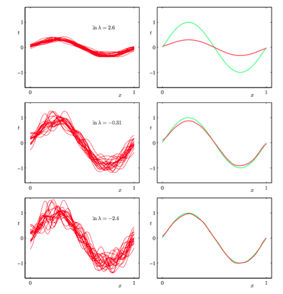
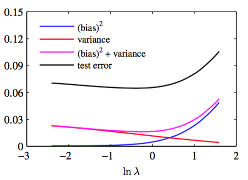

在目前讨论的线性回归模型中，我们假设基函数的形式和数量都已经确定好了。就像在第1章中看到的那样，如果使用有限的数据集去训练复杂的模型，最大似然或等价的最小二乘会导致巨大的过拟问题。然而，为了防止过拟问题，去限制基函数的数量，会有限制模型的去捕捉数据中有趣的，重要的趋势的灵活性的副作用。尽管引入的正则项可以控制多参数模型的过拟问题，但是它引入了如何确定正则化系数$$ \lambda $$的值的新问题。同时对于加权向量$$ w $$和正则化系数$$ \lambda
$$求解最小化正则化误差函数，会得到$$ \lambda = 0 $$的非正则化的解，所以这显然不是正确的方法。    

正如在之前章节看到的那样，过拟现象确实是最大似然的一个不好的性质，但是当我们在使用贝叶斯方法对参数进行边缘化时它不会出现。本章，我们会稍微深入的从贝叶斯观点讨论模型的复杂度。但是，在开始讨论之前，从频率学家的偏置-方差权衡（bias-variance trade-off）观点来考虑一下模型的复杂度问题是很有指导意义的。虽然为了使用简单的例子来说明一些基本的思想，我们将在线性基函数模型下介绍这个概念，但它可以推广到更一般的情形。    

1.5.5节中，当我们讨论回归问题的决策论时，我们考虑了一旦我们知道了条件概率分布$$ p(t|x) $$，就能够给出对应的最优预测结果的不同损失函数。使用最多的一个最优的预测由条件期望：

$$
h(x) = \mathbb{E}[t|x] = \int tp(t|x)dt \tag{3.36}
$$

给出的平方误差函数。现在，有必要区分一下决策论中的平方损失函数以及模型参数的最大似然估计中的平方和误差函数。我们可以使用比最小平方更复杂的方法，如正则化或纯粹的贝叶斯方法，来确定条件概率分布$$ p(t|x) $$。这些方法都可以与平方损失函数相结合来进行预测。    

在1.5.5节中，我们证明了平方损失函数的期望可以写成

$$
\mathbb{E}[L] = \int \{y(x)-h(x)\}^2p(x)dx+\int\{h(x)-t\}^2p(x,t)dxdt \tag{3.37}
$$

回忆一下，与$$ y(x) $$无关的，由数据本身的噪声造成的第二项，表示期望损失能够达到的最小值。第一项依赖我们对函数$$ y(x) $$的选择，且我们希望找到$$ y(x) $$的解使得这项最小化。由于这项是非负的，所以我们希望这项的最小能等于0。如果我们有无穷多的数据（并有无限多的计算资源），我们理论上能找到任意精确度的回归函数$$ h(x)
$$。但是，实际情况下，我们只有包含$$ N $$个有限点的数据集，这导致我们不能精确的得到回归函数$$ h(x) $$。    

如果使用由参数向量$$ w $$控制的参数函数$$ y(x,w) $$来对$$ h(x) $$建模，那么从贝叶斯的观点来看，我模型的不确定性是通过$$ w $$的后验概率分布来表示的。但是，从频率论的观点来看，这涉及根据数据集$$ D $$对$$ w $$进行点估计，并通过下面的思想实验来解读这个估计的不确定性。假设有很多独立的从分布$$ p(t,x) $$中抽取的大小为$$ N $$的数据集。对于任意给定的数据集$$ D
$$，可以运行我们的学习算法，得到一个预测函数$$ y(x;D) $$。不同的数据集会得出不同的函数，从而得出不同的平方损失。具体是学习算法表现是通过它在这些数据集上表现的平均值来评估的。    

考虑式（3.37）的第一项的被积函数，对于一个特定的数据集$$ D $$，它的形式为：    

$$
\{y(x;D)−h(x)\}^2 \tag{3.38}
$$

因为这个项是依赖于具体的数据集$$ D $$，所以对所有的数据集取平均值。如果在花括号中加上，减掉量$$ \mathbb{E}_D[y(x;D)] $$，展开得到：     

$$
\begin{eqnarray}
\{y(x;D) &-& \mathbb{E}_D[y(x;D)] + \mathbb{E}_D[y(x;D)] - h(x)\}^2 \\
&=& \{y(x;D) - \mathbb{E}_D[y(x;D)]\}^2 + \{\mathbb{E}_D[y(x;D)] - h(x)\}^2 \\
& & + 2\{y(x;D) - \mathbb{E}_D[y(x;D)]\}\{\mathbb{E}_D[y(x;D)] - h(x)\} \tag{3.39}
\end{eqnarray}
$$

现在关于$$ D $$求期望，然后注意到最后一项等于零，可得：

$$
\begin{eqnarray}
&\mathbb{E}_D&[\{y(x;D)−h(x)\}^2]
&=& \underbrace{ \{\mathbb{E}_D[y(x;D)] - h(x)\}^2}_{(bias)^2} + \underbrace{\mathbb{E}_D[\{y(x;D) - \mathbb{E}_D[y(x;D)]\}^2]}_{variance} \tag{3.40}
\end{eqnarray}
$$

我们看到，$$ y(x;D) $$与回归函数$$ h(x) $$的差的平方的期望可以表示为两项的和。第一项被称为偏置（bias）的平方，表示所有数据集的平均预测与预期的回归函数之间的差异。第二项被称为方差（variance），度量了对于单独的数据集，模型所给出的解在它们的均值附近波动的情况，因此也就度量了函数$$ y(x; D) $$对于数据集的具体选择的敏感程度。稍后我们会通过一个简单的例子，来直观地说明这些概念。     

目前为止，我们已经考虑了单一输入变量$$ x $$的情形。如果把这个展开式带回式（3.37）中，那么我们就得到

$$
\text{expected loss} = (\text{bias})^2 + \text{variance} + \text{noise} \tag{3.41}
$$

对于期望平方损失的分解。其中

$$
\begin{eqnarray}
(\text{bias})^2 &=& \int\{\mathbb{E}_D[y(x;D)] - h(x)\}^2p(x)dx \tag{3.42} \\
\text{variance} &=& \int\mathbb{E}_D[y(x;D) - \mathbb{E}_D[y(x;D)]\}^2]p(x)dx \tag{3.43} \\
\text{noise} &=& \int\{h(x) - t\}^2p(x,t)dxdt \tag{3.44}
\end{eqnarray}
$$

现在，偏置和方差指的是积分后的量。    

我们的目标是最小化被分解为偏置（平方）、方差和一个常数噪声项的和的损失期望。正如我们将看到的那样，非常灵活的模型偏置较小，方差较大，相对固定的模型偏置较大，方差较小，所以我们要在偏置和方差之间做一个权衡。有着最优预测能力的模型是在偏置和方差之间取得最优的平衡的模型。这可以通过第1章讨论过的正弦数据集来说明。我们产生了100个数据集合，每个集合都包含独立地从正弦曲线$$ h(x) = \sin(2\pi x) $$抽取的$$ N=25 $$个数据点，数据集的编号为$$ l = 1,...,L , L = 100
$$，且使用包含24个高斯基函数的模型，通过最小化正则误差函数（3.27）来拟合每个数据集$$ D^{(l)}
$$，得到预测函数$$ y^{(l)}(x) $$，如图3.5展示。

      
图 3.5 模型复杂度对于偏置和方差的依赖的说明    

最上面的一行对应着较大的正则化系数$$ \lambda $$，这样的模型的方差很小（因为左侧图中的红色曲线看起来很相似）,但是偏置很大（因为右侧图中的两条曲线看起来相当不同）。相反，最下面的一行，正则化系数$$ \lambda $$很小，这样模型的方差较大（因为左侧图中 的红色曲线变化性相当大），但是偏置很小（因为平均拟合的结果与原始正弦曲线十分吻合）。注意，把$$ M = 25
$$的这种复杂模型的多个解进行平均，会产生对于回归函数非常好的拟合，这表明求平均是一个很好的步骤。事实上，将多个解加权平均是贝叶斯方法的核心，虽然这种求平均针对的是参数的后验分布，而不是多个数据集。    

我们也可以定量地检验这个例子的偏置-方差权衡。平均预测通过

$$
\bar{y}(x) = \frac{1}{L}\sum\limits_{l=1}^Ly^{(l)}(x) \tag{3.45}
$$

估计得到。且积分后的偏置的平方及方差由

$$
\begin{eqnarray}
(\text{bias})^2 &=& \frac{1}{N}\sum\limits_{n=1}^N\{\bar{y}(x_n) - h(x_n)\}^2 \tag{3.46} \\
\text{variance} &=& \frac{1}{N}\sum\limits_{n=1}^N\frac{1}{L}\sum\limits_{l=1}^L\{y^{(l)}(x_n) - \bar{y}(x_n)\}^2 \tag{3.47} 
\end{eqnarray}
$$

其中由概率分布$$ p(x) $$加权的关于$$ x $$的积分由来自那个分布的有限数据点的和来近似的。图3.6展示了这些量以及它们的和关于$$ \ln\lambda $$的函数图像。

      
图 3.6 平方偏置和方差的图像

我们看到，小的$$ \lambda $$使得模型针对各个数据集里的噪声做了很好的调节，导致了较大的方差。相反，大的$$ \lambda $$把权值参数拉向零，导致了较大的偏置。    

虽然偏置-方差分解能够从频率论的角度对模型的复杂度提供一些有趣的见解，但是因为偏置-方差分解依赖于对所有的数据集的平均，而实际应用中我们只有一个观测数据集，所以它的实用价值很有限。如果我们有大量的给定大小的独立的训练数据集，那么最好的方法是把它们组合成一个大的训练集，来降低给定复杂度的模型的过拟合程度。    

由于有这么多局限性，因此我们在下一节里将讨论线性基函数模型的贝叶斯观点。它不仅提供了对过拟现象的深刻见解，还提出了解决模型复杂度问题的实用的技术。

