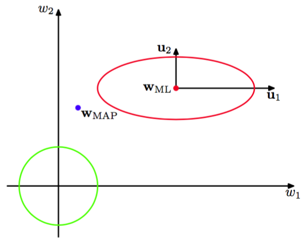
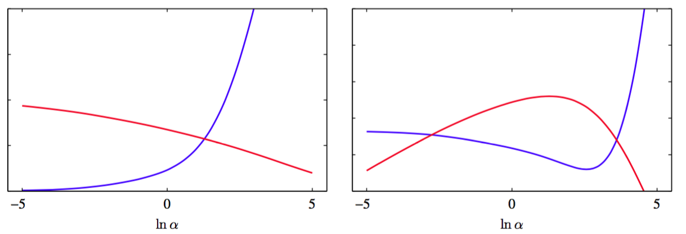
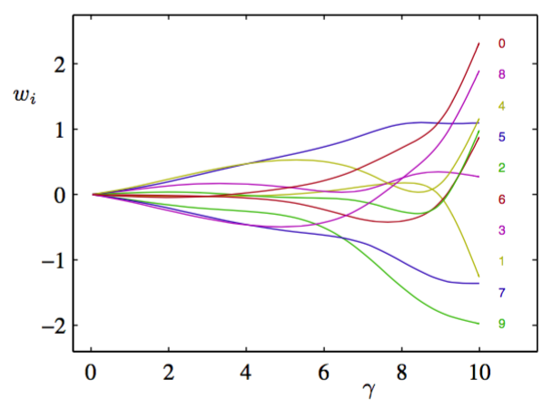

式（3.92）给出的结果有一个十分优雅的解释（MacKay, 1992a），它让我们更深刻的认识了关于$$ \alpha $$的贝叶斯解的。为了达到这个目的，考虑如图3.15所示的似然函数的等高线及先验分布。

      
图 3.15 似然函数的等高线（红色），先验分布（绿色）

这里，我们隐式地把参数空间的坐标轴进行了旋转变换，使其与式（3.87）定义的特征向量对齐。这样，似然函数的等高线线就是轴对齐的椭圆。特征值$$ \lambda_i $$度量了似然函数的曲率，因此在图3.15
中，特征值$$ \lambda_1 $$比$$ \lambda_2 $$要小（因为较小的曲率对应着似然函数等高线较大的拉伸)。由于$$ \beta\Phi^T\Phi $$是正定矩阵，所以它的特征值为正数，从而比值$$ \lambda_i/(\lambda_i + \alpha) $$位于0和1之间。所以式（3.91）定义的$$ \gamma $$取值范围为$$ 0 \leq \gamma \leq M $$。对于$$ \lambda_i \gg \alpha $$的方向，对应的参数$$ w_i $$会很接近最大似然值，且比值$$ \lambda_i/(\lambda_i + \alpha) $$会很接近1。由于这样的参数的值被数据严格限制，所以把它们称为好确定的（well
determined）。相反的，对于$$ \lambda_i \ll \alpha $$的方向，，对应的参数$$ w_i $$和比值$$ \lambda_i/(\lambda_i + \alpha) $$都会很接近于0。似然函数对于参数的值，这些方向上相对不敏感，因此参数被先验设置为较小的值。因此式（3.91）定义的$$ \gamma $$度量了好确定的参数的有效总数。    

比较$$ \beta $$与式（3.21）对应给出的最大似然解，可以进一步认识式（3.95）对$$ \beta $$重新估计。这两个公式都把方差（精度的逆）表示为目标值与模型预测差值的平方的均值。然而，它们之间的区别是最大似然结果的分母是数据点的数量$$ N $$，而贝叶斯结果的分母是$$ N − \gamma $$。回忆一下，由式（1.56）给出的一元变量$$ x $$的高斯分布的方差的最大似然估计

$$
\sigma_{ML}^2 = \frac{1}{N}\sum\limits_{n=1}^N(x_n-\mu_{ML})^2 \tag{3.96}
$$

因为均值的最大似然解$$ \mu_{ML} $$拟合了包含噪声的数据，所以这个估计是有偏的。从效果上来看，这占用了模型的一个自由度。对应的无偏的估计由式（1.59）给出，形式为    

$$
\sigma_{MAP}^2 = \frac{1}{N-1}\sum\limits_{n=1}^N(x_n - \mu_{ML})^2 \tag{3.97}
$$

在10.1.3节中，我们将会看到这个结果可以使用贝叶斯方法来对未知的均值做边缘化来求得。贝叶斯结果分母中的因子$$ N - 1 $$反映了模型中的一个自由度被用于拟合均值的事实,它抵消了最大似然解的偏差。现在考虑线性回归模型的对应解。现在，目标分布的均值由包含$$ M $$个参数的函数$$ w^T\phi(x) $$给出。然而，并不是所有的参数都根据数据做调整。由数据确定的有效参数的数量为$$ \gamma $$，剩余的$$ M −
\gamma $$个参数被先验设置为较小的值。这在贝叶斯结果中可以通过方差的分母中的因子$$ N − \gamma $$反映出来，因此修正了最大似然结果的偏差。    

我们可以使用1.1节中的正弦生成数据和包含9个高斯基函数的模型（因此模型包含了偏置后的参数总数为$$ M = 10 $$）来阐释超参数设置的证据框架。这里为了说明的简洁性，我们已经把$$ \beta $$设置为真实值11.1，然后使用证据框架来确定$$ \alpha $$，如图3.16所示。

      
图 3.16  左图给出了$$ \gamma ,\ln\alpha $$的关系（红色）以及$$ 2\alpha E_W(m_N) ,\ln\alpha $$的关系（蓝色），右图给出了对应的对数证据$$ \ln p(\textbf{t}|\alpha,\beta) $$关于$$ \ln\alpha $$的图像（红色）以及测试集误差（蓝色）

同样，我们可以看到参数$$ alpha $$是如何控制参数$$ \{w_i\} $$的大小。图3.17展示了各个参数与参数的有效数量$$ \gamma $$间的关系。

      
图 3.17 参数与参数的有效数量间的关系    

如果考虑数据点的数量大于参数数量$$ N \gg M $$的极限情况，那么根据式（3.87），因为$$ \Phi^T\Phi $$涉及到数据点的隐式求和，因此特征值$$ \lambda_i $$随着数据集规模的增加而增大，所以所有参数都可以很好的确定。在这种情况下$$ \gamma = M $$，且$$ \alpha,\beta $$的再估计方程变成了

$$
\begin{eqnarray}
\alpha &=& \frac{M}{2E_W(m_N)} \tag{3.98} \\
\beta &=& \frac{N}{2E_D(m_N)} \tag{3.99}
\end{eqnarray}
$$

其中，$$ E_W, E_D $$分别由（3.25）（3.26）定义。因为这些结果不需要计算Hessian矩阵的一系列特征值，所以可以当成完整证据再估计公式的简化计算的近似。
