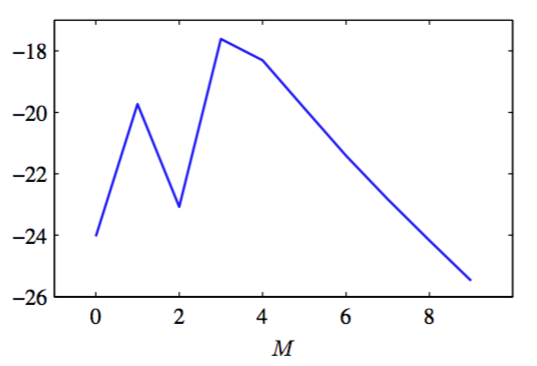

边缘似然函数$$ p(\textbf{t}|\alpha,\beta) $$是通过对权重参数$$ w $$的积分来获得的，即：    

$$
p(\textbf{t}|\alpha,\beta) = \int p(\textbf{t}|w,\beta)p(w|\alpha)dw \tag{3.77}
$$

计算这个积分的一种方法是再次使用式（2.115）给出的线性-高斯模型的条件分布的结果。这里，我们使用另一种通过对指数项配平方，然后使用高斯分布的标准化系数的基本形式，来计算这个积分。    

从（3.11）（3.12）和（3.52）中，得到我们可以把证据函数写成

$$
p(\textbf{t}|\alpha,\beta) = \left(\frac{\beta}{2\pi}\right)^{N/2}\left(\frac{\alpha}{2\pi}\right)^{M/2}\int exp\{-E(w)\}dw \tag{3.78}
$$

的形式。其中$$ M $$是$$ w $$的维数，且定义

$$
\begin{eqnarray}
E(w) &=& \beta E_D(w) + \alpha E_W(w) \\
&=& \frac{\beta}{2}\Vert \textbf{t}-\Phi w \Vert^2 + \frac{\alpha}{2}w^Tw \tag{3.79}
\end{eqnarray}
$$

如果忽略一些比例常数，式（3.79）可以看成与正则化的平方和误差函数相等。现在，对$$ w $$配平方，可得：

$$
E(w) = E(m_N) + \frac{1}{2}(w-m_N)^TA(w-m_N) \tag{3.80}
$$

其中，我们引入了

$$
A = \alpha I + \beta \Phi^T\Phi \tag{3.81}
$$

和

$$
E(m_N) = \frac{\beta}{2}\Vert \textbf{t}-\Phi m_N \Vert^2 + \frac{\alpha}{2}m_N^Tm_N \tag{3.82}
$$

注意$$ A $$对应的是误差函数的二阶导数矩阵 

$$
A = \nabla\nabla E(w) \tag{3.83}
$$

这被称为Hessian矩阵。这里我们定义$$ m_N $$为：

$$
m_N = \beta A^{-1}\Phi^T\textbf{t} \tag{3.84}
$$

使用式（3.54），可得$$ A = S_N^{-1} $$，因此式（3.84）等价于之前的定义的式（3.53），所以它表示后验分布的均值。    

通过标准化多元高斯分布的标准化系数，就可以简单的得到关于$$ w $$的积分，即：    

$$
\begin{eqnarray}
&\int& exp\{-E(w)\}dw \\
& & = exp\{-E(m_N)\}\int exp\left\{-\frac{1}{2}(w-m_N)^TA(w-m_N)\right\}dw \\
& & = exp\{-E(m_N)\}(2\pi)^{M/2}\vert A \vert^{-1/2} \tag{3.85}
\end{eqnarray}
$$

使用式（3.78）我们可以把对数边缘似然写成    

$$
\ln p(\textbf{t}|\alpha,\beta) = \frac{M}{2}\ln \alpha + \frac{N}{2}\ln \beta - E(m_N) - \frac{1}{2}\ln\vert A \vert - \frac{N}{2}\ln(2\pi) \tag{3.86}
$$

这就是证据函数所需要的表达式。    

回到多项式回归问题，我们可以画出模型证据与多项式阶数之间的关系，如图3.14所示。    

      
图 3.14 多项式回归模型的模型对数证据与阶数$$ M $$的关系图像

这里，我们已经假定先验分布的形式为式（1.65），参数$$ \alpha $$的值固定为$$ \alpha = 5 × 10^{−3} $$。这个图像的形式非常有指导意义。回头看图1.4，得到$$ M = 0 $$的多项式对数据的拟合效果非常差，结果模型证据的值也相对较小。$$ M = 1 $$的多项式对于数据的拟合效果有了显 著的提升，因此模型证据变大了。但是，对于$$ M = 2
$$的多项式，因为产生数据的正弦函数是奇函数，所以在多项式展开中没有偶次项，所以拟合效果又变差了。事实上，图1.5给出的数据残差从$$ M = 1 $$到$$ M = 2 $$只有微小的减小。由于复杂的模型有着更大的复杂度惩罚项，因此从$$ M = 1 $$到$$ M = 2 $$，模型证据实际上减小了。当$$ M = 3 $$时，我们对于数据的拟合效果有了很大的提升，如图1.4所示，因此模型证据再次增大，给出了多项式拟合的最高的模型证据。进一步增加$$ M
$$的值，只能少量地提升拟合的效果，但是模型的复杂度却越来越复杂，这导致整体的模型证据下降。再次看图1.5，我们看到泛化错误在$$ M = 3 $$到$$ M = 8 $$之间几乎为常数，因此只基于这幅图很难对模型做出选择。然而，模型证据的值明显地倾向于选择$$ M = 3 $$的模型，因为这是能很好地解释观测数据的最简单的模型。     

