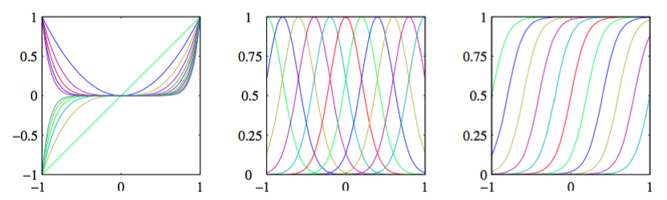

最简单的回归线性模型是输入变量的线性组合：     

$$
y(x,w) = w_0 + w_1x_1+ ... + w_Dx_D \tag{3.1}
$$

其中$$ x = (x_1,...,x_D)^T$$。这通常被简单的叫做线性回归（linear regression）。这个模型的关键性属性是它是参数$$ w_0,...,w_D $$的一个线性函数。同时，它也是输入变量$$ x_i $$的一个线性函数，这给模型带来的极大的局限性。因此，我们将输入变量确定了的非线性函数进行线性组合来扩展模型的类别：    

$$
y(x,w) = w_0 + \sum\limits_{j=1}^{M-1}w_j\phi_j(x) \tag{3.2}
$$

其中$$ \phi_j(x) $$被称为基函数（basis function）。通过把下标$$ j $$的最大值记作$$ M − 1$$，使得这个模型中的参数总数为$$ M $$。    

参数$$ w_0 $$使得数据中可以存在任意的固定偏移，通常被称为偏置参数（bias parameter）（不要和统计观念下的“偏置”搞混淆）。通常，定义一个额外的占位“基函数”$$ \phi_0(x) = 1 $$是很方便的，以便把函数简化为：

$$
y(x,w) = \sum\limits_{j=0}^{M-1}w_j\phi_j(x) = w^T\phi(x) \tag{3.3}
$$

其中$$ w = (w_0,...,w_{M-1})^T , \phi = (\phi_0,...,\phi_{M-1})^T $$。在很多模式识别的实际应用中，会在原始数据上应用固定形式的与处理或特征抽取。如果原始变量组成向量$$ x $$，那么特征可以表示为基函数$$ \{\phi_j(x)\} $$的项。    

通过使用非线性的基函数，我们允许函数$$ y(x,w) $$是关于输入向量$$ x $$的非线性函数。由于式（3.2）是关于$$ w $$的线性函数，所以它被称为线性模型。这种参数的线性性质极大地简化了这类模型的分析。不过，这也造成了3.6节所讨论的巨大的局限性。    

第1章中讨论的多项式拟合是这类模型的一个特例，它有单个输入变量$$ x $$，基函数是$$ x $$的幂指数的形式，即$$ \phi_j(x) = x^j $$。多项式基函数的一个局限性是它们是输入变量的全局函数，所以一个区域内个改变会影响所有区域。解决这个问题的方法是：把输入空间切分成若干个区域，然后对于每个区域用不同的多项式函数拟合。这样的函数叫做样条函数（spline function）（Hastie et al., 2001）。    

还有许多其他的基函数的选择，如：    

$$
\phi_j(x) = exp\left\{-\frac{(x-\mu_j)^2}{2s^2}\right\} \tag{3.4}
$$

其中$$ \mu_j $$控制着基函数在输入空间中的位置，参数$$ s $$控制着基函数的空间大小。这些通常被称为“高斯”基函数，虽然它们不一定具有概率解释。特别的，因为这些基函数会与一个调节参数$$ w_j $$ 相乘,所以标准化系数是不重要的。    

另一种选择是sigmoid基函数：    

$$
\phi_j(x) = \sigma\left(\frac{x-\mu_j}{s}\right) \tag{3.5}
$$

其中$$ \sigma(a) $$是logistic sigmoid函数，由

$$
\sigma_a = \frac{1}{1+exp(-a)} \tag{3.6}
$$

定义。    

等价的，我们可以使用“tanh”函数，因为它和logistic sigmoid函数的关系是$$ tanh(a) = 2\sigma(2a) − 1 $$，所以logistic sigmoid函数的一般线性组合，等价于“tanh”函数的一般线性组合。图3.1展示了选择不同的基函数的情况。     

      
图 3.1 基函数的例子，左图是多项式基函数，中图是形式为（3.4）的高斯基函数，右图是形式为（3.5）的sigmoid基函数。

另一种可能的基函数选择是傅里叶基函数，它引出正弦函数展开。每个基函数表示一个具体的频率，并在空间中有无限的延伸。对比，限制在有限输入空间的不同的空间频率的频谱的基函数。在很多信号处理应用中，考虑同时在空间和频率受限的基函数是非常有趣的，这引出了一类被称为小波（wavelet）的函数。为了简化应用，这些基函数被定义成相互正交的。当输入值位于正规的格子框架中是，使用小波是最合适的。如在时间序列上的连续时间点，或图像中的像素。关于小波的有用的教程包括Ogden（1997），Mallat（1999）和Vidakovic（1999）。     

本章中的大部分讨论都与基函数的选择无关，所以除非为了数值说明，我们大部分讨论不会指定基函数的具体形式。事实上，我们的大部分讨论将会等同的使用基函数向量$$ \phi(x) $$的简单形式：$$ \phi(x) = x $$。还有，为了保持记号的简洁，我们把注意力集中在单目标变量$$ t $$的情形。但是在3.1.5节中，为了简要的说明必要的修改，我们处理多目标变量的情形。

