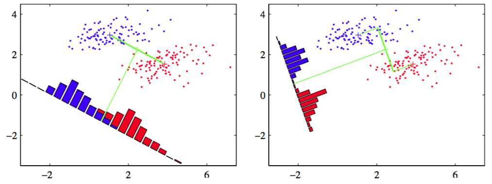

我们可以从降维的角度来观察线性分类模型。首先考虑二分类的情形，并假设有$$ D $$维输入向量$$ x $$并使用

$$
y=w^Tx \tag{4.20}
$$

把它投影到一维空间。如果我们在$$ y $$上放一个阈值，并把$$ y \geq -w_0 $$分到类别$$ C_1 $$中，其余的分到类别$$ C_2 $$，那么我们就得到了前一小节讨论的标准的线性分类器。通常来说，投影在一维空间会造成大程度的信息损失，所以能够在原来的$$ D $$维空间中完全分开的样本在一维空间中可能会相互重叠。不过通过调节分量的权向量$$ w $$，我们可以选择使类别最分散的一个投影。首先，考虑一个包含$$ N_1 $$个$$ C_1 $$点和$$ N_2 $$个$$ C_2
$$点的二分类问题，那么两个类别的均值向量为：    

$$
m_1 = \frac{1}{N_1}\sum\limits_{n \in C_1}x_n , m_2 = \frac{1}{N_2}\sum\limits_{n \in C_2}x_n \tag{4.21}
$$

当投影到$$ w $$上后，最简单的度量类别之间分开程度的方法就是投影之后的的类别均值的距离。这要求我们去选择那个使得

$$
m_2-m_1 = w^T(m_2 - m_1) \tag{4.22}
$$

最大的$$ w $$的值。 其中

$$
m_k = w^Tm_k \tag{4.23}
$$

类别$$ C_k $$的数据投影后的均值。但是，可以通过增大$$ w $$来使这个表达式无穷大。为了解决这个问题，我们现在$$ w $$为单位长的，即$$ \sum_i w_i^2 = 1 $$。使用拉格朗日乘数法来求解限制条件下的最大化问题，得到$$ w \propto (m_2 - m_1) $$。但是这个方法还有图4.6展示的问题。

      
图 4.6: 左图在投影空间中，存在一个比较严重的类别重叠，右图给出的基于Fisher线性判别的对应投影

它展示了在原来二维空间$$ (x1, x2) $$中可以完全分开的两个类别，当投影到连接它们的均值的直线上时，有一定程度的重叠。这是由于类别分布的协方差强非对角引起的。Fisher提出了最大化一种在给出大的投影均值的距离的同时，给出较小的每个类别内部的方差的函数的主意，来最小化类别重叠。    

投影公式（4.20）把通过$$ x $$标记的数据点转换为通过一维空间$$ y $$标记的点。转换后的类别$$ C_k $$的内部方差由

$$
s_k^2 = \sum\limits_{n \in C_k}(y_n - m_k)^2 \tag{4.24}
$$

其中$$ y_n = w^Tx_n $$。我们可以简单的定义整个数据集总的类别内部的方差为$$ s_1^2 + s_2^2 $$。Fisher准则是由类别间的方差与类别内部的方差比例定义的，即

$$
J(w) = \frac{m_2 - m_1)^2}{s_1^2 + s_2^2} \tag{4.25}
$$

使用式（4.20）、式（4.23）和式（4.24）对它重写得到

$$
J(w) = \frac{w^TS_Bw}{w^TS_Ww} \tag{4.26}
$$

来显示的表达对$$ w $$的依赖。其中$$ S_B $$是类别间的写方差矩阵，由

$$
S_B = (m_2 - m_1)(m_2 - m_1)^T \tag{4.27}
$$

给出，$$ S_W $$是总得类别内部方差矩阵，由

$$
S_W = \sum\limits_{n \in C_1}(x_n - m_1)(x_n - m_1)^T + \sum\limits_{n \in C_2}(x_n - m_2)(x_n - m_2)^T \tag{4.28}
$$

对式（4.26）对于$$ w $$求导，得到当

$$
(w^TS_Bw)S_Ww = (w^TS_Ww)S_Bw \tag{4.29}
$$

使得$$ J(w) $$最大。从式（4.27）我们得到$$ S_Bw $$总是在$$ (m_2 - m_1) $$的方向上。更重要的是我们只在乎$$ w $$的方向，而不在乎它的大小，因此我们可以去掉标量因子$$ (w^TS_Bw) (w^TS_Ww) $$。在式（4.29）两边都乘以$$ S_W^{-1} $$得到

$$
w \propto S_W^{-1}(m_2 - m_1) \tag{4.30}
$$

注意，如果类别内部的协方差是各向同性的，那么$$ S_W $$正比于单位矩阵，然后得到和之前讨论的一样，$$ w $$正比于类均值的差。    

尽管严格来说式（4.30）并不是一个判别式，而是对于数据向一维投影的方向的一个具体选择，但是仍习惯把它称为Fisher线性判别式。然而，投影的数据可以通过选择一个阈值$$ y_0 $$，使得当$$ y(x) \geq y_0 $$时，我们把它分到$$ C_1 $$中，否则把它分到$$ C_2 $$，来构造后面的判别式。例如，我们可以使用高斯概率分布对类条件密度$$ p(y|C_k)
$$建模，然后使用1.2.4节的技术通过最大似然找到高斯分布的参数值。当找到投影类别的高斯近似之后，1.5.1节的方法给出了最优的阈值的形式化解。注意，$$ y = w^Tx $$是一组随机变量的和，因此根据中心极限定理，我们可以作出高斯分布的假设。

