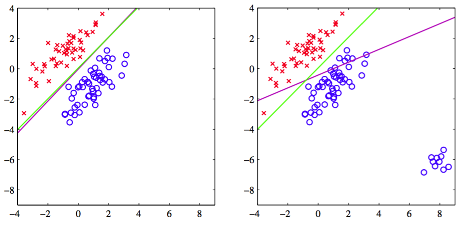
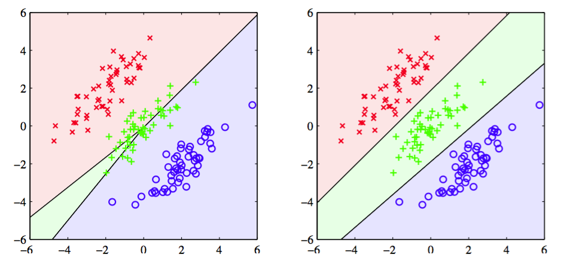

在第3章中，我们考虑了参数线性函数的模型，并看到通过最小化平方误差函数可以得到参数的简单解析解。因此我们想尝试在分类问题中是否也可以使用这种方法。考虑一个一般的使用“1-of-K”编码规则的目标向量的$$ K $$类别分类问题。在这样的背景下，使用最小二乘的一个理由是对于规定输入向量，它近似目标值的条件期望$$ \mathbb{E}[t|x]
$$。对于二元编码模式，这个条件期望是由后验类概率向量给出的。不幸的是，这些概率通常很难近似。事实上，正如我们稍后要讨论的那样，由于线性模型的灵活性很受限，近似的过程有可能产生位于区间$$ (0, 1) $$之外的值。    

每个类别$$ C_k $$通过它自己的线性模型    

$$
y_k(x) = w_k^Tx + w_{k0} \tag{4.13}
$$

来描述的，其中$$ k=1,...,K $$。可以很容易地把这些量聚集在一起表示，即

$$
y(x) = \widetilde{W}^T\tilde{x} \tag{4.14}
$$

其中$$ \widetilde{W} $$是第$$ k^{th} $$列构成$$ D+1 $$维向量$$ \tilde{w}_k = (w_{k0}, w_k^T)^T $$的矩阵，$$ \tilde{x} $$对应的是通过虚输入$$ x_0=1 $$扩张后的输入向量$$ (1,x^T)^T $$。这个表示方法已经在3.1节详细讨论过。然后，一个新的输入$$ x $$被分配到输出$$ y_k = \tilde{w}_k^T\tilde{x} $$最大的类别中。    

现在，就像我们在第3章中的回归一样，通过最小化平方和误差函数来确定参数矩阵$$ \widetilde{W} $$。考虑一个训练数据集$$ \{x_n,t_n\} n = 1,...,N $$，然后定义一个第$$ n^{th} $$行是向量$$ t_n^T $$矩阵$$ T $$，和第$$ n^{th} $$行是$$ \tilde{x}_n^T $$的矩阵$$ \tilde{X} $$。然后，平方和误差函数就可以写成

$$
E_D(\widetilde{W}) = \frac{1}{2}Tr\left\{(\tilde{X}\widetilde{W}-T)^T(\tilde{X}\widetilde{W}-T)\right\} \tag{4.15}
$$

令关于$$ \widetilde{W} $$的导数等于零，整理，可得$$ \widetilde{W} $$的解

$$
\widetilde{W} = (\tilde{X}^T\tilde{X})^{-1}\tilde{X}^TT=\tilde{X}^+T \tag{4.16}
$$

其中$$ \tilde{X}^+ $$是3.1.1节中讨论过的$$ \tilde{X} $$的伪逆。然后我们得到形式为

$$
y(x) = \widetilde{W}^T\tilde{x} = T^T\left(\tilde{X}^+\right)^T\tilde{x} \tag{4.17}
$$

的判别函数。    

多目标变量的最小二乘解的一个有趣性质是，如果训练集合中的每个目标向量对于某些常数$$ a, b $$都满足线性约束

$$
a^Tt_n + b = 0 \tag{4.18}
$$

那么，模型对于任意的$$ x $$值预测也满足这个约束，即

$$
a^Ty(x) + b = 0 \tag{4.19}
$$

因此，如果我们对$$ K $$个分类使用“1-of-K”编码模式，那么模型对任意的$$ x $$值所做的预测$$ y(x) $$的元素的和都是1。但是，由于模型的输出没有限制在区间$$ (0, 1) $$中，所以这个和的限制并不能让它具有概率的解释。    

最小二乘法给出了判别函数的参数的精确解析解。然而，即使作为判别函数（丢掉所有的概率解释直接进行预测）它依然有非常严重的问题。我们已经看到最小二乘解对于离群点缺乏健壮性，这对分类问题也是一样的，如图4.4所示。

      
图 4.4 最小二乘法给出的决策边界（洋红）以及logistic回归模型给出的决策边界（绿色）

这里，我们看到，右图中的额外的数据点极大的改变了决策边界的位置，即使这些点能够被左图中的原始的决策边界正确地分类。平方和误差函数会惩罚那些虽然在决策边界正确的一侧但距离很远的那些“过于正确”的预测。在1.7.2节中，我们将讨论一些其他的不会有这种问题的误差函 数。    

然而，如图4.5所示，最小二乘问题会有比缺乏健壮性验证的多的问题。

      
图 4.5 左图最小二乘法给出的决策边界以及右图logistic回归模型给出的决策边界

这幅图展示了从二维输入空间$$ (x_1, x_2) $$中，人工生成的线性决策边界能够将数据点完美地分开的，三个类别的数据的集合。实际上，在本章的后面介绍的logistic回归方法也可以给出满意的解，如右图所示。然而，最小二乘法给出的结果相当差，输入空间中只有一个相当小的区域被分给了绿色的类别。    

由于最小二乘对应的是高斯条件分布假设下的最大似然，而二元目标向量分布显然和高斯分布差距比较大，所以我们并不会对它的失败感到惊讶。通过使用更恰当的概率模型，我们会得到性质比最小二乘更好的分类方法。但是现在，我们继续探索其它的非概率方法来设置线性分类模型中的参数。

