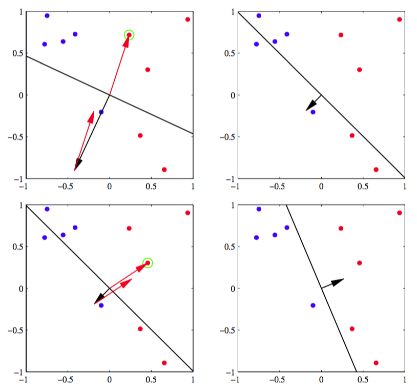
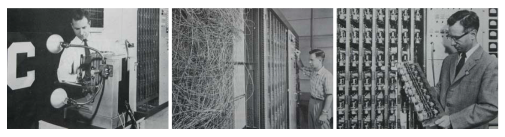

线性判别模型的另外一个例子是Rosenblatt的感知器（1.62）。它在模式识别算法的历史上占有重要地位。它是一个首先通过固定的非线性变换把输入向量$$ x $$转换为特征向量$$ \phi(x) $$，然后利用特征向量构造一个形式为

$$
y(x) = f\left(w^T\phi(x)\right) \tag{4.52}
$$

的一般线性模型的二分类模型。其中非线性激活函数$$ f(\dot) $$是一个形式为

$$
f(a) = 
\begin{cases}
+1, a \geq 0 \\
-1, a < 0
\end{cases} \tag{4.53}
$$

阶梯函数。向量$$ \phi(x) $$通常包含一个偏置分量$$ \phi_0(x) = 1 $$。在之前二分类问题的讨论中，我们关注的目标编码编码方式为$$ t = \{0, 1\} $$，这很适合概率模型。但是对于感知器来说，使用对类$$ C_1 $$使用$$ t = +1 $$，类$$ C_2 $$使用$$ t = -1 $$来对应选择的激活函数，会比较方便。    

用来确定感知器的参数$$ w $$的算法很容易地从最小化误差函数的思想中得到。误差函数的一个自然选择是误分类的模式的总数。但是，由于这个误差函数是关于$$ w $$的分段常数函数，所以当$$ w $$的改变引起跨越某个点时，这个函数的变化是不连续的，因此这不是一个简单的学习算法。而且由于基于$$ w $$变化的误差函数的梯度几乎在所有地方都为0，所以也是不能使用的。    

因此，我们考虑一个被称为感知器准则的误差函数。注意，我们要做的是寻找一个权向量$$ w $$使得类$$ C_1 $$中模式$$ x_n $$都有$$ w^T\phi(x_n) > 0 $$，而类$$ C_2 $$中模式$$ x_n $$都有$$  w^T\phi(x_n) < 0 $$。使用目标编码模式$$ t \in \{-1,+1\} $$，那么需要所有模式都满足$$  w^T\phi(x_n)t_n > 0 $$。感知器准则赋予正确分类的模式的误差为0，而对于误分类的模式$$ x_n $$，需要最小化$$ −w^T\phi(x_n)t_n $$。那么感知器准则由

$$
E_P(w) = -\sum\limits_{n \in M} w^T\phi_nt_n \tag{4.54}
$$

给出，其中$$ M $$表示所有误分类模式的集合。一个具体的误分类模式对误差的贡献是$$ w $$空间中模式误分类区域中关于$$ w $$的线性函数，而在正确分类的区域误差函数等于0。因此整体误差函数是分段线性的。    

现在，我们对这个误差函数使用随机梯度算法。那么权向量$$ w $$的改变是由

$$
w^{(\tau+1)} = w^{(\tau)} - \eta\nabla E_P(w) = w^{(\tau)} + \eta\phi_nt_n \tag{4.55}
$$

给出，其中$$ \eta $$是学习率参数，$$ \tau $$是指示算法迭代次数的整数。因为$$ w $$乘以一个常数后感知器函数$$ y(x,w) $$是不变的，所以我们可以不失一般性的令学习率参数$$ \eta $$等于1。注意，随着训练过程中权向量的不断改变，误分类的模式也跟着改变。    

感知器学习算法有如下简单的解释。我们循环的使用训练模式，对于每一个模式$$ x_n $$，我们计算感知器函数（4.52）。如果被正确的分类，那么权向量保持不变，如果被误分类，对于类别$$ C_1 $$我们在权向量$$ w $$的当前估计加上向量$$ \phi(x_n) $$，对于类别$$ C_2 $$减去向量$$ \phi(x_n) $$。图4.7展示了感知器学习算法。    

      
图 4.7 感知器学习算法

如果考虑感知器学习算法每次更新的影响，误分类模式对误差的贡献会越来越小，因为根据式（4.55）得到

$$
-w^{(\tau+1)T}\phi_nt_n=-w^{(\tau)T}\phi_nt_n-(\phi_nt_n)^T\phi_nt_n < -w^{(\tau)T}\phi_nt_n \tag{4.56}
$$

其中我们令$$ \eta = 1 $$，并使用了$$ \Vert \phi_nt_n \Vert^2 > 0 $$。当然，这不表示其他的误分类模式对误差函数的贡献也在减少。此外，权向量的改变可能会导致一些先前正确分类的模式被错误分类。因此感知机学习算法不保证每次迭代会使误差函数变小。    

但是，感知器收敛定理（perceptron convergence theorem）表明，如果存在一个精确的解（即训练数据线性可分），那么感知器学习算法可以保证在有限步骤内找到一个精确解。 这个定理的证明可以参考Rosenblatt（1962）、Block（1962）、Nilsson（1965）、Minsky and Papert（1969）、Hertz et
al.（1991）以及Bishop（1995a）。然是，需要注意的是，达到收敛所需的步骤可能非常多，且在实际应用中，在达到收敛状态之前，我们不知道它是不可分的还是收敛缓慢。     

即使数据集是线性可分的，也可能有多个解，而最终哪个解会被找到依赖于参数的初始化以及数据点出现的顺序。此外，对于线性不可分的数据集，感知器算法永远不会收敛。    

除了学习算法的这些困难之处以外，感知器算法既不提供概率形式的输出，推广到$$ K > 2 $$个类别的情形也不容易。然而，最重要的局限性是它基于固定基函数的线性组合（与本章中和 前一章中讨论的所有模型一样)。关于感知器算法更多的局限性，可以参考Minsky and Papert（1969）和Bishop（1995a）。    

Rosenblatt制造了使用发动机驱动的可变电阻来实现可调节参数$$ w_j $$的感知器的模拟硬件。图4.8展示了这个机器。

      
图 4.8 感知器硬件

输入从一个基于光传感器阵列摄像系统中得到，而基函数$$ \phi $$可以通过多种不同的方式来选择，如基于随机选择输入图像的像素子集的简单的固定基函数。典型的应用包括区分简单的图形和文字。   

同时，一个与感知器关系密切的系统adaline（“adaptive linear element”的简称）促进了感知器算法的发展。它是由Widrow以及他的合作者开发。这个模型采用与感知器相同的函数形式，但不同的训练方法（Widrow and Hoff, 1960; Widrow and Lehr, 1990）。
