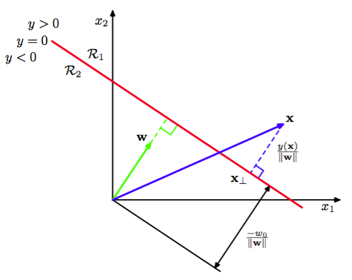

线性判别式的最简单形式是取输入向量的线性函数，即    

$$
y(x) = w^Tx + w_0 \tag{4.4}
$$

其中$$ w $$被称为权向量（weight vector），$$ w_0 $$是偏置（不要与统计中的偏置混淆）。偏置的相反数有时被称为阈值（threshold）。如果$$ y(x) \geq 0 $$则把输入向量$$ x $$分到类$$ C_1 $$中，否则分到$$ C_2 $$中。因此，对应的决策边界由$$ y(x) = 0 $$确定，它对应着$$ D $$维空间中的一个$$ (D-1) $$维超平面。考虑两个点$$ x_A, x_B $$都处在超平面上的情形。由于$$ y(x_A) = y(x_B) = 0 $$，得到$$ w^T(x_A - x_B) = 0
$$，所以向量$$ w $$与在决策面上的所有向量都正交，因此$$ w $$确定了决策面的方向。同样的，如果$$ x $$在决策面，那么$$ y(x) = 0 $$，所以原点到决策面的标准距离由

$$
\frac{w^Tx}{\Vert w \Vert} = -\frac{w_0}{\Vert w \Vert} \tag{4.5}
$$

所以我们看到偏置参数$$ w_0 $$确定了决策面的位置。图4.1阐释了$$ D = 2 $$情况下的这些性质。

      
图 4.1 二维线性判别函数的几何表示    

此外，我们注意到$$ y(x) $$的值给出了点$$ x $$到决策面的垂直距离$$ r $$的一个有符号的度量。为了证明这点，考虑任意点$$ x $$并令$$ x_{\perp} $$是它在决策面上的正交投影，即    

$$
x = x_{\perp} + r\frac{w}{\Vert w \Vert} \tag{4.6}
$$

两边同时乘以$$ w^T $$并加上$$ w_0 $$，再利用$$ y(x)=w^Tx+w_0, y(x_{\perp})=w^Tx_{\perp} + w_0 = 0 $$得到

$$
r = \frac{y(x)}{\Vert w \Vert} \tag{4.7}
$$

图4.1阐释的这个结果。    

与第3章线性回归模型相同，有时引入一个额外的虚“输入”$$ x_0 = 1 $$来使记号更简洁，会比较方便。然后定义$$ \tilde{w} = (w_0, w) \tilde{x} = (x_0, x) $$，然后

$$
y(x) = \tilde{w}^T\tilde{x} \tag{4.8}
$$

在这种情况下，决策面是一个穿过$$ D+1 $$维扩展输入空间原点的$$ D $$维超平面。    

