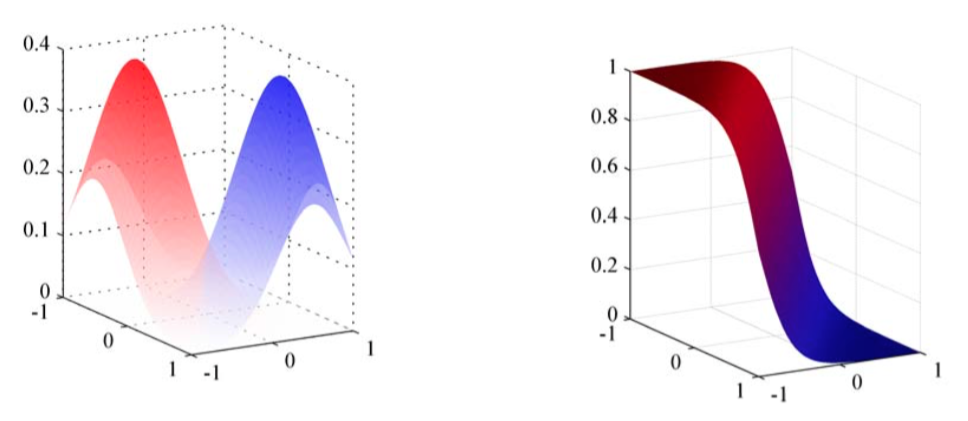
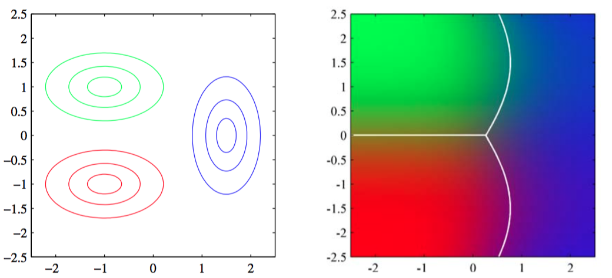

让我们假设类条件密度是高斯分布，然后探讨后验概率的形式。首先，我们假设所有类别共享相同的协方差矩阵。那么类$$ C_k $$的密度由

$$
p(x|C_k) = \frac{1}{(2\pi)^{D/2}}\frac{1}{\vert \Sigma \vert^{1/2}}exp\left\{-\frac{1}{2}(x-\mu_k)^T\Sigma^{-1}(x-\mu_k)\right\} \tag{4.64}
$$

首先，考虑二分类情形。根据式（4.57）（4.58）得到

$$
p(C_1|x) = \sigma(w^Tx + w_0) \tag{4.65}
$$

其中我们定义了

$$
\begin{eqnarray}
w &=& \Sigma^{-1}(\mu_1 - \mu_2) \tag{4.66} \\
w_0 &=& -\frac{1}{2}\mu_1^T\Sigma^{-1}\mu_1 + \frac{1}{2}\mu_2^T\Sigma^{-1}\mu_2 + \ln\frac{p(C_1)}{p(C_2)} \tag{4.67}
\end{eqnarray}
$$

我们看到高斯密度指数项中的$$ x $$的二次型消失了（由于我们假设相同的协方差矩阵）导致logistic sigmoid函数的参数中关于$$ x $$的线性函数。图4.10在二维输入空间$$ x $$下展示了这个结果。

      
图 4.10 左图给出了两个类别的类条件概率密度，分别用红色和蓝色表示。右图给出了对应的后验概率分布

得到的决策边界对应于后验概率$$ p(C_k|x) $$为常数的面，且是由$$ x $$的线性函数给出，从而决策边界在输入空间是线性的。先验概率密度$$ p(C_k) $$只出现在偏置参数$$ w_0 $$中，所以先验的改变的结果是平移决策边界，即平移常数后验概率的等高线。    

对于$$ K $$个类别的一般情形，根据式（4.62）和（4.63），得到

$$
a_k(x) = w_k^Tx + w_{k0} \tag{4.68}
$$

其中我们定义了

$$
\begin{eqnarray}
w_k &=& \Sigma^{-1}\mu_k \tag{4.69} \\
w_{k0} &=& =\frac{1}{2}\mu_k^T\Sigma^{-1}\mu_k + \ln p(C_k) \tag{4.70}
\end{eqnarray}
$$

我们看到，由于各个类别的协方差矩阵相同，使得二次项被消去，从而$$ a_k(x) $$与之前一样是$$ x $$的线性函数。最终的决策边界，对应最小错误分类率，会出现在当两个后验概率（两个最大）相等的位置，且是由$$ x $$的线性函数定义，从而我们再次得到了一个广义线性模型。    

如果我们不假设各个类别的协方差矩阵相同，而是允许每个类条件密度$$ p(x|C_k) $$有自己的协方差矩阵$$ \Sigma_k $$，那么之前消去想的情况就不会出现，从而我们会得到$$ x $$的二次函数，这就引出了二次判别式（quadratic discriminant）。图4.11展示了线性的和二次的决策边界。

      
图 4.11 左图给出了三个类别的类都是高斯分布的条件密度，分别用红、绿、蓝表示，其中红色和绿色的类别有相同的协方差矩阵。右图给出了对应的后验概率分布，其中RGB的颜色向量表示三个类别各自的后验概率。决策边界由白线标示。注意，具有相同协方差矩阵的红色类别和绿色类别的决策边界是线性的，而其他类别之间的类别的决策边界是二次的。
