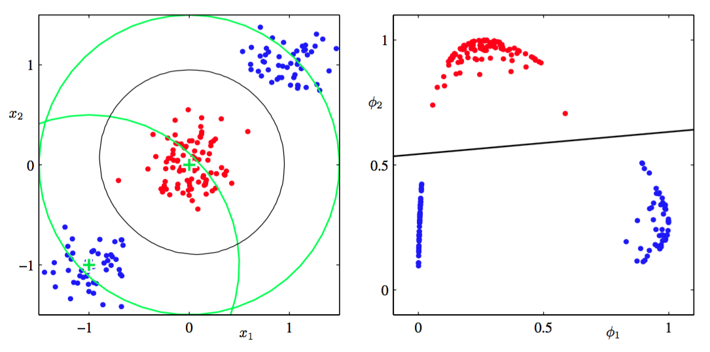

本章目前为止，我们已经考虑的是直接操作输入向量$$ x $$来进行分类的分类模型。但是，如果我们使用基函数向量$$ \phi(x) $$对输入做一个固定的非线性变换，这些算法同样适用。如图4.12所示，得到的决策边界在特征空间$$ \phi $$中是线性的，对应原始$$ x $$空间中的非线性决策边界。

      
图 4.12 特征空间与原始空间

在特征空间$$ \phi(x) $$中线性可分的类别，不需要在原始观测空间中也线性可分的。注意，我们讨论中的线性回归模型中，我们通常令其中一个基函数为常数$$ \phi_0(x) = 1 $$，来对应偏置参数$$ w_0 $$。本章接下来将使用一个固定基函数变换$$ \phi(x) $$来引入与第3章中讨论的回归模型相似的地方。    

对许多实际问题来说，类条件密度$$ p(x|C_k) $$间有着相当大的重叠。这表示有一些$$ x $$的值对应的后验概率$$ p(C_k|x) $$不等于0或1。在这样的情况下，最优解可以通过对后验概率精确的建模，然后使用第1章介绍的标准决策论来得到。注意，非线性变换$$ \phi(x)
$$不会消除这样的类间重叠。实际上，他们会增加重叠的程度，或者在原始空间中不重叠的地方产生重叠。但是，合适的非线性变换可以让后验概率的建模过程更加简单。    

这样的固定基函数模型有严重的局限性。这可以通过如后续章节介绍的允许允许基函数自身根据数据进行调节来解决。尽管有这些限制，但是它在实际应用中起着重要的作用。关于这个模型的讨论会引出许多理解更复杂的模型很有必要重要的概念。
