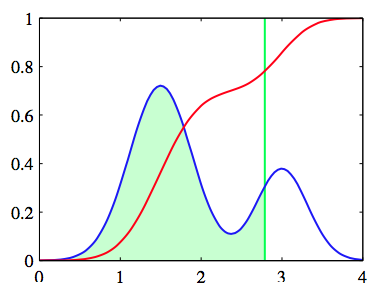

我们以讨论二分类问题来开始广义线性模型的讨论。在4.2节的生成方法讨论中，我看到在一般的假设条件下，类$$ C_1 $$的后验概率可以写成特征向量$$ \phi $$的线性函数上的logistic sigmoid，即    

$$
p(C_1|\phi) = y(\phi) = \sigma(w^T|\phi) \tag{4.87}
$$

且$$ p(C_2|\phi) = 1 - p(C_1|\phi) $$。其中$$ \sigma(\dot) $$是式（4.59）定义的logistic sigmoid函数。在统计学的术语，虽然这是一个分类模型而不是回归模型，但它被称为logistic回归。    

对于一个$$ M $$维特征空间，这个模型有$$ M $$个可调节参数。相比之下，如果我们使用最大似然拟合的类高斯条件密度，那么均值对应$$ 2M $$个参数，（共享）协方差矩阵有$$ M(M - 1) / 2 $$个参数。与类先验$$ p(C_1) $$一起这一共需要$$ M(M + 5) / 2 + 1 $$个参数，它以$$ M $$的二次形式增长，对比logistic回归参数数量线性依赖于$$ M $$。因此对于大的$$ M $$值直接选择logistic回归明显有很大的优势。    

现在，我们使用最大似然来确定logistic回归模型的参数。为了得到这个结果，我们需要求出，可以很方便地使用sigmoid函数来表示的logistic sigmoid函数的导数：    

$$
\frac{d\sigma}{da} = \sigma(1 - \sigma) \tag{4.88}
$$

对于$$ t_n \in \{0,1\} , \phi_n = \phi(x_n) , n = 1,...,N $$的数据集$$ \{\phi_n,t_n\} $$似然函数可以写成

$$
p(\textbf{t}|w) = \prod\limits_{n=1}^Ny_n^{t_n}\{1-y_n\}^{1-t_n} \tag{4.89}
$$

其中$$ \textbf{t} = (t_1,...,t_N)^T $$且$$ y_n = p(C_1|\phi_n) $$。通常，我们会用似然函数的对数的负来定义一个误差函数，这产生了形式为

$$
E(w) = -\ln p(\textbf{t}|w) = -\sum\limits_{n=1}^N\{t_n\ln y_n + (1-t_n)\ln (1-y_n)\} \tag{4.90}
$$

的交叉熵（cross-entropy）误差函数。其中$$ y_n = \sigma(a_n) $$且$$ a_n = w^T\phi_n $$。关于$$ w $$对误差函数求梯度得到

$$
\nabla E(w) = \sum\limits_{n=1}^N(y_n - t_n)\phi_n \tag{4.91}
$$

其中使用了式（4.88）。我们看到涉及到logistic sigmoid的导数的因子消失了。实际上，数据点$$ n $$对梯度的贡献由目标值和模型预测值之间的的“误差”$$ y_n - t_n $$乘以函数向量$$ \phi_n $$给出的。此外，与式（3.13）表明，这与线性回归模型的平方和误差函数的梯度的形式完全相同。    

有必要的话，可以使用式（4.91）的结果给出的每次只出现一个模式，使用式（3.22）更新权向量，$$ \nabla E_n $$是式（4.91）的第$$ n $$项的顺序算法。    

值得注意的是最大似然对线性可分的数据集可能会出现严重的过拟现象。这是由于最大似然解在超平面$$ \sigma = 0.5 $$时出现，等价于$$ w^T\phi = 0 $$。它把数据集分成了两类，$$ w $$的绝对值趋向于无穷大。这种情况下，logistic sigmoid函数在特征空间中变得非常常陡峭，它是一个使得每一个来自类别$$ k $$的训练数据都被赋予后验概率 $$ p(C_k|x) = 1 $$的阶跃函数（Heaviside
step）此外，由于任何切分超平面都会造成训练数据点同样的后验概率，所以通常这些解具有连续性，如面在图4.13所示。

      
图 4.13 连续性

最大似然方法无法区分一个解由于另一个解，且在实际应用中哪个解被找到依赖于优化算法的选择和参数的初始化。注意，即使与模型的参数相比数据点的数量很多，只要数据是线性可分的，这个问题就会出现。这种奇异性可以通过引入先验概率，然后寻找$$ w $$的MAP解，或等价的给误差函数增加一个正则化项来避免。    

