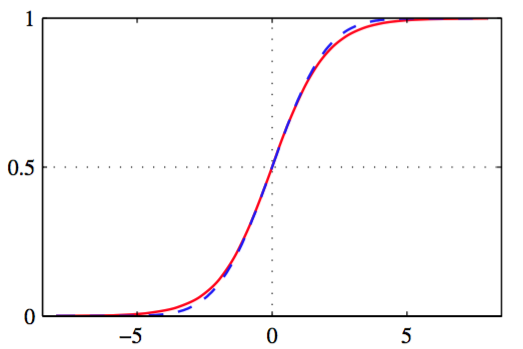

接下来，我们以概率的角度来看待分类问题，并说明模型如何从数据分布的简单假设来得到线性决策边界的。在1.5.4节中，我们讨论了分类中判别式和生成方法的区别。这里我们使用对类条件概率密度$$ p(x|C_k) $$和类先验概率分布$$ p(C_k) $$建模，并通过贝叶斯定理使用这些来计算后验概率$$ p(C_k|x) $$的生成方法。     

首先，考虑二分类的情形。类$$ C_1 $$的后验概率可以写成

$$
\begin{eqnarray}
p(C_1|x) &=& \frac{p(x|C_1)p(C_1)}{p(x|C_1)p(C_1) + p(x|C_2)p(C_2)} \\
&=& \frac{1}{1+exp(-a)} = \sigma(a) \tag{4.57}
\end{eqnarray}
$$

其中我们定义了

$$
a = \ln\frac{p(x|C_1)p(C_1)}{p(x|C_2)p(C_2)} \tag{4.58}
$$

$$ \sigma(a) $$是定义成

$$
\sigma(a) = \frac{1}{1+exp(-a)} \tag{4.59}
$$

的logistic sigmoid函数，如图4.9展示。

      
图 4.9 logistic sigmoid函数

“sigmoid”的意思是“S形”。由于这种函数把整个实数轴映射到了一个有限的区间中，所以它有时也被称为“压缩函数”。logistic sigmoid函数我们已经在之前的章节遇到过了，且在许多分类算法中都有着重要的作用。它满足对称性：

$$
\sigma(-a) = 1 - \sigma(a) \tag{4.60}
$$

这很容易证明。logistic sigmoid的反函数由

$$
a = \ln\left(\frac{\sigma}{1-\sigma}\right) \tag{4.61}
$$

给出，它被称为logit函数。表示两类的概率比值的对数$$ \ln[p(C_1|x)/p(C_2|x)] $$被称为log odds函数。

注意，式（4.57）中我们简单的吧后验概率重写为等价的形式，这可能使得logistic sigmoid函数看上去没有意义。但是，它使得$$ a(x) $$具有简单的函数形式。稍后，我们会考虑$$ a(x) $$为$$ x $$的线性函数的情况，其中后验概率是由通用线性模型控制的。    

对于$$ K > 2 $$个类别的情形，我们有

$$
\begin{eqnarray}
p(C_k|x) &=& \frac{p(x|C_k)p(C_k)}{\sum_jp(x|C_j)p(C_j)} \\
&=& \frac{exp(a_k)}{\sum_jexp(a_j)} \tag{4.62}
\end{eqnarray}
$$

这被称为标准化指数，并可以被当做logistic sigmoid函数对于多类情况的推广。$$ a_k $$由

$$
a_k = \ln p(x|C_k)p(C_k) \tag{4.63}
$$

定义。标准化指数也被称为softmax函数。这是因为，如果对于所有$$ j \neq k $$的情况，都有$$ a_k \gg a_j $$的情况下，有$$ p(C_k|x) \simeq 1 , p(C_j|x) \simeq 0 $$。所以它表示“最大化”函数的一个平滑版本。    

现在，我们探讨选择类条件密度的具体形式的结果，首先讨论连续输入变量$$ x $$的情形，然后简要地讨论离散输入的情形。

