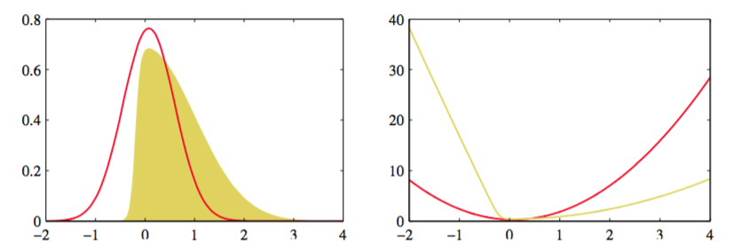

在4.5节中，将要讨论贝叶斯观点下的logistic回归。正如我们将要看到的那样，这比3.3，3.5节中，贝叶斯观点下的线性回归要复杂得多。实际上，当后验分布不在是高斯的时候，我们不能精确的得到关于参数向量$$ w $$的积分。这就需要引入一些近似形式。本书稍后会介绍一系列基于分析估计和数值采样的技术。    

这里，我们引入一种简单，但广泛使用的被称为拉普拉斯近似的框架。它关注于寻找定义在连续变量集合上的概率密度的高斯近似。首先，考虑单个连续变量$$ z $$，假设分布$$ p(z) $$由

$$
p(z) = \frac{1}{Z}f(z) \tag{4.125}
$$

其中$$ Z = \int f(z)dz $$是标准化参数。假设$$ Z $$是未知的。拉普拉斯方法的目标是找到中心位于分布$$ p(z) $$的众数的高斯近似$$ q(z) $$。第一步是找到$$ p(z) $$的众数，也就是说找到一个使得$$ p'(z_0) = 0 $$的$$ z_0 $$，即

$$
\left.\frac{df(z)}{dz}\vphantom{\Big|}\right|_{z=z_0} = 0 \tag{4.126}
$$

高斯分布有对数是变量的二次函数的性质。于是，我们考虑$$ \ln f(z) $$以众数$$ z_0 $$为中心的泰勒（Taylor）展开：    

$$
\ln f(z) \simeq \ln f(z_0) - \frac{1}{2}A(z - z_0)^2 \tag{4.127}
$$

其中

$$
A = -\left.\frac{d^2}{dz^2}\ln f(z)\vphantom{\Big|}\right|_{z=z_0} \tag{4.128}
$$

注意，当$$ z_0 $$是分布的局部最大值时，泰勒展开式中的一阶项消失了。两边同时取指数，得到

$$
f(z) \simeq f(z_0)exp\left\{-\frac{A}{2}(z-z_0)^2\right\} \tag{4.129}
$$

可以通过标准化的高斯的标准结果来得到标准分布$$ q(z) $$，即

$$
q(z) = \left(\frac{A}{2\pi}\right)^{1/2}exp\left\{-\frac{A}{2}(z-z_0)^2\right\} \tag{4.130}
$$

图4.14展示了拉普拉斯近似。

      
图 4.14 拉普拉斯近似

注意，只有当精度$$ A > 0 $$时，高斯近似才有良好的定义，也就是说，驻点$$ z_0 $$必须是局部最大值，使得$$ f(z) $$在点$$ z_0 $$处的二阶导数为负。    

我们可以扩展拉普拉斯方法来近似定义在$$ M $$维空间$$ z $$上的分布$$ p(z) = f(z)/Z $$。驻点$$ z_0 $$上的梯度$$ \nabla f(z) $$会消失。在驻点处展开，得到

$$
\ln f(z) \simeq \ln f(z_0) - \frac{1}{2}(z - z_0)^TA(z - z_0) \tag{4.131}
$$

其中$$ M \times M $$Hessian矩阵$$ A $$定义为

$$
A = -\nabla\nabla\ln f(z)\vert_{z=z_0} \tag{4.132}
$$

$$ \nabla $$是梯度操作。两边取指数得到

$$
f(z) \simeq f(z_0)exp\left\{-\frac{1}{2}(z-z_0)^TA(z-z_0)\right\} \tag{4.133}
$$

分布$$ q(z) $$正比于$$ f(z) $$，合适的标准化系数可以通过观察标准多元高斯的标准形式（2.43）得到

$$
q(z) = \frac{\vert A \vert^{1/2}}{(2\pi)^{M/2}}exp\left\{-\frac{1}{2}(z-z_0)^TA(z-z_0)\right\} = \mathcal{N}(z|z_0,A^{-1}) \tag{4.134}
$$

其中$$ \vert A \vert $$是$$ A $$的行列式。这个高斯分布有良好定义的前提是，它的精度矩阵$$ A $$是正定的，这隐含了驻点$$ z_0 $$一定是一个局部最大值，而不是一个最小值或者鞍点。    

为了应用拉普拉斯近似，首先需要找到众数$$ z_0 $$，然后根据这个众数计算Hessian矩阵。在实际应用当中，众数通常可以通过运行某种形式的数值最优化算法得到（Bishop and Nabney, 2008）。许多在实际应用中遇到的概率分布都是多峰的，因此根据峰值（众数）的不同，会有不同的拉普拉斯近似。注意，在应用拉普拉斯方法时，真实概率分布的标准化常数$$ Z
$$可以是未知的。根据中心极限定理，模型的后验概率会随着观测数据点的增多可以更好的用高斯分布来近似，因此在数据点相对较多的情况下，拉普拉斯近似会更适用。     

拉普拉斯近似的一个主要缺点是，由于它是以高斯分布为基础的，因此它只能直接应用于实值变量。在其他情况下，需要对变量做变换。例如，如果$$ 0 \leq \tau\infty $$，那么我们可以考虑$$ ln\tau $$ 的拉普拉斯近似。但是，拉普拉斯框架的最严重的局限性是，它完全依赖于某个变量具体值上的真实分布，因此无法描述一些重要的全局属性。在第10章，我们会考虑其他从一个更加全局的角度考察了这问题的方法。
