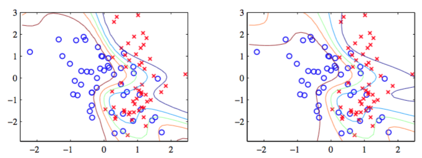

目前，我们已经使用了拉普拉斯近似，推导出了神经网络回归模型的贝叶斯方法。现在，我们要讨论的是，当应用于分类问题时，这个框架应该如何修改。这里，对应于一个二分类问题，我们的网络需要有一个logistic sigmoid输出。将网络扩展到多类softmax输出是很直接的。 我们构建神经网络的过程与4.5节讨论线性分类模型的结果十分类似，因此我们建议读者在学习本节之前，应该对那一节的内容比较熟悉。    

模型的对数似然函数为

$$
\ln p(D|w) = \sum\limits_{n=1}^N\{t_n\ln y_n + (1 - t_n)\ln (1-y_n)\} \tag{5.181}
$$

其中$$ t_n \in {0, 1} $$是目标值，且$$ y_n \equiv y(x_n, w) $$。注意，因为我们假定数据点被正确标记了，所以这里没有超参数$$ \beta $$。同样的，先验概率分布是式（5.162）给出的各向同性高斯分布。    

将拉普拉斯框架用在这个模型中的第一个阶段是初始化超参数$$ \alpha $$，然后通过最大化对数后验概率分布的方法确定参数向量$$ w $$。这等价于最小化正则化误差函数    

$$
E(w) = -\ln p(D|w) + \frac{\alpha}{2}w^Tw \tag{5.182}
$$

最小化的过程可以通过使用误差反向传播方法结合标准的最优化算法得到，正如5.3节所说的那样。     

找到权向量的解$$ w_{MAP} $$之后，下一步是计算由负对数似然函数的二阶导数组成的Hessian矩阵$$ H $$。这可以通过使用5.4.5节介绍的精确方法，或使用式（5.85）给出的外积近似方法求得。负对数后验概率的二阶导数可以写成式（5.166）的形式，这样，后验概率的高斯近似就由式（5.167）给出。     

为了最优化超参数$$ \alpha $$，我们再次最大化边缘似然函数。很容易证明，边缘似然函数的形式为

$$
\ln p(D|\alpha) \simeq - E(w_{MAP}) - \frac{1}{2}\ln\vert A \vert + \frac{W}{2}\ln\alpha \tag{5.183}
$$

其中，正则化的误差函数为

$$
E(w_{MAP}) = -\sum\limits_{n=1}^N\{t_n\ln y_n + (1-t_n)\ln(1-y_n)\} + \frac{\alpha}{2}w_{MAP}^Tw_{MAP} \tag{5.184}
$$

其中$$ y_n \equiv y(x_n, w_{MAP}) $$。关于$$ \alpha $$再次最大化这个模型证据函数，可以得到式（5.178）给出的再估计方程。    

使用模型证据的方法确定$$ \alpha $$的步骤如图5.22所示，所用的数据集在附录A中讨论。    

最后，我们需要找到式（5.168）定义的预测分布。与之前一样，由于网络函数的非线性的性质，积分是无法直接计算的。最简单的近似方法是假设后验概率非常窄，因此可以进行形式为

$$
p(t|x,D) \simeq p(t|x,w_{MAP}) \tag{5.185}
$$

的近似。然而，我们可以放宽这个假设，通过考虑后验概率分布的方差。在这种情况下，与回归问题的情形相同，因为输出单元激活函数是将输出限制在了区间$$ (0, 1) $$上的logistic sigmoid函数，所以对网络输出进行线性近似是不合适的。相反，我们对输出激活函数进行形式为

$$
a(x,w) \simeq a_{MAP}(x) + b^T(w-w_{MAP} \tag{5.186}
$$

线性近似，其中$$ a_{MAP}(x) = a(x, w_{MAP}) $$以及向量$$ b \equiv \nabla a(x, w_{MAP}) $$都可以通过反向传播方法求出。    

由于我们现在对$$ w $$的后验概率分布进行了高斯近似，且$$ a $$的模型是$$ w $$的线性函数，因此我们现在可以使用4.5.2节的结果 。由神经网络的权值的分布引出的输出单元激活的值的分布为    

$$
p(a|x,D) = \int \delta\left(a-a_{MAP}(x) - b^T(x)(w-w_{MAP})\right)q(w|D)dw \tag{5.187}
$$

其中$$ q(w|D) $$是式（5.187）给出的对后验概率分布的高斯近似。根据4.5.2节，我们看到这个分布是一个均值为$$ a_{MAP} \equiv a(x,w_{MAP}) $$，方差为

$$
\sigma_a^2(x) = b^T(x)A^{-1}b(x) \tag{5.188}
$$

高斯分布，最后，为了得到预测分布，我们必须对$$ a $$进行积分

$$
p(t=1|x,D) = \int \sigma(a)p(a|x,D)da \tag{5.189}
$$

高斯分布与logistic sigmoid函数的卷积是无法计算的。于是我们将式（4.153）给出的近似应用于式（5.189）得到

$$
p(t=1|x,D) = \sigma\left(\kappa(\sigma_a^2)a_{MAP}\right) \tag{5.190}
$$

其中$$ \kappa(\dot) $$由式（4.154）定义。回忆一下$$ \sigma_a^2, b $$都是$$ x $$的函数。    

图5.23使用的数据集是附录A介绍的人工生成数据集给出了这种方法的一个例子。

      
图 5.23 对于一个具有8个隐含结点带有tanh激活函数和一个logistic sigmoid输出结点的贝叶斯网络应用拉普拉斯近似的说明。
