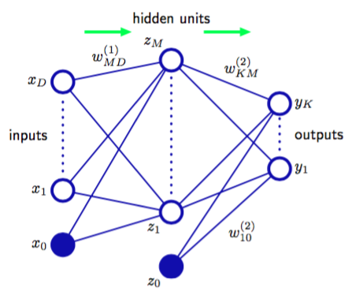
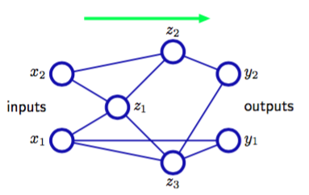
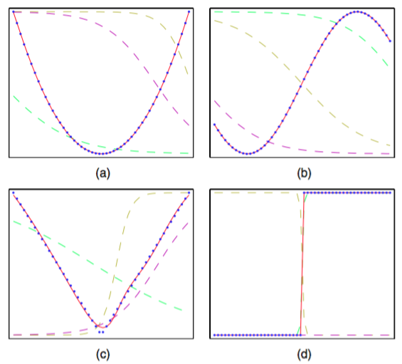
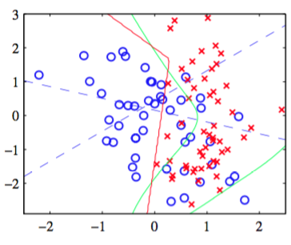

3，4章中分别讨论的线性模型的回归和分类是基于固定非线性基函数$$ \phi_j(x) $$的线性组合，且具有

$$
y(x,w) = f\left(\sum\limits_{j=1}^Mw_j\phi_j(x)\right) \tag{5.1}
$$

其中$$ f(\dot) $$在分类中是非线性激活函数，在回归中是恒等函数。我们的目标是使这些基函数$$ \phi_j(x) $$依赖于参数，从而能在训练阶段调节这些参数及系数$$ \{w_j\} $$来推广这些模型。当然，有许多种方法构造参数化的非线性基函数。神经网络使用与式（5.1）相同形式的基函数，即每个基函数本身是输入的线性组合的非线性函数，其中线性组合的系数是可调节参数。    

这就引入了可以被描述为一系列的函数变换的，基本神经网络模型。首先，我们构造形式为

$$
a_j = \sum\limits_{i=1}^Dw_{ji}^{(1)}x_i = w_{j0}^{(1)} \tag{5.2}
$$

的输入变量$$ x_1,...,x_D $$的$$ M $$个线性组合。其中$$j = 1,...,M $$且上标$$ (1) $$表示对应的参数是神经网络的第一“层”。根据第3章中的命名规则，我们把参数$$ w_{ji}^{(1)} $$称为权重（weights），参数$$ w_{j0}^{(1)} $$称为偏置（biases）。$$ a_j $$称为激活（activations）。它们都使用一个可微的非线性激活函数（activation function）$$ h(\dot) $$进行变换，得到

$$
z_j = h(a_j) \tag{5.3}
$$

这些量对应式（5.1）中的基函数的输出，这些基函数在神经网络中被称为隐含单元（hidden unit）。非线性函数$$ h(\dot) $$通常选择为sigmoidal函数，例如logistic sigmoid函数或双曲正切函数。根据式（5.1）再次线性组合这些值得到输出单元激活（output unit activations）：

$$
a_k = \sum\limits_{j=1}^Mw_{kj}^{(2)}z_j + w_{k0}^{(2)} \tag{5.4}
$$

其中$$ k = 1,...,K $$且$$ K $$是输出的总数。这个变换对应网络的第二层，同样的$$ w_{k0}^{(2)} $$表示偏置参数。最后，输出单元激活通过合适的激活函数变换得到网络的输出集合$$ y_k $$。激活函数是由数据本身以及目标变量的假定分布确定的，并遵循3，4章的线性模型确定激活函数的过程。所以，对于标准的回归问题，激活函数是恒等式$$ y_k = a_k $$。同样的，对于多个二元分类问题，每个输出单元激活使用logistic sigmoid函数进行变换，即

$$
y_k = \sigma(a_k) \tag{5.5}
$$

其中

$$
\sigma(a) = \frac{1}{1+exp(-a)} \tag{5.6}
$$

最后，对于多分类问题，我们使用了式（4.62）给出的softmax激活函数。输出单元激活函数的选择在5.2节中会详细讨论。

我们可以将各个阶段结合，得到整体的网络函数。对于sigmoid输出单元激活函数，整体的网络函数为

$$
y_k(x,w) = \sigma\left(\sum\limits_{j=1}^Mw_{kj}^{(2)}h\left(\sum\limits_{i=1}^Dw_{ji}^{(1)}x_i + w_{j0}^{(1)}\right) + w_{k0}^{(2)}\right) \tag{5.7}
$$

其中，所有权参数和偏置参数被组合到一起记作向量$$ w $$。因此神经网络模型可以简单地看成一个从输入变量$$ \{x_i\} $$到输出变量$$ \{y_k\} $$的非线性函数，并由可调节参数向量$$ w $$控制。    

这个函数可以表示成图5.1展示的网络图的形式

      
图 5.1 网络图    

这样，计算式（5.7）的过程可以看成信息通过网络前向传播（forward propagation）。需要强调的是，因为这些图的内部结点表示的是确定的变量而不是随机变量，所以这并不是第8章将要讨论的概率图模型。由于这个原因，我们为这两个模型采用的稍微不同的图形标记。稍后我们将会看到如何给出神经网络的概率解释。    

正如3.1节中讨论的那样，式（5.2）中的偏置参数可以通过定义一个额外的输入变量$$ x_0 $$（值被固定为$$ x_0 = 1 $$）来吧偏置参数包含在权重参数中，那么（5.2）就变成

$$
a_j = \sum\limits_{i=0}^Dw_{ji}^{(1)}x_i \tag{5.8}
$$

的形式。    

我们同样可以把第二层的偏置包含在第二层的权重中，这样整体的网络函数就变成了：

$$
y_k(x,w) = \sigma\left(\sum\limits_{j=0}^Mw_{kj}^{(2)}h\left(\sum\limits_{i=0}^Dw_{ji}^{(1)}x_i\right)\right) \tag{5.9}
$$

正如从图5.1中可以看到的那样，神经网络模型由两个处理阶段组成，每个阶段都类似于4.1.7节讨论的感知器模型，因此神经网络也被称为多层感知器（multilayer perceptron），或MLP。然而，与感知器模型相比，一个重要的区别是神经网络在隐含单元中使用连续的sigmoid非线性函数，而感知器使用阶梯函数这一非线性函数。这意味着神经网络函数关于神经网络参数是可微的，这个性质在神经网络的训练过程中起着重要的作用。    

如果网络中的所有隐含单元的激活函数都取线性函数，由于连续的线性变换的组合也是是一个线性变换，所以对于这种网络，我们总可以找到一个等价的无隐含单元的网络。然而，如果隐含单元的数量小于输入单元的数量或者小于输出单元的数量，那么网络能够产生的变换不是最一般的从输入到输出的线性变换，因为在隐含单元出的维度降低造成了信息丢失。在12.4.2节，我们将展示线性单元的网络可以引出主成分分析。但是通常情况下，我们对线性单元的多层神经网络几乎不感兴趣。    

图5.1给出的网络结构是在实际中最常用的一个。而且，它很容易扩展。例如，可以增加额外的处理层，每层包含一个由式（5.4）得到的加权线性组合，以及一个使用非线性激活函数进行的元素级别的变换。注意，在文献中，关于计算这种网络的层数，有一些混淆的地方。因此图5.1中的网络可能被描述成一个3层网络（计算单元的层数，把输入当成单元），或有时被当作一个单一隐含层网络（计算隐含单元层的数量）。我们推荐的计算方法是把图5.1的网络称为两层网络，因为这是对于确定网络性质很重要的可调节权值的层数。    

神经网络结构的另一个扩展是引入跨层（skip-layer）链接，每个跨层链接都关联着一个对应的可调节参数。例如，在一个两层的神经网络中，跨层链接可能直接从输入链接到输出。原则上，有着sigmoid隐含单元的网络总能通过使用足够小的第一层权值，从而使得隐含单元几乎是线性的，然后将隐含单元到输出的权值设置为足够大来进行补偿，来模拟跨层链接（对于有界输入值）。然而在实际应用中，显示地包含跨层链接可能会更方便。   

此外，网络可以是稀疏的。稀疏的网络中，并不是所有有可能的链接方式都被链接上。在5.5.6节讨论卷积神经网络时，我们会看到一个稀疏网络的例子。    

由于在网络图和它的数学函数表达式之间有一个直接的对应关系，因此我们可以通过考虑更复杂的网络图来构造更一般的网络映射。然而，这些网络必须被限制为前馈（feed-forward）结构，也就是说，网络中不能存在有向圈，从而确保了输出是输入的确定函数。图5.2用一个简单的例子说明了这一点。

      
图 5.2 网络图    

这样的网络中每个（隐含或输出）单元都计算了一个形式为

$$
z_k = h\left(\sum\limits_jw_{kj}z_j\right) \tag{5.10}
$$

函数。其中，求和的对象是所有向单元$$ k $$发送链接的单元（偏置参数也包含在了求和式当中）。对于一组给定的值作用在神经网络的输入上，不断应用式（5.10）使得网络中所有单元（包括输出单元）的激活都能够被计算出来。

广泛研究前馈网络的近似性质（Funahashi, 1989; Cybenko, 1989; Hornik et al., 1989; Stinchecombe and White, 1989; Cotter, 1990; Ito, 1991; Hornik, 1991; Kreinovich, 1991; Ripley, 1996）这些性质被发现相当通用。因此神经网络被称为通用近似（universal approximator）。
例如，一个带有线性输出的两层网络，只要隐含单元的数量足够多，可以在任意精度下近似任何输入变量较少的连续函数。这个结果对于一大类隐含单元激活函数都成立，但是不包括多项式函数。虽然这些定理是毋庸置疑的，但关键问题是，给定一组训练数据，如何寻找合适的参数值。在本章的后续章节中，我们会说明，基于最大似然方法和贝叶斯方法来高效的解决这个问题。    

图5.3说明了两层网络建模一大类函数的能力。这个图也说明了独立的隐含单元是如何联合地近似最终的函数的。

      
图 5.3 近似能力    

图5.4说明了在一个简单的分类问题中，隐含单元的作用。使用的数据集是附录A中描述的人工生成的分类数据。

      
图 5.4 简单的二分类问题的例子，数据集是人工生成的数据。模型为神经网络，网络具有两个输入结点，两个带有$$ tanh $$激活函数的隐含单元，以及带有logistic sigmoid激活函数的一个输出单元。蓝色虚线表示每个隐含单元的$$ z = 0.5 $$的轮廓线，红线表示网络的$$ y = 0.5 $$的决策面。为了对比，绿线表示根据生成数据的概率分布计算出的最优决策边界。    
