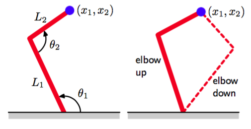
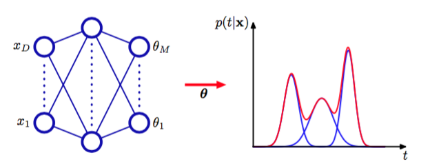
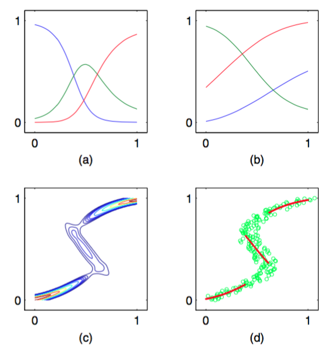

有监督学习的目标是对条件概率分布$$ p(t|x) $$建模。对于许多简单的回归问题来说，这个分布都被设为高斯分布。然而，实际的机器学习问题中，经常会遇到与高斯分布差别相当大的概 率分布。如，在逆问题（inverse problem）中，概率分布可以是多峰的，这种情况下，高斯分布的假设就会产生相当差的预测结果。    

作为逆问题的一个简单的例子，考虑机械臂的运动学问题，如图5.18所示。

      
图 5.18 左图给展示了一个具有两个连接的机械臂，其中，末端的笛卡尔坐标$$ (x_1,x_2) $$由两个连接角$$ \theta_1, \theta_2 $$以及机械臂的（固定）长度$$ L_1,L_2 $$唯一确定。这被称为机械臂的正向运动学（forward kinematics）。在实际应用中，我们必须寻找给出所需的末端位置的连接角，如右图所示。这个逆向运动学（inverse kinematics）有两个对应的解，即“肘部向上”和“肘部向下”。    

正向问题（forward problem）是在给定连接角的情况下求解机械臂末端的位置，这个问题有唯一解。然而，在实际应用中，我们想把机械臂末端移动到一个具体的位置。为了完成移动，我们必须设定合适的连接角。于是，我们需要求解逆问题，它有两个解，如图5.18所示。    

正向问题通常对应于物理系统的因果关系，通常有唯一解。例如，人体的某个具体的症状是由于特定的疾病造成的。然而在模式识别中，我们通常不得不求解逆问题，例如在给定症状的情况下，推断疾病的种类。如果正向问题涉及到多对一的映射，那么逆问题就会有多个解。例如，多种不同的疾病可能会导致相同的症状。    

在机械臂的例子中，运动由几何方程定义，多峰的性质是显然的。然而，在许多机器学习问题中，尤其是涉及到高维空间的问题中，多峰性质的存在并不显然。但是，为了教学的目的，我们会考虑一个相当简单的问题，这个问题中我们可以很容易地看出多峰性质。这个问题的数据的生成方式为:对服从区间$$ (0, 1) $$的均匀分布的变量$$ x $$进行取样，得到一组值$$ \{x_n\} $$，对应的目标值$$ t_n $$通过下面的方式得到：计算函数$$ x_n + 0.3\sin(2\pi x_n) $$，然后添加一个服从$$ (−0.1, 0.1)
$$上的均匀分布的噪声。这样，就可以通过使用相同的数据点，但是交换$$ x, t $$的角色来得到逆问题。图5.19给出了正向问题和逆问题的数据集，以及一个两层神经网络给出的结果。

      
图 5.19 左图是一个简单的“正向问题”的数据集，其中红色曲线给出了通过最小化平方和误差函数调节一个两层神经网络的结果。对应的逆问题，如右图所示，通过交换$$ x,t $$的顺序的方式得到。这里，因为数据集是多峰的，所以通过最小化平方和误差函数的方式训练的神经网络给出了对数据的非常差的拟合。

这个两层的神经网络有6个隐含单元，一个线性输出单元，误差函数为平方和误差函数。在高斯分布的假设下，最小平方方法对应于最大似然方法。我们看到，对于不服从高斯分布的逆问题，这种解法产生的模型非常差。    

于是，我们通过为$$ p(t|x) $$使用一个混合模型，模型的混合系数和每个分量的概率分布都是输入向量$$ x $$的一个比较灵活的函数来找到一个对条件概率密度建模的一般的框架。这就构成了混合密度网络（mixture density network）。对于任意给定的$$ x $$值，混合模型提供了一个通用的形式,用来对任意条件概率密度函数$$ p(t|x) $$进行建模。假设我们考虑一个足够灵活的网络，那么我们就有了一个近似任意条件概率分布的框架。    

这里，我们显式地令模型的分量为高斯分布，即    

$$
p(t|x) = \sum\limits_{k=1}^K\pi_k(x)\mathcal{N}(t|\mu_k(x),\sigma_k^2(x)I) \tag{5.148}
$$

这是异方差模型（heteroscedastic model）的一个例子，因为数据中的噪声方差是输入向量$$ x $$的一个函数。我们也可以使用高斯分布以外的其他分布，如，如果目标变量是二值的而不是连续的，我们就可以使用伯努利分布。我们已经把情况具体到了各向同性的协方差的情形，虽然可以通过使用Cholesky分解（Williams,
1996）表示协方差的方式，将混合密度网络扩展到可以处理更一般的协方差的情形。即使每个分量的方差是各向同性的，但是我们仍然不能假设条件概率分布$$ p(t|x) $$能够关于t的分量进行分解（这与标准的平方和回归模型不同），这是由于概率分布是一个混合分布。    

我们现在为混合模型取各种不同的参数，这些参数包括混合系数$$ \pi k(x) $$、均值$$ \mu_k(x) $$以及方差$$ \sigma_k^2(x) $$，这些参数控制了以$$ x $$作为输入的神经网络的输出。这个混合密度网络的结构如图5.20所示。混合密度网络与14.5.3节讨论的混合专家的关系十分紧密。主要的区别是，混合密度网络使用相同的函数来预测所有分量概率分布的参数以及混合参数，因此非线性隐含单元被依赖于输入的函数所共享。    

图5.20所示的神经网络可以是一个具有$$ S $$形（双曲正切）隐藏单元的两层的网络。

      
图 5.20 混合密度网络（mixture density network）

如果混合模型（5.148）中有$$ K $$个分量，且$$ t $$有$$ L $$个分量，那么网络就会有$$ K $$个输出单元激活（记作$$ a_k^\pi $$ ）确定混合系数$$ \pi_k(x) $$，有$$ K $$个输出（记作$$ a_k^\sigma $$）确定核宽度$$ \sigma_k(x) $$，有$$ K \times L $$个输出（记作$$ a_{kj}^\mu $$)确定核中心$$ \mu_k(x) $$的分量$$ \mu_{kj}(x) $$。网络输出的总数为$$ (L + 2)K $$，这与通常的网络的$$ L $$个输出不同。通常的网络只是简单地预测目标变量的条件均值。

混合系数必须满足

$$
\sum\limits_{k=1}^K\pi_k(x) = 1, 0 \leq \pi_k(x) \leq 1  \tag{5.149}
$$

的限制。可以通过使用一组softmax输出来实现。

$$
\pi_k(x) = \frac{exp(a_k^\pi)}{\sum_{l=1}^K exp(a_l^\pi)} \tag{5.150}
$$

同样的，方差必须满足$$ \sigma_k^2(x) \geq 0 $$，因此可以使用对应的网络激活的指数形式表示：

$$
\sigma_k(x) = exp(a_k^\sigma) \tag{5.151}
$$

最后，由于均值$$ \mu_k(x) $$有实数分量，因此它们可以直接用网络的输出激活表示

$$
\mu_{kj}(x) = a_{kj}^\mu \tag{5.152}
$$

混合密度网络的可调节参数由权向量$$ w $$和偏置组成。这些参数可以通过最大似然法确定，或等价地，使用最小化误差函数（负对数似然函数）的方法确定。对于独立的数据，误差函数的形式为

$$
E(w) = -\sum\limits_{n=1}^N\ln\left\{\sum\limits_{k=1}^K\pi_k(x_n,w)\mathcal{N}(t_n|\mu_k(x_n,w),\sigma_k^2(x_n,w)I)\right\} \tag{5.153}
$$

其中，我们显式地写出了误差函数对于$$ w $$的依赖。    

为了最小化误差函数，我们需要计算误差函数$$ E(w) $$关于$$ w $$的分量的导数。如果我们得到了误差函数关于输出单元激活的导数的表达式，那么我们就可以通过标准的反向传播方法来计算误差函数关于$$ w $$的分量的导数。误差函数关于输出单元激活的导数代表了每个模式和每个输出单元的误差信号$$ \sigma
$$并且可以反向传播到隐含单元，从而误差函数的导数可以按照通常的方式进行计算。由于误差函数（5.153）由一组项的求和式构成，每一项都对应一个训练数据点，因此我们可以考虑对于特定的模式$$ n $$的导数，然后通过求和的方式找到$$ E $$的导数。    

由于我们处理的是混合概率分布，因此比较方便的做法是把混合系数$$ \pi_k(x) $$看成与$$ x $$相关的先验概率分布，从而就引入了对应的后验概率，形式为     

$$
\gamma_{nk} = \gamma_k(t_n|x_n) = \frac{\pi_k\mathcal{N}_{nk}}{\sum_{l=1}^K\pi_l\mathcal{N}_{nl}} \tag{5.154}
$$

其中$$ \mathcal{N}_{nk} $$表示$$ \mathcal{N}(t_n|\mu_k(x_n),\sigma_k^2(x_n)) $$。    

关于控制混合系数的网络输出激活的导数为    

$$
\frac{\partial E_n}{\partial a_k^\pi} = \pi_k - \gamma_{nk} \tag{5.155}
$$

类似地，关于控制分量均值的网络输出激活的导数为

$$
\frac{\partial E_n}{\partial a_{kl}^\mu} = \gamma_k\left\{\frac{\mu_{kl} - t_{nl}}{\sigma_k^2}\right\} \tag{5.156}
$$

最后，关于控制分量方差的网络激活函数为    

$$
\frac{\partial E_n}{\partial a_k^\sigma} = \gamma_{nk}\left\{L-\frac{\Vert t_n - \mu_k \Vert^2}{\sigma_k^2}\right\} \tag{5.157}
$$

我们回到图5.19所示的逆问题的简单例子，来说明混合密度网络的应用。图5.21给出了混合系数$$ \pi_k(x) $$、均值$$ \mu_k(x) $$和对应于$$ p(t|x) $$的条件概率等高线。

      
图 5.21  (a)对于使用图5.19给出的数据训练的混合密度网络的三个核函数，混合系数$$ \pi_k(x) $$与$$ x $$的函数关系图像。模型有三个高斯分量，使用了一个多层感知器，在隐含层有五个“tanh”单元，同时有9个输出单元（对应于高斯分量的3个均值、3个方差以及3个混合系数）。在较小$$ x $$值和较大的$$ x $$值处，目标数据的条件概率密度是单峰的，对于它的先验概率分布，只有一个核具有最大的值。而在中间的$$ x $$值处，条件概率
分布具有3个峰，3个混合系数具有可比的值。(b)使用与混合系数相同的颜色表示方法来表示均值$$ \mu_k(x) $$。 (c)对于同样的混合密度网络，目标数据的条件概率密度的图像。(d)条件概率密度的近似条件峰值的图 像，用红色点表示。

神经网络的输出，即混合模型的参数，是输入变量的连续单值函数。然而，从图5.21(c)中我们可以看到，通过调整混合分 量$$ \pi_k(x) $$的大小，模型能够产生一个对于某些$$ x $$是单峰的，而对于其它$$ x $$值是多峰的概率分布。    

一旦混合密度网络训练结束，它就可以预测对于任意给定的输入向量的目标数据的条件密度函数。只要我们关注的是预测输出向量的值的问题，那么这个条件概率密度就能完整地描述用于生成数据的概率分布。根据这个概率密度函数，我们可以计算不同应用中我们感兴趣的更加具体的量。一个最简单的量就是目标数据的条件均值：    

$$
\mathbb{E}[t|x] = \int tp(t|x)dt = \sum\limits_{k=1}^K\pi_k(x)\mu_k(x) \tag{5.158}
$$

其中我们使用了式（5.148）。由于使用最小平方方法训练的标准的神经网络近似了条件均值，因此我们看到作为一个特例，混合密度网络可以复制传统的最小平方的结果。当然，正如我们已经注意到的那样，对于一个多峰分布，条件均值是一个受限的值。    

同样的，我们可以利用条件均值的结果，计算密度函数的方差：    

$$
\begin{eqnarray}
s^2(x) &=& \mathbb{E}[\Vert t- \mathbb{E}[t|x] \Vert^2|x] \tag{5.159} \\
&=& \sum\limits_{k=1}^K\pi_k(x)\left\{\sigma_k^2(x) + \Vert \mu_k(x) - \sum\limits_{l=1}^K\pi_l(x)\mu_l(x)\Vert^2\right\} \tag{5.160}
\end{eqnarray}
$$    

其中我们使用了式（5.148）和（5.158）。与对应的最小平方结果相比，因为方差是$$ x $$的一个函数，所以这个结果更一般。     

我们已经看到，对于多峰分布，用条件均值描述数据的效果很差。例如，在图5.18给出的控制机械臂的例子中，我们需要从两个可能的连接角中选出一个，来得到所需的末端位置。在这种情况下，条件众数可能更有价值。由于混合密度网络的条件众数没有一个简单的解析解，因此需要数值迭代。一个简单的替代方法是取每个$$ x $$对应的最可能分量（即具有最大混合系数的分量）的均值。对于之前的那个简单的例子，图5.21(d)给出了这个结果。
