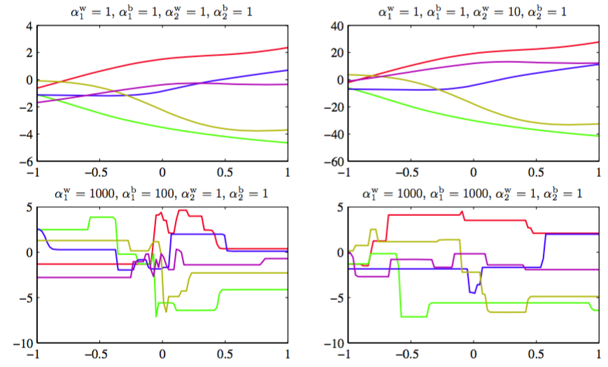

式（5.112）给出的简单权值衰减的一个局限性是，它与网络映射的确定缩放性质不一致。为了说明这一点，考虑具有两层权值和线性输出单元的多层感知网络，它给出了从输入变量集合$$ \{x_i\} $$到输出变量集合$$ \{y_k\} $$的映射。第一个隐藏层的隐藏单元的激活的形式为

$$
z_j = h\left(\sum\limits_i w_{ji}x_i + w_{j0}\right) \tag{5.113}
$$

输出单元的激活由

$$
y_k = \sum\limits_j w_{kj}z_j + w_{k0} \tag{5.114}
$$

给出。假设我们对输入变量进行一个形式为

$$
x_i \to \tilde{x}_i = ax_i + b \tag{5.115}
$$

线性变换。然后我们可以根据这个映射对网络，从输入单元到隐含层单元的权值和偏置也进行一个对应的形式为

$$
\begin{eqnarray}
w_{ji} \to \tilde{w}_{ji} = \frac{1}{a}w_{ji} \tag{5.116} \\
w_{j0} \to \tilde{w}_{j0} = w_{j0} - \frac{b}{a}\sum\limits_iw_{ji} \tag{5.117}
\end{eqnarray}
$$

线性变换，使得网络给出的映射不变。同样的，网络的输出变量的线性变换

$$
y_k \to \tilde{y}_k = cy_k + d \tag{5.118}
$$

可以通过对第二层的权值和偏置使用形式为

$$
\begin{eqnarray}
w_{kj} \to \tilde{w}_{kj} &=& cw_{kj} \tag{5.119} \\
w_{k0} \to \tilde{w}_{k0} &=& cw_{k0} + d \tag{5.120}
\end{eqnarray}
$$

线性变换达到。    

如果我们分别用原始数据、输入和（或）目标变量通过上面线性变换做变换后的数据来训练网络，那么一致性要求两个网络应该是等价的，差别仅在于上面给出的权值的线性变换。每个正则化项都应该与这个性质一致，否则模型就会倾向于选择某个解，而忽视某个等价的解。显然，简单的权值衰减（5.112）由于把所有的权值和偏置同等对待，因此不满足这个性质。    

于是我们要寻找一个正则化项，它在线性变换（5.116）、（5.117）、（5.119）和（5.120）下具有不变性。这需要正则化项应该对于权值的重新缩放不变，对于偏置的平移不变。这样的正则化项由    

$$
\frac{\lambda_1}{2}\sum\limits_{w\in W_1} w^2 + \frac{\lambda_2}{2}\sum\limits_{w\in W_2} w^2 \tag{5.121}
$$

其中，$$ W_1 $$表示第一层的权值集合，$$ W_2 $$表示第二层的权值集合，且偏置被排除在求和式外。这个正则化项在正则化参数在使用$$ \lambda_1 \to a^{1/2}\lambda_1, \lambda_2 \to c^{-1/2}\lambda_2 $$进行缩放的权值变换下，正则项不会发生变化。    

正则化项（5.121）对应

$$
p(w|\alpha_1, \alpha_2) \propto exp\left(-\frac{\alpha_1}{2}\sum\limits_{w \in W_1}w^2 - \frac{\alpha_2}{2}\sum\limits_{w \in W_2}w^2\right) \tag{5.122}
$$

这样形式的先验。    

注意，这种形式的先验因为偏置参数没有限制，所以是反常的（improper）（不能够被标准化）。使用反常先验使得对应的模型证据等于零，从而会给正则化系数的选择，或贝叶斯框架下的模型比较，造成很大的困难。因此，通常的做法是包含一个有着自己单独的一套超参数的偏置的先验（这就破坏了平移不变性）。为了说明四个超参数的效果，我们首先从先验中抽取样本，然后画出了对应的神经网络函数，如图5.11所示。

      
图 5.11 控制两层神经网络的权值和偏置的先验概率分布的超参数的效果说明    

更一般地，我们可以考虑权值被分为任意数量的组$$ W_k $$的情况下的先验，即    

$$
p(w) \propto exp\left(-\frac{1}{2}\sum\limits_k\alpha_k\Vert w \Vert_k^2\right) \tag{5.123}
$$

其中

$$
\Vert w \Vert_k^2 = \sum\limits_{j \in W_k}w_j^2 \tag{5.124}
$$

作为这种形式的先验的一个特殊情况，如果我们将每个输入单元关联的权值设为一个分组，且关于对应的参数$$ \alpha_k $$最优化边缘似然函数，那么我们就得到了将在7.2.2节讨论的自动相关性确定（automatic relevance determination）的方法。    

