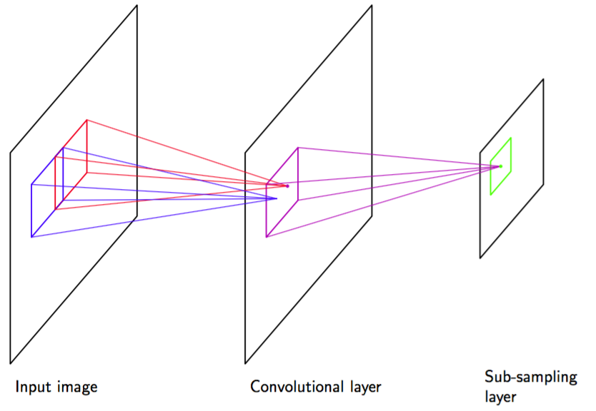

另一种构造在输入变量的变换下具有不变性的模型的方法是将不变性的性质融入到神经网络结构的构建中。这是卷积神经网络（convolutional neural network）（LeCun et al., 1989; LeCun et al., 1998）的基础，它被广泛的应用于图像处理领域。    

考虑手写数字识别这个具体的任务。每个输入图像由一组像素的灰度值组成，输出为10个数字类别的后验概率分布。我们知道，数字的种类对于平移、缩放以及（微小的）旋转具有不变性。此外，网络还必须对一些更微妙的变换具有不变性，如图5.14所示的弹性形变。一种简单的方法是把图像作为一个完全连接的神经网络的输入，如图5.1所示的网络。假设数据集充分大，那么这样的网络原则上可以得到这个问题的一个较好的解，从而可以从样本中学习到恰当的不变性。    

然而，这种方法忽略了图像的一个关键性质，即距离较近的像素的相关性要远大于距离较远的像素的相关性。计算机视觉领域中，许多现代的方法通过抽取只依赖于图像里小的子区域的局部特征的方式来利用这个性质。之后，来自这些特征的信息就可以融合到后续处理阶段中，来检测更高级的特征，最后产生图像整体的信息。并且，对于图像的一个区域有用的局部特征可能对于图像的其他区域也有用，例如感兴趣的物体发生平移的情形。    

通过(1)局部接收场，(2)权值共享，(3)二次采样这三种方式，可以把这些想法整合到了卷积神经网络中。卷积网络的结构如图5.17所示。

      
图 5.17 卷积神经网络的一个例子，给出了一层卷积单元层跟着一个二次采样单元层。可能连续使用这种层对。

在卷积层，各个单元被组织在一系列被称为特征地图（feature map）的平面中。每个特征地图中单元只从图像的一个小的子区域接收输入，且特征地图中的所有单元被限制为共享相同的权值。如，一个特征地图可能由100个单元组成，这些单元被放在了$$ 10 \times 10 $$的网格中，每个单元接受图像中一个$$ 5 \times 5
$$的像素块的输入。因此，整个特征地图就有25个可调节的权值参数，加上一个可调节的偏置参数。来自一个像素块的输入值通过权值和偏置进行线性组合，其结果通过式（5.1）给出的$$ S
$$形非线性函数进行变换。如果我们把每个单元想象成特征检测器，那么特征地图中的所有单元都检测了输入图像中位置不同的相同的模式。由于权值共享，这些单元的激活计算等价于图像像素的灰度值与权向量组成的“核”进行卷积。如果输入图像发生平移，那么特征地图的激活也会发生等量的平移，否则就不发生改变。这提供了神经网络输出对于输入图像的平移和变形的（近似）不变性的基础。由于我们通常需要检测多个特征来构造一个有效的模型，因此通常在卷积层会有多个有自己的权值和偏置参数的特征地图。

卷积单元的输出构成了网络的二次采样层的输入。对于卷积层的每个特征地图，有一个二次采样层的单元组成的平面，且二次采样层的每个单元从对应的卷积层的特征地图中的一个小的接收场接收输入。这些单元执行二次采样。例如，每个二次采样单元可能从对应的特征地图中的一个$$ 2 \times 2 $$单元的区域中接收输入，然后计算这些输入的平均值，乘以一个可调节的权值和可调节的偏置参数，然后使用$$ S
$$形非线性激活函数进行变换。选择的接收场是连续的、非重叠的，从而二次采样层的行数和列数都是卷积层的一半。使用这种方式，二次采样层的单元的结果对于对应的输入空间区域中的图片的微小平移相对不敏感。    

在实际构造中，可能有若干卷积层和二次采样层对。在每个阶段，与前一层相比，都会有一个更高层次的关于输入变换的不变性。在一个给定的卷积层中，对于每个由前一个二次采样层的单元构成的平面，可能存在若干个特征地图，从而空间分辨率的逐层减小就可以通过增加特征的数量进行补偿。网络的最后一层通常是完全连接的，是一个完全可调节的层。在多分类问题中，输出层使用的是softmax非线性函数。   

整个网络可以使用误差函数最小化的方法计算。误差函数梯度的计算可以使用反向传播算法。这需要对一般的反向传播算法进行微小的修改，来确保共享权值的限制能够满足。由于使用局部接收场，网络中权值的数量要小于完全连接的网络的权值数量。此外，由于权值上的大量限制，需要从训练数据中学习到的独立参数的数量仍然相当小。
