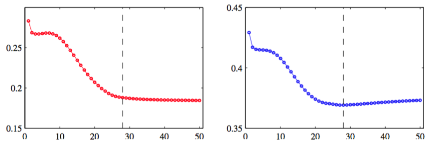
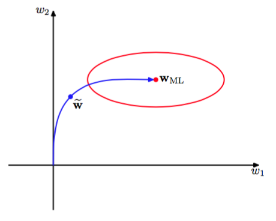

另一种控制网络的复杂度的正则化方法是早期停止（early stopping）。非线性网络模型的训练对应于关于训练数据集定义的误差函数的迭代减小。对于许多用于网络训练的最优化算法（如共轭梯度法），误差函数是一个关于迭代次数的非增函数。然而，在独立数据（通常被称为验证集）上测量的误差，通常会首先减小，然后由于模型开始过拟合而逐渐增大。于是，训练过程可以在关于验证集误差最小的点停止，如图5.12所示。

      
图 5.12 训练集误差（左图）和验证集误差（右图）在一般的训练阶段的行为说明。

这样就可以得到一个有着较好泛化性能的网络。   

这种情况下，网络的行为有时可以通过网络的自由度有效数量来定量描述。自由度有效数量开始时很小，然后在训练过程中增长，对应于模型复杂度的持续增长。这样，在训练误差达到最小值之前停止训练就表示了一种限制模型复杂度的方式。    

在二次误差函数的情况下，我们可以验证这种直观的描述，并说明早期停止的效果与使用简单的权值衰减的正则化项的效果类似。这可以通过图5.13来理解。图5.13中，权值空间的坐标轴已经进行了旋转，使得坐标轴平行于Hessian矩阵的特征向量。

      
图 5.13 在二次误差函数的情况下，早期停止给出与权值衰减类似的结果的说明。

在没有权值衰减的情况下，如果权向量开始于原点，且在训练过程中沿着局部负梯度向量确定的路径移动，那么权向量从最开始平行于$$ w_2 $$轴的位置，移动到大致对应$$ \tilde{w} $$的位置，然后向最小化误差函数的位置$$ w_{ML} $$移动。这可以从误差曲面和Hessian矩阵的特征值得出。于是，在点$$ \tilde{w} $$附近停止就类似于权值衰减。早期停止和权值衰减之间的关系可以定量描述，这说明了$$ \tau\eta $$（其中$$ \tau $$是迭代次数，$$ \eta
$$是学习率参数）扮演了正则化参数$$ \lambda $$的倒数的角色。于是网络中有效参数的数量会在训练过程中增长。

