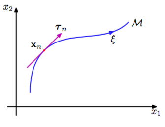
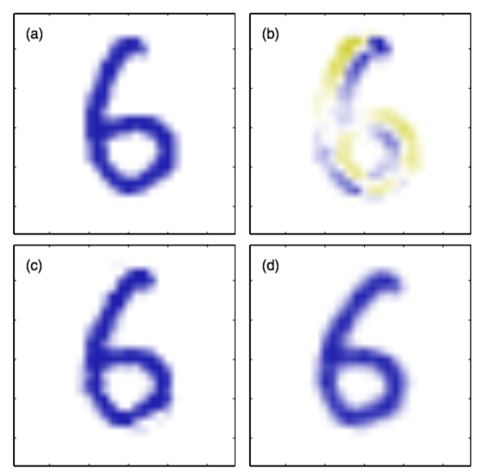

通过切线传播（tangent propagation）方法，我们可以使用正则化来让模型对于输入的变换具有不变性（Simard et al., 1992）。对于一个特定的输入向量$$ x_n $$，考虑变换产生的效果。假设变换是连续的（如平移或旋转，而不是镜像翻转），那么变换的模式会扫过$$ D $$维输入空间的一个流形$$ M $$。图5.15说明了$$ D = 2 $$的情形。

      
图 5.15 二维输入空间的例子，展示了在一个特定的输入向量$$ x_n $$上的连续变换的效果。一个参数为连续变量$$ \xi $$的一维变换作用于$$ x_n $$上会使它扫过一个一维流形$$ M $$。局部来看，变换的效果可以用切向量$$ \tau_n $$来近似。

假设变换由单一参数$$ \xi $$控制（如$$ \xi $$可能是旋转的角度）。那么被$$ x_n $$扫过的子空间$$ M $$是一维的，且以$$ \xi $$为参数。令这个变换作用于$$ x_n $$上产生的向量为$$ s(x_x, \xi) $$，且$$ s(x,0) = x $$。这样曲线$$ M $$的切线就由方向导数$$ \tau = \partial x $$给出，且点$$ x_n $$处的切线向量为：    

$$
\tau_n = \left.\frac{\partial s(x_n, \xi)}{\partial \xi}\vphantom{\Big|}\right| _{\xi = 0} \tag{5.125}
$$

对于输入向量进行变换之后，网络的输出通常会发生变化。输出$$ k $$关于$$ \xi $$的导数为    

$$
\left.\frac{\partial y_k}{\partial \xi}\vphantom{\Big|}\right| _{\xi = 0} = \sum\limits_{i=1}^D\frac{\partial y_k}{\partial x_i}\left.\frac{\partial x_i}{\partial \xi}\vphantom{\Big|}\right| _{\xi = 0} = \sum\limits_{i=1}^DJ_{ki}\tau_i \tag{5.126}
$$

其中$$ J_ki $$为Jacobian矩阵$$ J $$的第$$ (k, i) $$个元素，正如5.3.4节讨论的那样。式（5.126）给出的结果可以用于修改标准的误差函数：给原始的误差函数$$ E $$增加一个正则化函数$$ \omega $$得到下面形式的误差函数

$$
\tilde{E} = E + \lambda\omega \tag{5.127}
$$

使得在数据点的邻域之内具有不变性。其中$$ \lambda $$是正则化系数，且

$$
\omega = \frac{1}{2}\sum\limits_n\sum\limits_k\left(\left.\frac{\partial y_{nk}}{\partial \xi}\vphantom{\Big|}\right| _{\xi = 0}\right)^2 = \frac{1}{2}\sum\limits_n\sum\limits_k\left(\sum\limits_{i=1}^DJ_{nki}\tau_{ni}\right)^2 \tag{5.128}
$$

当网络映射函数在每个模式向量的邻域内都具有变换不变性时，正则化函数等于零。$$ \lambda $$的值确定了训练数据和学习不变性之间的平衡。    

在实际执行过程中，切线向量$$ \tau_n $$可以通过即将原始向量$$ x_n $$从使用了小的$$ \xi $$进行变换后的对应的向量中减去，再除以$$ \xi $$进行有限差近似。图5.16阐述了这个过程。    

      
图 5.16 (a)原始的手写数字x，(b)对应于无穷小顺时针旋转的切向量$$ \tau $$，其中蓝色和黄色分别对应于正值和负值，(c)将来自这个切向量的微小贡献作用于原始图像的结果，得到了$$ x + \epsilon\tau $$ ，其中$$ \epsilon = 15 $$度。(d)真实的图像旋转，用作对比。

正则化函数通过Jacobian矩阵$$ J $$对网络的权值产生依赖。通过对5.3节中讨论的方法进行推广，计算正则化项关于网络权值的导数的反向传播公式可以很容易地得到。如果变换由$$ L $$个参数控制（如，对于二维图像的平移变换与面内旋转变换项结合），那么流形$$ M $$的维度为$$ L
$$，对应的正则化项由形如式（5.128）的项求和得到，每个变换都对应求和式中的一项。如果同时考虑若干个变换，且让网络映射对于每个变换分别具有不变性，那么对于变换的组合来说就会具有（局部）不变性）Simard et al., 1992）。    

一个被称为切线距离（tangent distance）相关技术，可以用来构造基于距离的方法（如最近邻分类器）的不变性（Simard et al., 1993）。    

