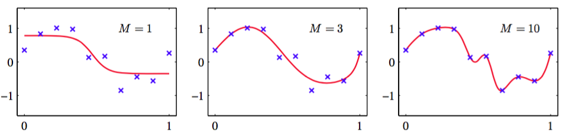
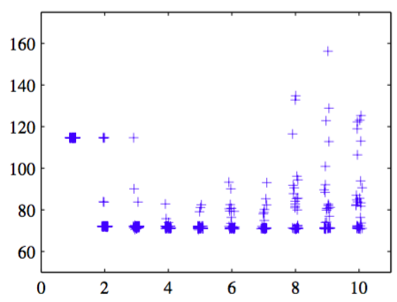

神经网络的输入输出数量通常由数据集的维数确定，其中隐藏单元的数量$$ M $$是自由参数，可以调节来给出最好的预测表现。注意，这个$$ M $$控制了网络中参数（权值和偏置）的数量，所以我们期望最大似然能给出一个在欠拟和过拟之间做最好平衡的能得到最好泛化表现的$$ M $$的值。图5.9给出了不同的$$ M $$值对于正弦曲线回归问题的结果。    

      
图 5.9 两层神经网络的正弦曲线回归问题    

然而，由于误差函数中存在局部极小值，所以泛化误差与$$ M $$的关系不是一个简单的函数关系，如图5.10所示。

      
图 5.10 展示了多项式数据集的平方和测试误差与网络中隐藏单元数量间的关系    

这里，我们看到了对于不同的$$ M $$值，权值的多次随机初始化的影响。当$$ M = 8 $$的某个特定解在验证集上有整体最优表现。在实际应用中，选择$$ M $$的一种方法就是画一张类似图5.10的图，然后选择有最小验证集误差的具体的解。    

然而，有一些其它的方法来控制神经网络模型的复杂度从而避免过拟问题。根据我们第1章中对多项式曲线拟合问题的讨论，我们知道，一种方法是选择一个相对较大的$$ M $$值，然后通过给误差函数加上一个正则化项来控制模型的复杂度。最简单的正则化项是二次的，给出了形式为

$$
\tilde{E}(w) = E(w) + \frac{\lambda}{2}w^Tw \tag{5.112}
$$

的正则化的误差函数。这个正则化项也被称为权值衰减（weight decay），已经在第3章中详细的讨论过了。这样，模型复杂度可以通过选择正则化系数$$ \lambda $$来确定。正如我们之前看到的那样，正则化项可以表示为权向量$$ w $$上的0均值高斯先验分布的负对数。
