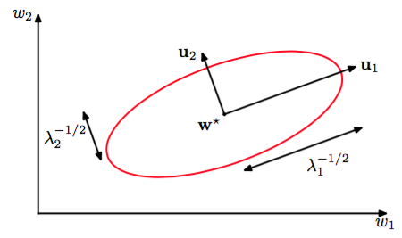

考虑局部二次近似可以让我们更深入的认识最优化问题，得到更多解决这个问题的技术。    

考虑$$ E(w) $$在权空间中某个点$$ \hat{w} $$处的泰勒展开

$$
E(w) \simeq E(\hat{w}) + (w-\hat{w})^Tb + \frac{1}{2}(w-\hat{w})^TH(w-\hat{w}) \tag{5.28}
$$

其中我们省略了立方和更高阶的项。这里定义$$ b $$为$$ E $$的梯度在$$ \hat{w} $$处的值    

$$
b \equiv \nabla E|_{w=\hat{w}} \tag{5.29}
$$

且Hessian矩阵$$ H = \nabla\nabla E $$具元素

$$
(H)_{ij} \equiv \left.\frac{\parital E}{\partial w_i\partial w_j}\vphantom{\Big|}\right|_{w=\hat{w}} \tag{5.30}
$$

根据式（5.28）梯度对应的局部近似由

$$
\nabla E \simeq b + H(w-\hat{w}) \tag{5.31}
$$

对于距离$$ \hat{w} $$充分近的点$$ w $$，这些表达式对误差函数和它的梯度给出了合理的近似。    

考虑在误差函数最小值的点$$ w^* $$附近的局部二次近似的特殊情况。这种情况下，由于在$$ w^* $$处$$ \nabla E = 0 $$，所以没有线性项，式（5.28）变成

$$
E(w) = E(w^*) + \frac{1}{2}(w-w^*)^TH(w-w^*) \tag{5.32}
$$

其中Hessian矩阵$$ H $$是在$$ w^* $$处计算的。为了以几何方式来解释，考虑Hessian矩阵的特征方程

$$
Hu_i = \lambda_iu_i \tag{5.33}
$$

其中特征向量$$ u_i $$构成了完备正交集（附录C），即

$$
u_i^Tu_j = \delta_{ij} \tag{5.34}
$$

现在，我们展开$$ (w - w^*) $$得到特征向量的线性组合形式    

$$
w - w^* = \sum\limits_i \alpha_iu_i \tag{5.35}
$$

这可以解释成，原点变成了点$$ w^* $$，并旋转坐标轴与特征向量对齐（通过以$$ u_i $$为列的正交矩阵）的坐标系统变换，在附录C中有更详细的讨论。把式（5.35）代入式（5.32）并使用式（5.33）及（5.34）得到误差函数可以写成

$$
E(w) = E(w^*) + \frac{1}{2}\sum\limits_i\lambda_i\alpha_i^2 \tag{5.36}
$$

的形式。    

矩阵$$ H $$是正定的，当且仅当    

$$
v^THv > 0, for all v \neq 0 \tag{5.37}
$$

因为特征向量$$ \{u_i\} $$组成了一个完备集，所以任意一个向量$$ v $$都可以写成

$$
v = \sum\limits_ic_iu_i \tag{5.38}
$$

的形式。    

根据（5.33）（5.34）得到

$$
v^THv = \sum\limits_ic_i^2\lambda_i \tag{5.39}
$$

所以，当且仅当所有特征值为正的时候$$ H $$是正定的。图5.6展示了，在新的坐标系统中，基向量由特征向量$$ \{u_i\} $$给出，$$ E $$的等高线是以原点为中心的椭圆。

      
图 5.6 在最小值$$ w^* $$的邻域中，误差函数的二次函数近似

对于1维权空间，当

$$
\left.\frac{\partial^2E}{\partial w^2}\vphantom{\Big|}\right| _{w^*} > 0 \tag{5.40}
$$

时，驻点$$ w^* $$是最小值。对于$$ D $$维权空间$$ w^* $$处的Hessian矩阵是正定时，驻点$$ w^* $$是最小值。    

