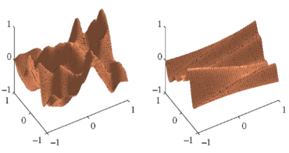
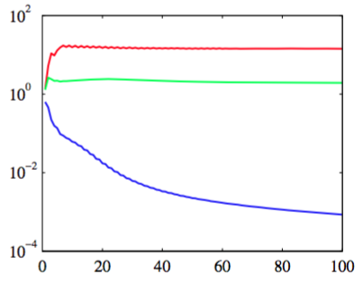

在前一节里，我们看到最大似然方法如何被用于确定高斯过程中的长度缩放参数的值。通过为每个输入变量整合一个单独的参数，这种方法可以很有用地推广（Rasmussen and Williams, 2006）。正如我们将看到的那样，这样做的结果是，通过最大似然方法进行的参数最优化，能够将不同输入的相对重要性从数据中推断出来。这是高斯过程中的自动相关性确定（automatic relevance detemination）或ARD的一个例子。它起源于神经网络的框架（MacKay, 1994;
Neal, 1996）。这种方法倾向于选择合适的输入的机理在7.2.2节讨论。    

考虑二维输入空间$$ x = (x_1,x_2) $$，有一个形式为：

$$
k(x,x') = \theta_0 exp\left\{-\frac{1}{2}\sum\limits_{i=1}^2\eta_i(x_i - x_i')^2\right\} \tag{6.71}
$$

的核函数。图6.9给出了两个不同的精度参数$$ \eta_i $$的设定下，$$ y(x) $$的先验概率分布。

      
图 6.9 来自高斯过程的ARD先验的样本，其中核函数由式（6.71）给出。左图对应于$$ \eta_1 = \eta_2 = 1 $$，右 图对应于$$ \eta_1 = 1, \eta_2 = 0.01 $$。    

我们看到，随着特定的$$ \eta_i $$的减小，函数逐渐对对应的输入变量$$ x_i $$不敏感。通过使用最大似然法按照数据集调整这些参数，它可以检测到对于预测分布几乎没有影响的输入变量，因为对应的ηi会很小。这在实际应用中很有用，因为它使得这些输入可以被遗弃。图6.10使用一个具有三个输入$$ x_1, x_2, x_3 $$的简单人造数据集来说明ARD（Nabney, 2002）。

      
图 6.10 高斯过程的自动相关性检测的例子。数据集是人工生成的数据集，由三个输入$$ x_1, x_2, x_3 $$。曲线表示对应的超参数的值与最优化边缘似然函数时的迭代次数的关系，红色表示$$ \eta_1 $$，绿色表示$$ \eta_2 $$，蓝色表示$$ \eta_3 $$。细节在正文中给出。注意垂直轴的对数标度。 

目标变量$$ t $$是通过一个高斯分布中采样$$ 100 $$个$$ x_1 $$，计算函数$$ \sin(2\pi x_1) $$，然后加上添加上高斯噪声生成的。$$ x_2 $$的值通过复制对应的$$ x_1 $$然后添加噪声的方式获得，$$ x_3 $$的值从一个独立的高斯分布中采样的。因此，$$ x_1 $$很好地预测了$$ t $$，$$ x_2 $$对$$ t $$的预测的噪声更大，$$ x_3 $$与$$ t $$之间只有偶然的相关性。一个带有ARD参数$$ \eta_1, \eta_2, \eta_3
$$的高斯过程的边缘似然函数使用放缩的共轭梯度算法进行最优化。从图6.10中，我们看到$$ \eta_1 $$收敛到了一个相对较大的值，$$ \eta_2 $$收敛到了一个小得多的值，η3 变得非常小，表明$$ x_3 $$与预测$$ t $$无关。     

ARD框架很容易整合到指数-二次核（6.63）中，得到下面形式的核函数，它对于一大类将高斯过程应用于回归问题的实际应用都很有帮助。    

$$
k(x_n,x_m) = \theta_0exp\left\{-\frac{1}{2}\sum\limits_{i=1}^D\eta_i(x_{ni} - x_{mi})^2\right\} + \theta_2 + \theta_3\sum\limits_{i=1}^Dx_{ni}x_{mi} \tag{6.72}
$$

其中$$ D $$是输入空间的维度。
