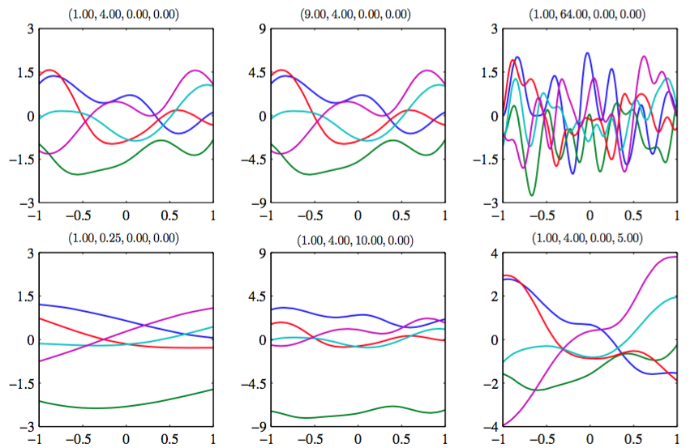
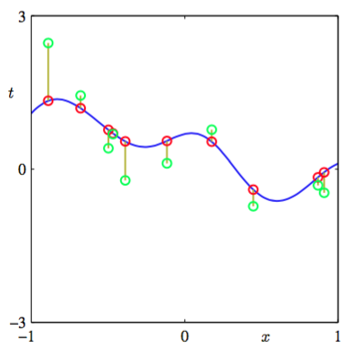
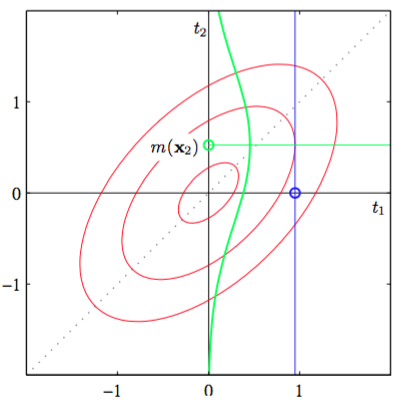
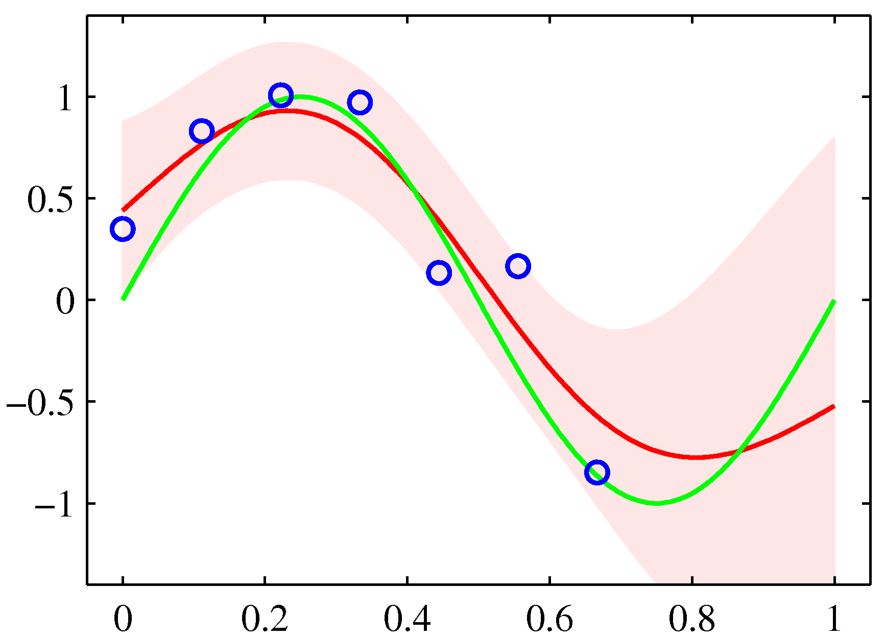

为了把高斯过程模型应用于回归问题，我们需要考虑观测目标值的形式为

$$
t_n = y_n + \epsilon_n \tag{6.57}
$$

的噪声，其中$$ y_n = y(x_n) $$，$$ \epsilon_n $$是一个随机噪声变量，它的值对于每个观测$$ n $$是独立的。这里，我们需要考虑服从高斯分布的噪声过程，即      

$$
p(t_n|y_n) = \mathcal{N}(t_n|y_n,\beta^{-1}) \tag{6.58}
$$

其中$$ \beta $$是一个表示噪声的精度的超参数。由于噪声对于每个数据点是独立的，所以以$$ y = (y_1,...,y_N)^T $$为条件，目标值$$ t = (t_1,...,t_N)^T $$的联合概率分布是一个形式为 

$$
p(t|y) = \mathcal{N}(t|y,\beta^{-1}I_N) \tag{6.59}
$$

的各向同性的高斯分布，其中$$ I_N $$表示一个$$ N \times N $$的单位矩阵。根据高斯过程的定义，边缘概率分布$$ p(y) $$是一个高斯分布，均值为0，协方差由Gram矩阵$$ K $$定义，即

$$
p(y) = \mathcal{N}(y|0,K) \tag{6.60}
$$

确定$$ K $$的核函数通常通常选择那些具有对于相似的点$$ x_n $$和$$ x_m $$，对应的值$$ y(x_n),y(x_m) $$的相关性要大于不相似的点的性质的函数。这里，相似性的概念取决于实际应用。    

为了找到以输入值$$ x1,...,x_N $$为条件的边缘概率分布$$ p(t) $$，我们需要对$$ y $$积分。可以通过使用2.3.3节的线性高斯模型的结果来完成。使用式（2.115），我们看到的边缘概率分布为    

$$
p(t) = \int p(t|y)p(y)dy = \mathcal{N}(t|O,C) \tag{6.61}
$$

其中协方差矩阵$$ C $$的元素为：    

$$
C(x_n,x_m) = k(x_n,x_m) + \beta^{-1}\delta_{nm} \tag{6.62}
$$

这个结果反映了下面的事实：两个随机的高斯分布（即与$$ y(x) $$相关的和与$$ \epsilon $$相关的高斯分布）是独立的，因此它们的协方差可以简单地相加。

对于高斯过程回归，一个广泛使用的核函数的形式为指数项的二次型加上常数和线性项，即    

$$
k(x_n,x_m) = \theta_0exp\left\{-\frac{\theta_1}{2}\Vert x_n - x_m \Vert^2\right\} + \theta_2 + \theta_3x_n^Tx_m \tag{6.63}
$$

注意，涉及到$$ \theta_3 $$的项对应于一个参数模型，这个模型是输入变量的线性函数。图6.5给出了不同的参数$$ \theta_0,...,\theta_3 $$的情况下，这个先验的图像。

      
图 6.5 由协方差函数(6.63)定义的高斯过程先验的样本。每张图上方的标题表示$$ (\theta_0, \theta_1, \theta_2, \theta_3) $$。

图6.6给出了一组从概率分布（6.60）中取样的样本点，以及由式（6.61）定义的对应的值。

      
图 6.6 高斯过程的数据点$$ \{t_n\} $$的取样的说明。蓝色曲线给出了函数上的高斯过程先验的一个样本函数，红点表示计算函数在一组输入值$$ \{x_n\} $$上计算得到的函数值$$ y_n $$。对应的$$ \{t_n\} $$的值，用绿色表示，可以通过 对每个$$ \{y_n\} $$添加独立噪声的方式得到。    

目前为止，我们已经使用高斯过程的观点来构建数据点的集合上的联合概率分布的模型。然而，我们在回归问题中的目标是在给定一组训练数据的情况下，对新的输入变量预测目标变量的值。让我们假设$$ t_N =(t_1,...,t_N)^T $$，对应于输入值$$ x_1,...,x_N $$，组成观测训练集，并且我们的目标是对于新的输入向量$$ x_{N+1} $$预测目标变量$$ t_{N+1} $$。这要求我们计算预测分布$$ p(t_{N+1}|N) $$。注意，这个分布还要以变量$$ x_1,...,x_N $$和$$ x_{N+1}
$$为条件。但是为了记号的简介，我们不会显式地写出这些条件变量。    

为了找到条件分布$$ p(t_{N+1}|t) $$，我们首先写下联合概率分布$$ p(t_{N+1}) $$，其中$$ t_{N+1} $$表示向量$$ (t_1,...,t_N,t_{N+1})^T $$。然后，我们利用2.3.1节的结果来得到所求的条件概率分布，如图6.7所示。

      
图 6.7 高斯过程回归的原理说明，其中只有一个训练点和一个测试点，红色椭圆表示联合概率分布$$ p(t_1,t_2) $$的轮廓线。这里$$ t_1 $$是训练数据点。以$$ t_1 $$为条件（蓝色直线），我们得到了$$ p(t_2|t_1) $$。绿色曲线表示它关于$$ t_2 $$的函数。    

根据式（6.61）$$ t_1,...,t_{N+1} $$的联合概率分布为    

$$
p(t_{N+1}) = \mathcal{N}(t_{N+1}|O,C_{N+1}) \tag{6.64}
$$

其中$$ C_{N+1} $$是一个$$ (N + 1) \times (N + 1) $$的协方差矩阵，元素由式（6.62）给出。由于这个联合分布是高斯分布，因此我们可以使用2.3.1节的结果得到条件高斯分布。为了达到这个目的，我们将协方差矩阵按：

$$
\begin{eqnarray}
C_{N+1} = 
\left(
\begin{array}{cc}
C_N & k \\
k^T & c 
\end{array}
\right) \tag{6.65}
\end{eqnarray}
$$

分块。其中$$ C_N $$是一个$$ N \times N $$的协方差矩阵，元素由式（6.62）给出，其中$$ n,m = 1,...,N $$向量$$ k $$的元素为$$ k(x_n, x_{N+1}) $$，其中$$ n = 1,...,N $$，标量$$ c = k(x_{N+1}, x_{N+1}) + \beta^{-1} $$。使用式（2.81）和式（2.82），我们看到条件概率分布$$ p(t_{N+1}|t) $$是一个高斯分布，均值和协方差分别为：    

$$
\begin{eqnarray}
m(x_{N+1}) &=& k^TC_N^{-1}t \tag{6.66} \\
\sigma^2(x_{N+1}) &=& c - k^TC_N^{-1}k \tag{6.67}
\end{eqnarray}
$$

这些是定义高斯过程回归的关键结果。由于向量$$ k $$是测试点输入值$$ x_{N+1} $$的函数，因此我们看到预测分布是一个高斯分布，它的均值和方差都依赖于$$ x_{N+1} $$。图6.8给出了高斯过程回归的一个例子。    

      
图 6.8 阐述了图A.6的正弦数据集的高斯回归过程，其中最右的三个点被省略。正弦函数由绿色曲线给出，其中蓝色数据点是通过对这个函数取样并添加高斯噪声得到的。红线表示高斯过程预测分布的均值，阴影区域对应于两个标准差的范围。注意在数据点的右侧区域的不确定性是如何增加的。

核函数的唯一的限制是式（6.62）给出的协方差矩阵一定是正定的。如果$$ \lambda_i $$是$$ K $$的一个特征值，那么$$ C $$的对应的特征值就是$$ \lambda_i + \beta^{-1} $$。因此可以证明对于任意点对$$ x_n, x_m $$，核矩阵$$ k(x_n,x_m) $$一定是半正定的，即$$ \lambda_i \geq 0 $$，因为$$ \beta > 0 $$，所以任何等于0的特征值$$ \lambda_i $$仍然会产生出$$ C
$$的一个正的特征值。这个限制条件与之前讨论的核函数的限制条件相同，因此我们可以再次利用6.2节的所有方法构造恰当的核。    

注意，预测分布的均值（6.66）可以写成$$ x_{N+1} $$的形式为

$$
(x_{N+1}) = \sum\limits_{n=1}^Na_nk(x_n,x_{N+1}) \tag{6.68}
$$

的函数。其中$$ a_n $$是$$ C_N^{−1} $$的第$$ n $$个元素。如果核函数$$ k(x_n,x_m) $$只依赖于距离$$ \Vert x_n − x_m \Vert $$，那么我们就得到了径向基函数的一个展开。    

式（6.66）和（6.67）的结果定义了具有任意核函数$$ k(x, x') $$的高斯过程回归。在特殊情况下，如果核函数$$ k(x, x') $$根据基函数的有限集定义，那么我们就可以从高斯过程的观点开始，推导出之前在3.3.2节得到的线性回归的结果。    

因此对于这种模型，我们既可以通过参数空间的观点使用线性回归的结果得到预测分布，也可以通过函数空间的观点使用高斯过程的结果得到预测分布。    

使用高斯过程的核心计算涉及到对$$ N \times N $$的矩阵求逆。标准的矩阵求逆方法需要$$ O(N^3) $$次计算。相反，在基函数模型中，我们要对一个$$ M \times M $$的矩阵$$ S_N $$求逆，这需要$$ O(M^3) $$次计算。注意，对于两种观点来说，给定训练数据，矩阵求逆的计算必须进行一次。对于每个新的测试数据，两种方法都需要进行向量-矩阵的乘法，这在高斯过程中需要$$ O(N^2) $$次计算，在线性基函数模型中需要$$ O(M^2) $$次计算。如果基函数的数量$$ M $$比数据点的数量$$ N
$$小，那么使用基函数框架计算会更高效。但是，高斯过程观点的一个优点是，我们可以处理那些只能通过无穷多的基函数表达的协方差函数。    

但是，对于大的训练数据集，直接应用高斯过程方法就变得不可行了，因此一系列近似的方法被提出来。与精确的方法相比，这些近似的方法关于训练数据集的规模有着更好的时间复杂度（Gibbs, 1997; Tresp, 2001; Smola and Bartlett, 2001; Williams and Seeger, 2001; Csato and Opper, 2002; Seeger et al., 2003）。    

我们已经介绍了单一目标变量的高斯过程回归。扩展到多个目标变量的情形（被称为co-kriging）是很直接的（Cressie, 1993）。也可以将高斯过程回归进行各种其他的扩展，用于对无监督学习的低维流形上的概率分布建模（Bishop et al., 1998a）以及解决随机微分方程（Graepel, 2003）。

