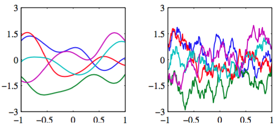

为了引出高斯过程的观点，让我们回到线性回归的例子中，通过对函数$$ y(x, w) $$的计算，重新推导出预测分布。来给出高斯过程的一个具体的例子。    

考虑一个模型$$ M $$，它被定义为由向量$$ \phi(x) $$的元素给出的$$ M $$个固定基函数的线性组合，即    

$$
y(x) = w^T\phi(x) \tag{6.49}
$$

其中$$ x $$是输入向量，$$ w $$是$$ M $$维权向量。现在，考虑$$ w $$上的一个先验概率分布，这个分布是一个各向同性的高斯分布，形式为    

$$
p(w) = \mathcal{N}(w|0,\alpha^{-1}I) \tag{6.50}
$$

它由一个表示分布精度（方差的逆）的超参数$$ \alpha $$控制。对于任意给定的$$ w $$，式（6.49）定义了$$ x $$的一个特定函数。于是，式（6.50）定义的$$ w $$上的概率分布就产生了一个函数$$ y(x) $$上的一个概率分布。在实际应用中，我们希望计算这个函数在某个具体的$$ x $$处的函数值，例如在训练数据点$$ x_1,...,x_N $$处的函数值。于是我们感兴趣的是函数值$$ y(x_1),...,y(x_N) $$的概率分布。我们把函数值的集合记作向量，它的元素为$$ y_n = y(x_n)
$$，其中$$ n = 1,...,N $$。根据式（6.49）这个向量等于    

$$
y = \Phi w \tag{6.51}
$$

其中$$ \Phi $$是设计矩阵，元素为$$ \Phi_{nk} = \phi_k(x_n) $$。首先，我们注意到由$$ w $$的元素给出的服从高斯分布的变量的线性组合，因此它本身是服从高斯分布。 于是，我们只需要找到它的均值和方差找到的概率分布，就找到$$ y $$的概率分布。根据公式（6.50），均值和方差为    

$$
\begin{eqnarray}
\mathbb{E}[y] &=& \Phi\mathbb{E}[w] = 0 \tag{6.52} \\
cov[y] &=& \mathbb{E}[yy^T] = \Phi\mathbb{E}[ww^T]\Phi^T = \frac{1}{\alpha}\Phi\Phi^T = K \tag{6.53}
\end{eqnarray}
$$    

其中$$ K $$是元素为

$$
K_{nm} = k(x_n,x_m) = \frac{1}{\alpha}\phi(x_n)^T\phi(x_m) \tag{6.54}
$$

的Gram矩阵。其中$$ k(x,x') $$是核函数。    

这个模型给我们提供了高斯过程的一个具体的例子。通常来说，高斯过程被定义为函数$$ y(x) $$上的一个概率分布，使得在任意点集$$ x_1,...,x_N $$处计算的$$ y(x) $$的值的集合联合起来服从高斯分布。在输入向量$$ x $$是二维的情况下，这也可以被称为高斯随机场（Gaussian random field）。更一般地，可以用一种合理的方式为$$ y(x_1),...,y(x_N) $$赋予一个联合的概率分布，来确定一个随机过程（stochastic process）$$
y(x) $$。    

高斯随机过程的一个关键点是$$ N $$个变量$$ y_1,...,y_N $$上的联合概率分布完全由二阶统计（即均值和协方差）确定。在大部分应用中，我们关于$$ y(x) $$的均值没有任何先验的知识，因此根据对称性，我们令其等于零。这等价于基函数的观点中，令权值$$ p(w|\alpha) $$的先验概率分布的均值等于0。之后，高斯过程的确定通过给定两个$$ x $$处的函数值$$ y(x) $$的协方差来完成。这个协方差由核函数确定    

$$
\mathbb{E}[y(x_n)y(x_m)] = k(x_n,x_m) \tag{6.55}
$$

对于由式（6.49）定义的带有权值先验（6.50）的线性回归模型来说，核函数为（6.54）。    

我们也可以直接定义核函数，而不是间接地通过选择基函数。图6.4给出了两个不同的核函数的由高斯过程产生的函数的样本。

      
图 6.4 左图为“高斯”核的高斯过程的样本，右图为指数核的高斯过程的样本

第一个核函数是式（6.23）定义的高斯核，第二个核函数是定义为

$$
k(x,x') = exp(-\theta\vert x - x' \vert) \tag{6.56}
$$

的指数核。它对应于最开始由Uhlenbeck and Ornstein(1993)提出的，用来描述布朗运动的Ornstein-Uhlenbeck过程。
