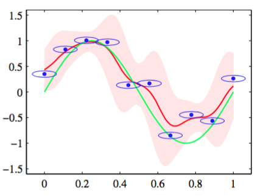

在3.3.3节中，我们看到线性回归模型对新输入$$ x $$的预测是系数由满足加和限制“等价核”（3.62）给出的训练数据集的目标值的线性组合。    

我们可以从核密度估计开始，以一个不同的角度研究核回归模型（3.61）。假设我们有一个训练集$$ \{x_n, t_n\} $$，我们使用Parzen密度估计来对联合分布$$ p(x, t) $$进行建模，即    

$$
p(x,t) = \frac{1}{N}\sum\limits_{n=1}^Nf(x-x_n,t-t_n) \tag{6.42}
$$

其中$$ f(x,t) $$是分量密度函数，每个数据点都有一个这种以数据点为中心的分量。我们现在要找到回归函数$$ y(x) $$的表达式，对应于以输入变量为条件的目标变量的条件均值，它的表达式为    

$$
\begin{eqnarray}
y(x) &=& \mathbb{E}[t|x] = \int_{-\infty}^\infty tp(t|x)dt \\
&=& \frac{\int tp(x,t)dt}{\int p(x,t)dt} \\
&=& \frac{\sum\limits_n\int tf(x-x_n,t-t_n)dt}{\sum\limits_m\int f(x-x_m,t-t_m)dt} \tag{6.43}
\end{eqnarray}
$$

简单起见，现在，我们假设量的密度函数的均值为零，即

$$
\int_{-\infty}^\infty f(x,t)tdt = 0 \tag{6.44}
$$

对所有$$ x $$都成立。使用一个简单的变量替换，得到

$$
\begin{eqnarray}
y(x) &=& \frac{\sum\limits_ng(x-x_n)t_n}{\sum\limits_mg(x-x_m)} \\
&=& \sum\limits_nk(x,x_n)t_n \tag{6.45}
\end{eqnarray}
$$

其中$$ n,m = 1,...,N $$，且核函数$$ k(x,x_n) $$由

$$
k(x,x_n) = \frac{g(x-x_n)}{\sum\limits_mg(x-x_m)} \tag{6.46}
$$

我们还定义了     

$$
g(x) = \int_{-\infty}^\infty f(x,t)dt \tag{6.47}
$$

式（6.45）被称为Nadaraya-Watson模型或核回归（kernel regression）（Nadaraya, 1964; Watson, 1964）。对于局部核函数，它具有给距离$$ x $$较近的数据点$$ x_n $$较高的权重的性质。注意，核（6.46）满足加和限制：    

$$
\sum\limits_{n=1}^Nk(x,x_n) = 1
$$

实际上，这个模型不仅定义的条件期望，还定义了整个条件概率分布    

$$
p(t|x) = \frac{p(t,x)}{\int p(t,x)dt} = \frac{\sum\limits_nf(x-x_n,t-t_n)}{\sum\limits_m\int f(x-x_m,t-t_m)dt} \tag{6.48}
$$

从中我们也可以计算其它期望。    

为了举例说明，我们考虑一元输入变量$$ x $$的情形，其中$$ f(x,t) $$由变量$$ z = (x, t) $$上的一个零均值各向同性的高斯分布给出，方差为$$ \sigma^2 $$。对应的条件分布（6.48）由高斯混合模型给出。图6.3展示了在人工生成的正弦曲线数据集下，这个条件分布的情况以及它的均值。    

      
图 6.3 使用各向同性的高斯核的Nadaraya-Watson核回归模型的说明。数据集为正弦数据集。原始的正弦函数由绿色曲线表示，数据点由蓝色的点表示，每个数据点是一个各向同性的高斯核的中心。得到的回 归函数，由条件均值给出，用红线表示。同时给出的还有条件概率分布$$ p(t|x)
$$的两个标准差的区域，用红色阴影表示。在每个数据点周围的蓝色椭圆给出了对应的核的一个标准差轮廓线。由于水平轴和垂直轴的标度不同，这些轮廓线似乎不是圆形的。

这个模型的一个直接的推广是允许形式更灵活的高斯分布作为其分量，如让输入和目标值具有不同方差。更一般地，我们可以使用第9章讨论的方法训练（Ghahramani and Jordan, 1994）的高斯混合模型对联合分布$$ p(t,x) $$建模，然后找到对应的条件概率分布$$ p(t|x)
$$。在后一种情况中，模型不再由训练数据点处的核函数表示，但是混合模型中分量的个数会小于训练数据点的个数，从而使得生成的模型对于测试数据点能够更快地计算。为了能够生成一个预测速度较快的模型，我们可以接受训练阶段的计算开销。
