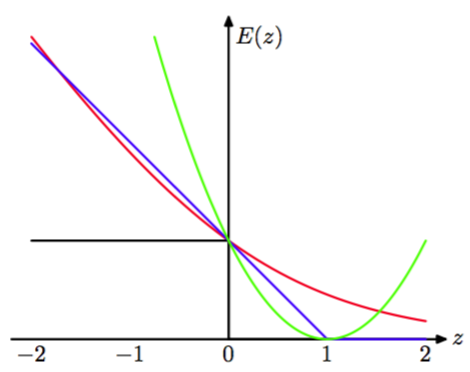

与线性可分的情形一样，对于线性不可分的概率分布，我们可以用最小化正则化的误差函数的方法重新表示SVM。这也使得我们能够强调与logistic回归模型之间的相似性和差别。    

我们已经看到，对于位于边缘边界正确一侧的数据点，即满足$$ y_nt_n \geq 1 $$的数据点，我们有$$ \xi_n = 0 $$，对于剩余的数据点，有$$ \xi_n = 1 − y_nt_n $$。因此目标函数（7.21）可以写成（忽略整体的具有可乘性的常数）

$$
\sum\limits_{n=1}^NE_{SV}(y_nt_n) + \lambda\Vert w \Vert^2 \tag{7.44}
$$

这样的形式。其中$$ \lambda = (2C)^{−1} $$，$$ E_{SV}(\dot) $$是定义为

$$
E_{SV}(y_nt_n) = [1 - y_nt_n]_{+} \tag{7.45}
$$

的铰链(hinge)误差函数，其中$$ [\dot]_{+} $$表示正数部分。这个函数之所以被称为“铰链”误差函数，是因为它的形状，如图7.5所 示。

      
图 7.5 支持向量机使用的“铰链”误差函数的图像，用蓝色表示。同时画出的还有logistic回归的误差函数，使用因子$$ 1/\ln(2) $$重新缩放，从而通过点$$ (0, 1) $$，用红色表示。还画出了误分类误差函数（黑色）和平方误差函数（绿色）。

它可以被看做误分类误差函数的一个近似。误分类误差函数是我们在理想情况下希望最小化的函数，它也被画在了图7.5中。

当我们考虑4.3.2节的logistic回归模型的时候，我们发现比较方便的做法是对目标变量$$ t \in \{0, 1\} $$进行操作。为了与支持向量机进行对比，我们首先使用目标变量$$ t \in \{−1, 1\} $$重写最大似然logistic回归函数。为了完成这一点，我们注意到$$ p(t=1|y) = \sigma(y) $$，其中$$ y(x) $$由式（7.1）给出，$$ \sigma(y) $$是式（4.59）给出的logistic sigmoid函数。因此有$$ p(t = −1|y) = 1 − \sigma(y) = \sigma(−y)
$$，其中我们用到了logistic sigmoid函数的性质，因此我们有    

$$
p(t|y) = \sigma(yt) \tag{7.46}
$$

从这个式子中我们可以通过对似然函数取负对数的方式构造一个误差函数。带有正则化项的误差函数的形式为    

$$
\sum\limits_{n=1}^NE_{LR}(y_nt_n) + \lambda\Vert w \Vert^2 \tag{7.47}
$$

其中    

$$
E_{LR}(yt) = \ln(1 + exp(-yt)) \tag{7.48}
$$

为了与其他的误差函数进行比较，我们可以除以$$ \ln(2) $$使得误差函数通过点$$ (0, 1) $$。重新标度的误差函数也被画在了图7.5中。我们看到它的形式与支持向量机的误差函数类似。关键的区别在于$$ E_{SV}(yt) $$的平台区域产生了稀疏解。    

logistic误差函数与铰链损失都可以看成对误分类误差函数的连续近似。有时用于解决分类问题的另一个连续近似的误差函数时平方和误差函数，也被画在了图7.5中。但是，它具有：会着重强调那些被正确分类的在正确的一侧距离决策边界较远的点的性质。如果这些点是误分类的点，那么这些点也会被赋予较高的权值。因此如果我们的目标是最小化分类错误率，那么一个单调递减的误差函数是一个更好的选择。    

