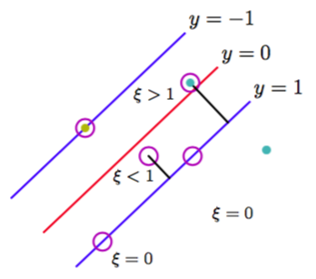
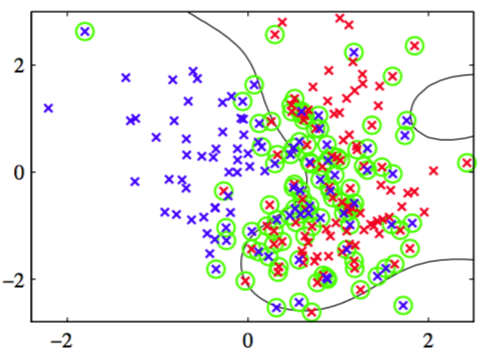

目前为止，我们假设训练数据点在特征空间$$ \phi(x) $$中是线性可分的。解得的支持向量机在原始输入空间$$ x $$中会对训练数据进行精确地划分，虽然对应的决策边界是非线性的。然而，在实际中，类条件分布可能重叠，这种情况下对训练数据的精确划分会导致较差的泛化能力。    

因此我们需要一种方式修改支持向量机，允许一些训练数据点被误分类。根据式（7.19），我们看到在可以分开的类别的情况下，我们隐式地使用了一个误差函数。当数据点被错误分类时，这个误差函数等于无穷大，而当数据点被正确分类时，这个误差函数等于零，这样就将模型参数优化为了最大化边缘。我们现在修改这种方法，使得数据点允许在边缘边界的“错误侧”，但是增加一个惩罚项，这个惩罚项随着与决策边界的距离的增大而增大。对于接下来的最优化问题，令这个惩罚项是距离的线性函数比较方便。为了完成这一点，我们引入松弛变量（slack
variable）$$ \xi_n \geq 0 $$，其中$$ n = 1,...,N $$，每个训练数据点都有一个松弛变量（Bennett, 1992; Cortes and Vapnik, 1995）。对于位于正确的边缘边界内部的点或边界上的点，$$ \xi_n = 0 $$，对于其它点$$ \xi_n = \vert t_n − y(x_n) \vert $$。因此,对于位于决策边界$$ y(x_n) = 0 $$上的点，$$ \xi_n = 1 $$，且$$ \xi_n > 1 $$的点就是被误分类的点。这样，式（7.5）给出的精确分类的限制条件就被替换为    

$$
t_ny(x_n) \geq 1 - \xi_n, n=1,...,N \tag{7.20}
$$

其中松弛变量被限制为满足$$ \xi_n \geq 0 $$。$$ \xi_n = 0 $$的数据点被正确分类，要么位于边缘上，要么在边缘的正确一侧。$$ 0 < \xi_n \leq 1 $$的点位于边缘内部，但是在决策边界的正确一侧。$$ \xi_n > 1 $$的点位于决策边界的错误一侧，是被错误分类的点。如图7.3所示。

      
图 7.3 松弛变量$$ \xi_n \geq 0 $$的说明。圆圈标记的数据点是支持向量。

这种方法有时被描述成放宽边缘的硬限制，得到一个软边缘（soft margin），并且允许一些训练数据点被错分。注意，虽然松弛变量允许类分布的重叠，但是这个框架对于异常点很敏感，因为误分类的惩罚随着$$ \xi $$线性增加。    

现在我们的目标是最大化边缘，同时以一种比较柔和的方式惩罚位于边缘边界错误一侧的点。于是，我们最小化    

$$
C\sum\limits_{n=1}^N\xi_n + \frac{1}{2}\Vert w \Vert^2 \tag{7.21}
$$

其中参数$$ C > 0 $$控制了松弛变量惩罚与边缘之间的折中。由于任何被误分类的数据点都有$$ \xi_n > 1 $$，因此$$ \sum_n\xi_n $$是误分类数据点数量的上界。于是，参数$$ C $$类似于（作用相反的）正则化系数，因为它控制了最小化训练误差与模型复杂度之间的折中。在$$ C \to \infty $$的期限情况下，我们就回到了之前讨论过的用于线性可分数据的支持向量机。    

我们现在想要在式（7.20）以及$$ \xi_n \geq 0 $$的条件下最小化公式（7.21）。对应的拉格朗日函数为：    

$$
L(w,b,\xi,a,\mu) = \frac{1}{2}\Vert w \Vert^2 + C\sum\limits_{n=1}^N\xi_n - \sum\limits_{n=1}^Na_n\{t_ny(x_n) - 1 + \xi_n\} - \sum\limits_{n=1}^N\mu_n\xi_n \tag{7.22}
$$

其中$$ \{a_n \geq 0\} $$和$$ \{\mu_n \geq 0\} $$是拉格朗日乘数。对应的KKT条件为    

$$
\begin{eqnarray}
a_n &\geq& 0 \tag{7.23} \\
t_ny(x_n) - 1 + \xi_n &\geq& 0 \tag{7.24} \\
a_n(t_ny(x_n) - 1 + \xi_n) &=& 0 \tag{7.25} \\
\mu_n &\geq& 0 \tag{7.26} \\
\xi_n &\geq& 0 \tag{7.27} \\
\mu_n\xi_n &=& 0 \tag{7.28}
\end{eqnarray}
$$

其中$$ n = 1,...,N $$。    

我们现在对$$ w, b $$和$$ \{\xi_n\} $$进行最优化。使用式（7.1）给出的$$ y(x) $$的定义，我们有    

$$
\begin{eqnarray}
\frac{\partial L}{\partial w} = 0 &\rightarrow& w = \sum\limits_{n=1}^Na_nt_n\phi(x_n) \tag{7.29} \\
\frac{\partial L}{\partial b} = 0 &\rightarrow& \sum\limits_{n=1}^Na_nt_n = 0 \tag{7.40} \\
\frac{\partial L}{\partial \xi_n} = 0 &\rightarrow& a_n = C - \mu_n \tag{7.31}
\end{eqnarray}
$$

使用这些结果，从拉格朗日函数中消去$$ w, b, \{\xi_n\} $$，我们得到形式为

$$
\tilde{L}(a) = \sum\limits_{n=1}^Na_n - \frac{1}{2}\sum\limits_{n=1}^N\sum\limits_{m=1}^Na_na_mt_nt_mk(x_n,x_m) \tag{7.32}
$$

的拉格朗日函数。这与线性可分的情况完全相同，唯一的区别就是限制条件多少有些差异。为了理解这些限制条件究竟是什么，我们注意到，由于$$ a_n $$是拉格朗日乘数，因此必须有$$ a_n \geq 0 $$。此外，式（7.31）以及$$ \mu_n \geq 0 $$表明$$ a_n \leq C $$。于是，我们关于对偶变量$$ \{a_n\} $$最大化式（7.32）时必须要满足

$$
\begin{eqnarray}
0 \leq a_n \leq C \tag{7.33} \\
\sum\limits_{n=1}^Na_nt_n = 0 \tag{7.34}
\end{eqnarray}
$$

的限制。其中$$ n = 1,...,N $$。式（7.33）被称为盒限制（box constraint）。这又一次变成了一个二次规划的问题。如果我们将式（7.29）代入式（7.1），我们看到对于新数据点的预测又一次使用了式（7.13）。    

我们现在可以表示最终的解。同样的，对于数据点的一个子集，有$$ a_n = 0 $$，在这种情况下这些数据点对于预测模型（7.13）没有贡献。剩余的数据点组成了支持向量。这些数据点满足$$ a_n > 0 $$，因此根据式（7.25），它们必须满足    

$$
t_ny(x_n) = 1 - \xi_n \tag{7.35}
$$

如果$$ a_n < C $$，那么式（7.31）表明$$ \mu_n > 0 $$，根据式（7.28），这要求$$ \xi_n = 0 $$，从而这些点位于边缘上。$$ a_n = C $$的点位于边缘内部，那么，如果$$ \xi_n \leq 1 $$则被正确分类，如果$$ \xi_n > 1 $$则分类错误。    

为了确定公式（7.1）中的参数$$ b $$，我们注意到$$ 0 < a_n < C $$的支持向量满足$$ \xi_n = 0 $$即$$ t_ny(x_n) = 1 $$，因此满足     

$$
t_n\left(\sum\limits_{m \in S}a_mt_mk(x_n,x_m) + b\right) = 1 \tag{7.36}
$$

与之前一样，一个对于数值计算比较稳定的解可以通过求平均的方式得到，结果为：    

$$
b = \frac{1}{N_M}\sum\limits_{n \in M}\left(t_n - \sum\limits_{m \in S}a_mt_mk(x_n,x_m)\right) \tag{7.37}
$$

其中$$ M $$表示满足$$ 0 < a_n < C $$的数据点的下标集合。    

支持向量机的另一种等价形式，被称为v-SVM，由Scholkopf et al.(2000)提出。它涉及到最小化    

$$
\tilde{L} = -\frac{1}{2}\sum\limits_{n=1}^N\sum\limits_{m=1}^Na_na_mt_nt_mk(x_n,x_m) \tag{7.38}
$$

限制条件为

$$
\begin{eqnarray}
0 \leq a_n &\leq& \frac{1}{N} \tag{7.39} \\
\sum\limits_{n=1}^Na_nt_n &=& 0 \tag{7.40} \\
\sum\limits_{n=1}^Na_n &\geq& v \tag{7.41}
\end{eqnarray}
$$

这种方法的优点是，参数$$ v $$代替了参数$$ C $$，它既可以被看做边缘错误（margin error）（$$ \xi_n > 0 $$的点，因此就是位于边缘边界错误一侧的数据点，它可能被误分类也可能没被误分类）的上界，也可以被看做支持向量比例的下界。图7.4给出了v-SVM用于人造数据集的一个例子。

      
图 7.4 v-SVM应用于二维不可分数据集的例子。圆圈表示支持向量。

这里使用了形如$$ exp(−\gamma\Vert x − x' \Vert^2) $$的高斯核，且$$ \gamma = 0.45 $$。    

虽然对新输入的预测只通过支持向量完成，但是训练阶段（即确定参数$$ a, b $$的阶段）使用了整个数据集，因此找到一个解决二次规划问题的高效算法很重要。我们首先注意到由公式（7.10）或式（7.31）给出目标函数$$ \tilde{L}(a)
$$是二次的，因此如果限制条件定义了一个凸区域（由于限制条件的线性性质，实际情况确实是这样），那么任意局部最优解也是全局最优解。因为需要的计算量和存储空间都相当大，所以使用传统的方法直接求解二次规划问题通常是不可行的，因此我们需要寻找更实际的方法。分块（chunking）方法（Vapnik,
1992）利用了如果我们将核矩阵中对应于拉格朗日乘数等于零的行和列删除，那么拉格朗日函数是不变的这一事实。这使得完全的二次规划问题被分解为一系列小的二次规划问题，这些小的问题的目标是识别出所有的非零拉格朗日乘数，然后丢弃其它的。分块可以通过保护共轭梯度（protected conjugate gradient）方法实现（Burges,
1998）。虽然分块可以将二次函数中矩阵的大小从数据点的个数的平方减小到近似等于非零拉格朗日乘数的个数的平方，但是对于大规模应用来说，这个数量仍然过大，从而内存无法满足要求。分解方法（decomposition method）（Osuna et al.,
1996）也解决一系列较小的二次规划问题，但是这些问题被设计为具有固定的大小，这个方法可以应用于任意规模的数据集。然而，这种方法仍然涉及到二次规划子问题的数值解，求出这些数值解是很困难的，代价很高的。一种最流行的训练支持向量机方法是被称为顺序最小化优化（sequential minimal optimization），或称为SMO（Platt,
1999）。这种方法考虑了分块方法的极限情况，每次只考虑两个拉格朗日乘数。这种情况下，子问题可以解析地求解，因此避免了数值二次规划。选择每一步骤中需要考虑的拉格朗日乘数对时，使用了启发式的方法。在实际应用中，SMO与训练数据点数量的关系位于线性与二次之间，取决于具体的应用。    

我们已经看到核函数对应于特征空间中的内积。特征空间可以是高维的，甚至是无穷维的。 通过直接对核函数操作，而不显式地引入特征空间，支持向量机或许在一定程度上避免了维度灾难的问题。然而，因为限制了特征空间维度的特征的值之间存在限制，是哟一事实并非如此。为了说明这一点，考虑一个简单的二阶多项式核，我们可以用它的分量进行展开    

$$
\begin{eqnarray}
k(x,z) &=& (1 + x^Tz)^2 = (1 + x_1z_1 + x_2z_2)^2 \\
&=& 1 + 2x_1z_1 + 2x_2z_2 + x_1^2z_1^2 + 2x_1z_1x_2z_2 + x_2^2z_2^2 \\
&=& (1,\sqrt{2}x_1,\sqrt{2}x_2,\sqrt{2}x_1x_2,x_2^2)(1,\sqrt{2}z_1,\sqrt{2}z_2,z_1^2,\sqrt{2}z_1z_2,z_2^2)^T \\
&=& \phi(x)^T\phi(z) \tag{7.42}
\end{eqnarray}
$$     

于是这个核函数表示六维特征空间中的一个内积，其中输入空间到特征空间的映射由向量函数$$ \phi(x) $$描述。然而，对这些特征加权的系数被限制为具体的形式。因此，原始二维空间$$ x $$中的任意点集都会被限制到这个六维特征空间中的二维非线性流形中。    

我们已经强调，支持向量机不提供概率输出，而是对新的输入进行分类决策，这个事实。Veropoulos et al.(1999)讨论了对SVM的修改，使其能控制假阳性和假阴性之间的权衡。然而，如果我们希望把SVM用作较大的概率系统中的一个模块，那么我们需要对于新的输入$$ x $$的类别标签$$ t $$的概率预测。     

为了解决这个问题，Platt(2000)提出了使用logistic sigmoid函数拟合训练过的支持向量机的输出的方法。具体来说，需要求解的条件概率被假设具有

$$
p(t=1|x) = \sigma(Ay(x) + B) \tag{7.43}
$$

这样的形式，其中$$ y(x) $$由式（7.1）定义。参数$$ A,B $$的值通过最小化交叉熵误差函数的方式确定。交叉熵误差函数根据由$$ y(x_n), t_n $$组成的训练数据集定义。为了避免严重的过拟合现象，用于拟合sigmoid函数的数据需要独立于训练原始SVM的数据。这种两个阶段的方法等价于假设支持向量机的输出$$ y(x) $$表示属于类别$$ t = 1 $$的$$ x $$的对数概率。由于SVM的训练过程并没有体现这种倾向，因此SVM给出的对后验概率的近似结果比较差(Tipping, 2001)。     

