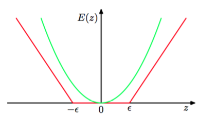
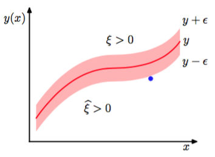
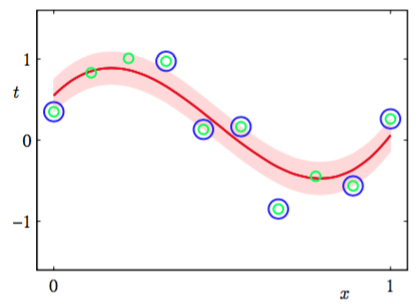

我们现在将支持向量机推广到回归问题，同时保持它的稀疏性。在简单的线性回归模型中，我们最小化一个正则化的误差函数    

$$
\frac{1}{2}\sum\limits_{n=1}^N\{y_n - t_n\}^2 + \frac{\lambda}{2}\Vert w \Vert^2 \tag{7.50}
$$

为了得到稀疏解，二次误差函数被替换为一个$$ \epsilon $$-不敏感误差函数（$$ \epsilon $$-insensitive error function）（Vapnik, 1995）。如果预测$$ y(x) $$和目标$$ t $$之间的差的绝对值小于$$ \epsilon $$，那么这个误差函数给出的误差等于零，其中$$ \epsilon > 0 $$。$$ epsilon $$-不敏感误差函数的一个简单的例子是    

$$
E_\epsilon(y(x) - t) =
\begin{cases}
0, if \vert y(x) - t \vert < \epsilon; \\
\vert y(x) - t \vert - \epsilon, otherwise
\end{cases} \tag{7.51}
$$

它在不敏感区域之外，会有一个与误差相关联的线性代价。如图7.6所示。

      
图 7.6 $$ \epsilon $$-不敏感误差函数（红色）在不敏感区域之外,误差函数值随着距离线性增大。作为对比，同时给出了二次误差函数（绿色）。    

于是我们最小化正则化的误差函数，形式为

$$
C\sum\limits_{n=1}^NE_{\epsilon}(y(x) - t_n) + \frac{1}{2}\Vert w \Vert^2 \tag{7.52}
$$

其中$$ y(x) $$由式（7.1）给出。按照惯例，（起着相反作用的）正则化参数被记作$$ C $$，出现在误差项之前。    

与之前一样，通过引入松弛变量的方式，我们可以重新表达最优化问题。对于每个数据点$$ x $$，我们现在需要两个松弛变量$$ \xi \geq 0 $$和$$ \xi \geq 0 $$，其中$$ \xi > 0 $$对应于$$ t > y(x) + \epsilon $$的数据点，$$ \hat{\xi} > 0 $$对应于$$ t_n < y(x_n) − \epsilon $$的数据点，如图7.7所示。

      
图 7.7 SVM回归的说明。图中画出了回归曲线以及$$ \epsilon $$-不敏感“管道”。同时给出的是松弛变量$$ \xi $$和$$ \hat{\xi} $$的例子。对于$$ \epsilon $$-管道上方的点，$$ \xi > 0 $$且$$ \xi = 0 $$，对于$$ \epsilon $$-管道下方的点，$$ \xi = 0 $$且$$ \xi  > 0 $$，对于$$ \epsilon $$-管道内部的点$$ \xi = \hat{\xi} = 0 $$。    

目标点位于$$ \epsilon $$-管道内的条件是$$ y_n − \epsilon \leq t_n \leq y_n + \epsilon $$，其中$$ y_n = y(x_n) $$。引入松弛变量使得数据点能够位于管道之外，只要松弛变量不为零即可。对应的条件变为

$$
\begin{eqnarray}
t_n \leq y(x_n) + \epsilon + \xi_n \tag{7.53} \\
t_n \geq y(x_n) - \epsilon - \hat{\xi_n} \tag{7.54}
\end{eqnarray}
$$

这样，支持向量回归的误差函数就可以写成    

$$
C\sum\limits_{n=1}^N(\xi_n + \hat{\xi_n} + \frac{1}{2}\Vert w \Vert^2) \tag{7.55}
$$

它必须在限制条件$$ \xi_n \geq 0 $$和$$ \hat{\xi_n} \geq 0 $$和式（7.53），（7.54）下进行最小化。通过引入拉格朗日乘数$$ a_n \geq 0, a_n \geq 0, \mu_n \geq 0 $$以及$$ \mu_n \geq 0 $$，然后最优化拉格朗日函数    

$$
\begin{eqnarray}
L = &C& \sum\limits_{n=1}^N(\xi_n + \hat{\xi_n}) + \frac{1}{2}\Vert w \Vert^2 - \sum\limits_{n=1}^N(\mu_n\xi_n + \hat{\mu_n}\hat{\xi_n}) \\
&-& \sum\limits_{n=1}^Na_n(\epsilon + \xi_n + y_n - t_n) - \sum\limits_{n=1}^N\hat{a_n}(\epsilon + \hat{\xi_n} - y_n + t_n) \tag{7.56}
\end{eqnarray}
$$

我们现在使用式（7.1）替换$$ y(x) $$，然后令拉格朗日函数关于$$ w, b, \xi_n $$和$$ \xi_n $$的导数为0，得到：    

$$
\begin{eqnarray}
\frac{\partial L}{\partial w} = 0 &\rightarrow& w = \sum\limits_{n=1}^N(a_n - \hat{a}_n)\phi(x_n) \tag{7.57} \\
\frac{\partial L}{\partial b} = 0 &\rightarrow& \sum\limits_{n=1}^N(a_n - \hat{a}_n) = 0 \tag{7.58} \\
\frac{\partial L}{\partial \xi_n} = 0 &\rightarrow& a_n + \mu_n = C \tag{7.59} \\
\frac{\partial L}{\partial \hat{\xi_n}} = 0 &\rightarrow& \hat{a}_n + \hat{\mu}_n = C \tag{7.60}
\end{eqnarray}
$$    

使用这些结果消去拉格朗日函数中对应的变量，我们看到对偶问题涉及到关于$$ \{a_n\} $$和$$ \{\hat{a}_n\} $$最大化    

$$
\begin{eqnarray}
\tilde{L}(a,\hat{a}) = &-&\frac{1}{2}\sum\limits_{n=1}^N\sum\limits_{m=1}^N(a_n - \hat{a}_n)(a_m - \hat{a}_m)k(x_n,x_m) \\
&-&\epsilon\sum\limits_{m=1}^N(a_n - \hat{a}_n) + \sum\limits_{m=1}^N(a_n - \hat{a}_n)t_n \tag{7.61}
\end{eqnarray}
$$    

其中我们已经引入了核$$ k(x, x') = \phi(x)^T\phi(x') $$。与之前一样，这是一个具有限制条件的最大化问题。为了找到限制条件，我们注意到，因为$$ a_n, \hat{a}_n $$是拉格朗日乘数，所以它们要满足$$ a_n \geq 0 $$和$$ \hat{a}_n \geq 0 $$必须成立。且$$ \mu_n \geq 0 $$和$$ \hat{\mu}_n \geq 0 $$以及式（7.59）（7.60）要求$$ a_n \leq C $$且$$ \hat{a}_n \leq C $$，因此我们又一次得到盒限制

$$
\begin{eqnarray}
0 \leq a_n \leq C \tag{7.62} \\
0 \leq \hat{a}_n \leq C \tag{7.63}
\end{eqnarray}
$$

以及条件（7.58）。    

将式（7.57）代入式（7.1），我们看到对于新的输入变量，可以使用

$$
y(x) = \sum\limits_{n=1}^N(a_n - \hat{a}_n)k(x,x_n) + b \tag{7.64}
$$

进行预测，这又一次被表示为核函数的形式。    

对应的Karush-Kuhn-Tucker（KKT）条件说明了在解的位置，对偶变量与限制的乘积必须等于0，形式为    

$$
\begin{eqnarray}
a_n(\epsilon + \xi_n + y_n - t_n) &=& 0 \tag{7.65} \\
\hat{a}_n(\epsilon + \hat{\xi}_n + y_n - t_n) &=& 0 \tag{7.66} \\
(C - a_n)\xi_n &=& 0 \tag{7.67} \\
(C - \hat{a}_n)\hat{\xi}_n &=& 0 \tag{7.68}
\end{eqnarray}
$$

根据这些条件，我们能得到一些有用的结果。首先，我们注意到如果$$ \epsilon + \xi_n + y_n − t_n = 0 $$，那么系数$$ a_n $$只能非零，这表明数据点要么位于$$ \epsilon $$-管道的上边界上（$$ \xi_n = 0 $$），要么位于上边界的上方（$$ \xi > 0 $$）。类似地，$$ \hat{a}_n $$的非零值表示$$ \epsilon + \xi − y_n + t_n = 0 $$，这些点必须位于$$ \epsilon $$-管道的下边界上或下边界的下方。     

此外，由于将两式相加，注意到$$ \xi_n $$和$$ \hat{\xi}_n $$是非负的，而$$ \epsilon $$是严格为正的，因此对于每个数据点$$ x_n,a_n $$或$$ \hat{\a_n} $$至少一个为0，或都为0。所以$$ \epsilon + \xi_n + y_n − t_n = 0 $$和$$ \epsilon + \xi_n − y_n + t_n = 0 $$这两个限制是不兼容的。    

支持向量是对于由式（7.64）给出的预测有贡献的数据点，换句话说，就是那些使得$$ a_n \neq 0 $$或$$ \hat{a}_n \neq 0 $$成立的数据点。这些数据点位于$$ \epsilon $$-管道边界上或者管道外部。管道内部的所有点都有$$ a_n =  \hat{a}_n = 0 $$。我们又一次得到一个稀疏解，在预测模型（7.64）中唯一必须计算的项就是涉及到支持向量的项。    

参数$$ b $$可以通过，考虑一个数据点，满足$$ 0 < a_n < C $$。根据式（7.67），一定有$$ \xi_n = 0 $$，根据式（7.65），一定有$$ \epsilon + y_n − t_n = 0 $$。使用式（7.1），然后求解$$ b $$得到。这时我们有    

$$
\begin{eqnarray}
b &=& t_n - \epsilon - w^T\phi(x_n) \\
&=& t_n \epsilon - \sum\limits_{m=1}^N(a_m - \hat{a}_m)k(x_n,x_m) \tag{7.69}
\end{eqnarray}
$$    

其中我们使用了式（7.57）。通过考虑一个满足$$ 0 < a_n < C $$的数据点，我们可以得到一个类似的结果。在实际应用中，更好的做法是对所有的这些b的估计进行平均。    

与分类问题的情形相同，有另一种用于回归的SVM的形式。这种形式的SVM中，控制复杂度的参数有一个更加直观的意义(Scholkopf et al., 2000)。特别地，我们不固定不敏感区域$$ \epsilon $$的宽度，而是固定位于管道外部的数据点的比例$$ v $$。这涉及到最大化    

$$
\begin{eqnarray}
\tilde{L}(a,\hat{a}) = &-&\sum\limits_{n=1}^N\sum\limits_{m=1}^N(a_n - \hat{a}_n)(a_m - \hat{a}_m)k(x_n,x_m) \\
&+&\sum\limits_{m=1}^N(a_n - \hat{a}_n)t_n \tag{7.70}
\end{eqnarray}
$$    

限制条件为    

$$
\begin{eqnarray}
0 \leq a_n &\leq& \frac{C}{N} \tag{7.71} \\
0 \leq \hat{a}_n &\leq& \frac{C}{N} \tag{7.72} \\
\sum\limits_{n=1}^N(a_n - \hat{a}_n) &=& 0 \tag{7.73} \\
\sum\limits_{n=1}^N(a_n + \hat{a}_n) &\leq& vC \tag{7.74}
\end{eqnarray}
$$    

可以证明至多有$$ vN $$个数据点落在不敏感管道外部，而至少有$$ vN $$个数据点是支持向量，因此位于管道上或者管道外部。   

图7.8说明了使用支持向量机解决回归问题的一个例子，数据集使用的是正弦曲线数据集。 

      
图 7.8 $$ v $$-SVM回归应用到人工生成的正弦数据集上的说明，SVM使用了高斯核。预测分布曲线为红色曲线，$$ \epsilon $$-不敏感管道对应于阴影区域。此外，数据点用绿色表示，支持向量用蓝色圆圈标记。 

这里参数$$ v  $$和$$ C  $$已经手动选择完毕。在实际应用中，它们的值通常通过交叉验证的方法确定。
