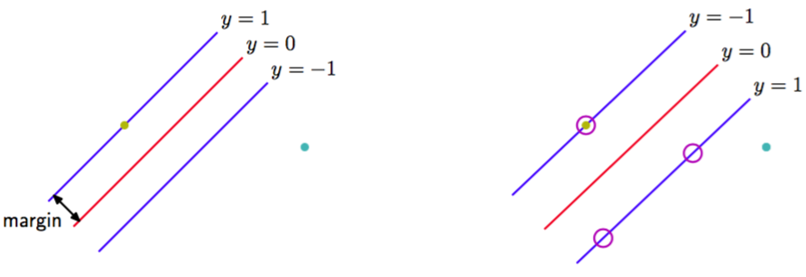
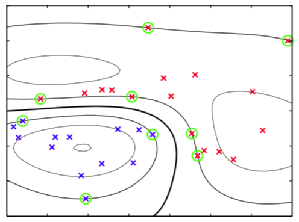

为了开始我们关于支持向量机的讨论，我们回到使用线性模型的二分类问题。线性模型的形式为    

$$
y(x) = w^T\phi(x) + b \tag{7.1}
$$

其中$$ \phi(x) $$表示一个固定的特征空间变换，并且我们显式地写出了偏置参数$$ b $$。注意，我们会简要介绍使用核函数表达的对偶形式，这避免了显式地在特征空间中进行计算。训练数据集由$$ N $$个输入向量$$ x_1,...,x_N $$组成，对应的目标值为$$ t_1,...,t_N $$，其中$$ t_n \in \{−1,1\} $$，新的数据点$$ x $$根据$$ y(x) $$的符号进行分类。    

现阶段，我们假设训练数据集在特征空间中是线性可分的，即根据定义，存在至少一个参数$$ w, b $$的选择方式，使得对于$$ t_n = +1 $$的点，函数（7.1）都满足$$ y(x_n) > 0 $$，对于$$ t_n = −1 $$的点，都有$$ y(x_n) < 0 $$，从而对于所有训练数据点，都有$$ t_ny(x_n) > 0 $$。    

当然，存在许多能够把类别精确分开的解。在4.1.7节，我们介绍了感知器算法，它能够保证在有限步骤之内找到一个解。然而，它找到的这个解依赖于$$ w, b $$的（任意的）初始值选择，还依赖于数据点出现的顺序。如果有多个能够精确分类训练数据点的解，那么我们应该尝试寻找泛化错误最小的那个解。支持向量机通过引入边缘(margin)的概念，这 个概念被定义为决策边界与任意样本之间的最小距离来解决这个问题，如图7.1所示。

      
图 7.1 边缘被定义为决策边界与最近的数据点之间的垂直距离，如左图所示。最大化边缘会生成对决策边界的一个特定的选择，如右图所示。这个决策边界的位置由数据点的一个子集确定，被称为支持向量，用圆圈表示。    

在支持向量机中，决策边界被选为使边缘最大化的那个决策边界。采用最大边缘解的原因可以通过计算学习理论（computational learning theory）或统计学习理论（statistical learning theory）进行理解。然而，Tong and Koller(2000)给出了使用最大边缘解的一个简单的原因。他们考察了一个基于生成式方法和判别式方法组成的金字塔的分类框架，并首先使用带有共同参数$$ \sigma^2 $$的高斯核的Parzen密度估计对每个类别的输入向量$$ x
$$的分布进行建模。伴随着类别先验，这个分布定义了一个最优的分类错误率决策边界。然而，他们没有使用这个最优的决策边界，而是通过最小化学习到的模型的错误率来寻找最优的超平面。在极限$$ \sigma^2 \to 0 $$的情况下，可以证明最优超平面是有着最大边缘的超平面。这个结果背后的直观含义是，随着$$ \sigma^2 $$的减小，距离超平面较近的点对超平面的控制能力逐渐大于距离较远的点。在极限情况下，超平面会变得与非支持向量的数据点无关。    

我们会在图10.13中看到，对于一个简单的线性可分数据集，在贝叶斯方法中，关于参数的先验概率分布进行积分或求和，可以产生一个位于分开数据点的区域中间的决策边界。最大边缘解有着类似的行为。    

回忆一下，根据图4.1，点$$ x $$与由$$ y(x) = 0 $$定义的超平面的垂直距离为$$ \vert y(x) \vert / \Vert w \Vert $$，其中$$ y(x) $$的形式由式（7.1）给出。此外，我们感兴趣的是那些能够正确分类所有数据点的解，即对于所有的$$ n $$都有$$ t_ny(x_n) > 0 $$，因此点$$ x_n $$距离决策面的距离为    

$$
\frac{t_ny(x_n)}{\Vert w \Vert} = \frac{t_n(w^T\phi(x_n) + b)}{\Vert w \Vert} \tag{7.2}
$$

边缘由数据集里垂直距离最近的点$$ x_n $$给出，我们希望最优化参数$$ w,b $$，使得这个距离能够最大化。因此，最大边缘解可以通过

$$
\arg\max_{w,b} \left\{\frac{1}{\Vert w \Vert}\min_n[t_n(w^T\phi(x_n) + b)]\right\} \tag{7.3} 
$$

得到。其中由于$$ w, n $$无关，所以我们将因子$$ 1/\Vert w \Vert $$提到了对$$ n $$的最优化之外。直接求解这个最优化问题相当复杂，因此我们要把它转化为一个更容易求解的等价问题。为了达到这个目的，我们注意到如果我们进行重新缩放$$ w \to \kappa w $$以及$$ b \ \kappa b $$，那么任意点$$ x_n $$距离决策面的距离$$ t_ny(x_n) $$不会发生改变。我们可以对距离决策面最近的点使用这个性质，令    

$$
t_n(w^T\phi(x_n) + b) = 1 \tag{7.4}
$$

在这种情况下，所有的数据点会满足限制    

$$
t(w^T\phi(x_n) + b) \geq 1, n = 1,...,N \tag{7.5}
$$

这被称为决策超平面的标准表示。对于使上式取得等号的数据点，我们说限制被激活（active），对于其他的数据点，我们说限制未激活（inactive）。根据定义，总会存在至少一个激活限制，因为总会有一个距离最近的点，并且一旦边缘被最大化，会有至少两个激活的限制。这样，最优化问题就简化为了最大化$$ \Vert w \Vert^{−1} $$，这等价于最小化$$ \Vert w \Vert^2 $$，因此我们要在限制条件（7.5）下，求解最优化问题    

$$
\arg\min_{w,b}\frac{1}{2}\Vert w \Vert^2 \tag{7.6}
$$

式（7.6）的因子$$ \frac{1}{2} $$的引入是为了后续计算方便。这是二次规划（quadratic programming）问题的一个例子，其中我们试图在一组线性不等式的限制条件下最小化二次函数。似乎偏置$$ b $$从最优化问题中消失了。然而，由于这些限制条件要求$$ \Vert w \Vert $$的改变需要通过$$ b $$的改变进行补偿，所以它可以通过限制条件隐式地确定。我们稍后会看到它是如何工作的。    

为了解决这个限制的最优化问题，我们引入拉格朗日乘数$$ a_n 
\geq 0 $$。式（7.5）中的每个限制条件都对应着一个乘数$$ a_n $$。从而可得下面的拉格朗日函数    

$$
L(w,b,a) = \frac{1}{2}\Vert w \Vert^2 - \sum\limits_{n=1}^Na_n\left\{t_n(w^T\phi(x_n) + b) - 1\right\} \tag{7.7}
$$

其中$$ a = (a_1,...,a_N)^T $$。注意，因为我们要关于$$ w, b $$最小化，关于$$ a $$最大化，所以拉格朗日乘数项前面的符号为负。令$$ L(w, b, a) $$关于$$ w, b $$的导数等于0，我们得到了下面两个条件    

$$
\begin{eqnarray}
w &=& \sum\limits_{n=1}^Na_nt_n\phi(x_n) \tag{7.8} \\
0 &=& \sum\limits_{n=1}^Na_nt_n \tag{7.9}
\end{eqnarray}
$$    

使用这两个条件从$$ L(w,b,a) $$中消去$$ w, b $$，就得到了最大化边缘问题的对偶表示（dual representation），其中我们要关于$$ a $$最大化    

$$
\tilde{L}(a) = \sum\limits_{n=1}^Na_n - \frac{1}{2}\sum\limits_{n=1}^N\sum\limits_{m=1}^Na_na_mt_nt_mk(x_n,x_m) \tag{7.10}
$$

限制条件为    

$$
\begin{eqnarray}
a_n \geq 0, n=1,...,N \tag{7.11} \\
\sum\limits_{n=1}^Na_nt_n = 0 \tag{7.12}
\end{eqnarray}
$$    

这里，核函数被定义为$$ k(x, x') = \phi(x)^T\phi(x') $$。同样的，这是一个二次规划问题，其中我们要在不等式限制条件下最优化$$ a $$的二次函数。我们会在7.1.1节讨论求解这种二次规划问题的方法。    

$$ M $$个变量的二次规划问题的求解，通常的时间复杂度为$$ O(M^3) $$。通过将原始问题转化为对偶问题，我们将涉及到$$ M $$个变量的最小化公式（7.6）的问题转化为了涉及到$$ N $$个变量的对偶问题（7.10）。对于一组固定的基函数，其中基函数的数量$$ M $$小于数据点的数量$$ N
$$，转化为对偶问题似乎没有什么好处。但是，对偶问题使得模型能够用核函数重新表示，因此最大边缘分类器可以被高效地应用于维数超过数据点个数的特征空间，包括无穷维特征空间。核公式也让核函数$$ k(x, x') $$正定这一限制条件存在的原因变得更显然，因为这确保了拉格朗日函数$$ \tilde{L}(a) $$有上界，从而使得最优化问题有良好的定义。    

为了使用训练过的模型分类新的数据点，我们计算式（7.1）定义的$$ y(x) $$的符号。通过使用式（7.8）消去$$ w $$，$$ y(x) $$可以根据参数$$ \{a_n\} $$和核函数表示，即    

$$
y(x) = \sum\limits_{n=1}^Na_nt_nk(x,x_n) + b \tag{7.13}
$$

在附录E中，我们说明了这种形式的限制的最优化问题满足Karush-Kuhn-Tucker（KKT）条件。在这个问题中具有

$$
\begin{eqnarray}
a_n &\geq& 0 \tag{7.14} \\
t_ny(x_n) - 1 &\geq& 0 \tag{7.15} \\
a_n\{t_ny(x_n) - 1\} &=& 0 \tag{7.16}
\end{eqnarray}
$$

这三个性质。因此对于每个数据点，要么$$ a_n = 0 $$，要么$$ t_ny(x_n) = 1 $$。任何使得$$ a_n = 0 $$的数据点都不会出现在式（7.13）的求和式中，因此对新数据点的预测没有作用。剩下的数据点被称为支持向量（support vector）。由于这些支持向量满足$$ t_ny(x_n) = 1 $$，因此它们对应于特征空间中位于最大边缘超平面内的点，如图7.1所示。

这个性质是支持向量机在实际应用中的核心。一旦模型被训练完毕，相当多的数据点都可以被丢弃，只有支持向量被保留。    

解决了二次规划问题，找到了$$ a $$的值之后，注意到支持向量$$ x_n $$满足$$ t_ny(x_n) = 1 $$，我们就可以确定阈值参数$$ b $$的值。使用式（7.13）得到：    

$$
t_n\left(\sum\limits_{m \in S}a_mt_mk(x_n,x_m) + b\right) = 1 \tag{7.17}
$$

其中$$ S $$表示支持向量的下标集合。虽然我们可以使用任意选择的支持向量$$ x_n $$解这个关于$$ b $$的方程，但是我们可以通过，首先乘以$$ t_n $$，使用$$ t_n^2 = 1 $$的性质，然后对于所有的支持向量，整理方程，解出$$ b $$得到    

$$
b = \frac{1}{N_S}\sum\limits_{n \in S}\left(t_n - \sum\limits_{m \in S}a_mt_mk(x_n,x_m)\right) \tag{7.18}
$$

其中$$ N_S $$是支持向量的总数，来得到在数值计算上更加稳定的解。    

对于接下来的模型比较，我们可以将最大边缘分类器通过带有简单二次正则化项的最小化误差函数来表示，形式为：    

$$
\sum\limits_{n=1}^NE_{\infty}(y(x_n)t_n - 1) + \lambda\Vert w \Vert^2 \tag{7.19}
$$

其中$$ E_{\infty}(z) $$是一个函数，当$$ z \geq 0 $$时，函数值为零，其他情况下函数值为$$ \infty $$。这就确保了限制条件（7.5）成立。注意，只要正则化参数满足$$ \lambda > 0 $$，那么它的精确值就没有影响。    

图7.2给出了一个分类问题的例子。

      
图 7.2 二维空间中来自两个类别的人工生成数据的例子。图中画出了具有高斯核函数的支持向量机的得到的常数$$ y(x) $$的轮廓线。同时给出的时决策边界、边缘边界以及支持向量。

分类用的模型使用支持向量机训练，训练数据是一个简单的人工生成的数据集，核函数是式（6.23）给出的高斯核。虽然数据点在二维空间中显然不是线性可分的，但是它在隐式地由非线性核函数定义的非线性特征空间中是线性可分的。因 此，训练数据点在原始数据空间中被完美地分开了。    

这个例子也从几何角度说明了SVM中稀疏性的来源。最大边缘超平面由支持向量的位置定义，其他数据点可以自由移动（只要仍然在边缘区域之外）而不改变决策边界，因此解与这些数据点无关。
