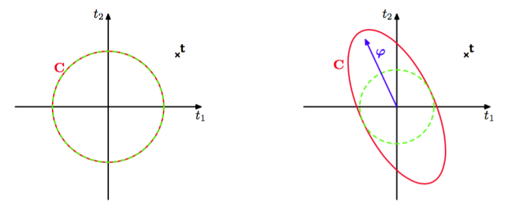
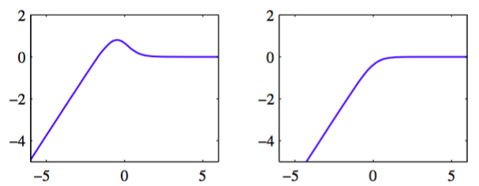

我们之前已经注意到自动相关性检测的过程使得参数的一个子集趋于零。我们现在更加详细地考察相关向量机的稀疏性的原理。在这个过程中，我们会得到一个与之前的直接方法相比更快的最优化超参数的方法。    

关于贝叶斯线性模型的稀疏性的来源，在进行数学的分析之前，我们首先给出一些非形式化的观点。考虑一个数据集，这个数据集由$$ N = 2 $$个观测$$ t_1 $$和$$ t_2 $$组成。我们有一个基函数为$$ \phi(x) $$，超参数为$$ \alpha $$的模型，以及一个精度为$$ \beta $$的各向同性的噪声。根据式（7.85），边缘似然函数为$$ p(t|\alpha,\beta) = \mathcal{N}(t|0,C) $$，其中协方差矩阵的形式为    

$$
C = \frac{1}{\beta}I + \frac{1}{\alpha}\varphi\varphi^T \tag{7.92}
$$

其中$$ \varphi $$表示$$N $$维向量$$ (\varphi(x_1), \varphi(x2_))^T $$，类似地$$ t = (t_1, t_2)^T $$。注意，这是上的一个零均值的高斯过程模型，协方差为$$ C $$。给定的一个特定的观测，我们的目标是通过最大化边缘似然函数的方法找到$$ \alpha^*, \beta^* $$。从图7.10中，我们看到，如果$$ \phi $$的方向与训练数据向量之间没有很好的对齐的话，那么对应的超参数$$ \alpha $$会趋于$$ \infty
$$，基向量会被从模型中剪枝掉。

      
图 7.10 贝叶斯线性回归模型的稀疏性的原理说明。图中给出了目标值的一组训练向量，形式为$$ t = (t_1, t_2)^T $$，用叉号表示，模型有一个基向量$$ \phi = (\phi(x_1), \phi(x_2))^T $$，它与目标数据向量的对齐效果很差。左图中，我们看到一个只有各向同性的噪声的模型，因此$$ C = \beta^{−1}I $$，对应于$$ \alpha = \infty $$，$$ \beta $$被设置为概率最高的值。右图中，我们看到了同样的模型，但是$$ \alpha
$$的值变成了有限值。在两种情况下，红色椭圆都对应于单位马氏距离，$$ \vert C \vert $$对于两幅图的取值相同，而绿色虚线圆表示由项$$ \beta^{−1} $$产生的噪声的贡献。我们看到$$ \alpha $$的任意有限值减小了观测数据的概率，因此对于概率最高的解，基向量被移除。

这种现象出现的原因是$$ \alpha $$的任意有限值总会给数据一个较低的概率，因此就减小了$$ t $$的值，假设$$ \beta $$被设置为最优值。 我们看到$$ \alpha $$的任意有限值会使得分布在远离数据的方向被拉长，从而增加了远离观测数据的区域的概率质量，因此就减小了目标数据向量本身的概率密度的值。对于更一般的$$ M $$个基向量$$ \phi_1,...,\phi_M $$的情形，也有类似的直观含义，即如果垂直的基向量与数据向量$$ t
$$没有很好地对齐，那么它很可能被从模型中剪枝掉。    

我们现在从一个更加数学的角度，对于涉及到$$ M $$个基函数的一般情形，考察稀疏性的原理。为了进行这个分析，我们首先注意到，在式（7.87）给出的参数$$ \alpha_i $$的重新估计的结果中，右侧的项本身也是$$ \alpha_i $$的函数。于是这些结果表示隐式解，需要用迭代的方式求出，即使对于所有的$$ j \neq i $$的$$ \alpha_j $$都固定时，确定单一的$$ \alpha_i $$也需要迭代。    

这给出了解决RVM的最优化问题的一个不同的方法，其中我们显式地写出边缘似然函数（7.85）中所有对特定的$$ \alpha_i $$的依赖关系，然后显式地确定驻点（Faul and Tipping, 2002; Tipping and Faul, 2003）。为了完成这一点，我们首先写出由式（7.86）定义的矩阵$$ C $$中来自$$ \alpha_i $$的贡献，即：    

$$
\begin{eqnarray}
C &=& \beta^{-1}I + \sum\limits_{j \neq i}\alpha_j^{-1}\varphi_j\varphi_j^T + \alpha_i^{-1}\varphi_i\varphi_i^T \\
&=& C_{-i} + \alpha_i^{-1}\varphi_i\varphi_i^T \tag{7.93}
\end{eqnarray}
$$

其中$$ \phi_i $$表示矩阵$$ \Phi $$的第$$ i $$列，即$$ N $$维向量，元素为$$ (\phi_i(x_1),...,\phi_i(x_N)) $$。这与$$ \phi_n $$不同，它表示的是$$ \Phi $$的第$$ n $$行。矩阵$$ C^{−i} $$表示将基函数i的贡献删除之后的矩阵C。使用矩阵恒等式(C.7)和 (C.15),矩阵C 的行列式和逆矩阵可以写成    

$$
\begin{eqnarray}
\vert C \vert = \vert C_{-i} \vert(1+\alpha_i^{-1}\varphi_i^TC_{-i}^{-1}\varphi_i) \tag{7.94} \\
C^{-1} = C_{-i}^{-1} - \frac{C_{-i}^{-1}\varphi_i\varphi_i^TC_{-i}^{-1}}{\alpha_i + \varphi_i^TC_{-i}^{-1}\varphi_i} \tag{7.95}
\end{eqnarray}
$$    

使用这些结果，我们可以将对数边缘似然函数（7.85）写成下面的形式。    

$$
L(\alpha) = L(\alpha_{-i}) + \lambda(\alpha_i) \tag{7.96}
$$

其中$$ L(\alpha_{−i}) $$是省略了基函数$$ \phi_i $$的对数边缘似然函数，$$ \lambda(\alpha_i) $$被定义为    

$$
\lambda(\alpha_i) = \frac{1}{2}\left[\ln\alpha_i - \ln(\alpha_i + s_i) + \frac{q_i^2}{\alpha_i + s_i}\right] \tag{7.97}
$$

包含了所有依赖于$$ \alpha_i $$的项。这里我们引入了两个量    

$$
\begin{eqnarray}
s_i &=& \varphi_i^TC_{-i}^{-1}\varphi_i \tag{7.98} \\
q_i &=& \varphi_i^TC_{-i}^{-1}t \tag{7.99}
\end{eqnarray}
$$    

这里$$ s_i $$被称为稀疏度（sparsity），$$ q_i $$被称为$$ \varphi_i $$的质量（quality），并且正如我们将要看到的那样，$$ s_i $$的值相对于$$ q_i $$的值较大意味着基函数$$ \varphi_i $$更可能被模型剪枝掉。“稀疏度”度量了基函数$$ \varphi_i $$与模型中其他基函数重叠的程度，“质量”度量了基向量$$ \varphi_i $$与误差向量之间的对齐程度，其中误差向量是训练值$$ t = (t_1,...,t_N)^T $$与会导致$$ \varphi_i $$从模型中被删除掉的预测向量$$ y_{−i} $$之间的差值（Tipping and Faul, 2003）。   

在边缘似然函数关于$$ \alpha_i $$的驻点处，导数    

$$
\frac{d\lambda(\alpha_i)}{d\alpha_i} = \frac{\alpha_i^{-1}s_i^2 - (q_i^2 - s_i)}{2(\alpha_i + s_i)^2} \tag{7.100}
$$

等于0。有两种可能形式的解。回忆一下$$ \alpha_i \geq 0 $$，我们看到如果$$ q_i^2 < s_i $$，那么$$ \alpha_i \to \infty $$提供了一个解。相反，如果$$ q_i^2 > s_i $$，我们可以解出$$ \alpha_i $$，得    

$$
\alpha_i = \frac{s_i^2}{q_i^2 - s_i} \tag{7.101}
$$

图7.11给出了这两个解。

      
图 7.11 对数边缘似然$$ \lambda(\alpha_i) $$与$$ \ln\alpha_i $$的图像。左图中，单一的最大值出现在有限的$$ \alpha_i $$处，此时$$ q_i^2 = 4 $$且$$ s_i = 1 $$（从而$$ q_i^2 > s_i $$）。右图中，最大值位于$$ \alpha_i = \infty $$的位置，此时$$ q_i^2 = 1 $$且$$ s_i = 2 $$（从而$$ q_i^2 < s_i $$）。

我们看到质量项和稀疏度项的相对大小确定了一个特定的基向量是否会被模型剪枝掉。一个更加复杂的分析（Faul and Tipping, 2002）基于边缘似然函数的二阶导数，确保了这些解确实是$$ \lambda(\alpha_i) $$的唯一最大值。    

注意，在给定其他超参数的值的情况下，这种方法产生了$$ \alpha_i $$的一个解析解。结合对于RVM中稀疏性来源的分析，上述分析也产生了一个高速最优化超参数的实用算法。这种算法使用固定的候选基向量集合，然后在集合上循环，确定每个向量是否应该被包含在模型中。最终的顺序稀疏贝叶斯学习算法描述如下。    

* 如果求解回归问题，初始化$$ \beta $$。    
* 使用一个基函数$$ \phi_1 $$进行初始化，用式（7.101）确定超参数$$ \alpha_1 $$，其余的$$ j \neq 1 $$的超参数$$ \alpha_j $$被初始化为无穷大，从而只有$$ \varphi_1 $$被包含在模型中。    
* 对于所有基函数，计算$$ \Sigma, m $$，以及$$ q_i $$和$$ s_i $$。    
* 选择一个候选的基函数$$ \varphi_i $$。    
* 如果$$ q-i^2 > s_i $$且$$ \alpha_i < \infty $$，从而基向量$$ \varphi_i $$已经被包含在了模型中，那么使用式（7.101)更新$$ \alpha_i $$ 。    
* 如果$$ q-i^2 > s_i $$且$$ \alpha_i = \infty $$，那么将$$ \varphi_i $$添加到模型中，使用式（7.101）计算$$ \alpha_i $$。    
* 如果$$ q-i^2 \leq s_i $$且$$ a_i < \infty $$，那么从模型中删除基函数$$ \varphi_i $$，令$$ \alpha_i = \infty $$。    
* 如果求解回归问题，更新$$ \beta $$。    
* 如果收敛，则算法终止，否则回到第3步。    

注意，如果$$ q_i^2 \leq s_i $$且$$ \alpha_i = \infty $$，那么基函数$$ \phi_i $$已经从模型中被去除掉了，不需要采取动作。    

在实际应用中，比较方便的做法是计算

$$
\begin{eqnarray}
Q_i &=& \varphi_i^TC^{-1}t \tag{7.102} \\
S_i &=& \varphi_i^TC^{-1}\varphi_i \tag{7.103}
\end{eqnarray}
$$

这两个个量。这样，质量和稀疏性变量可以表示为    

$$
\begin{eqnarray}
q_i &=& \frac{\alpha_iQ_i}{\alpha_i - S_i} \tag{7.104} \\
s_i &=& \frac{\alpha_iS_i}{\alpha_i - S_i} \tag{7.105}
\end{eqnarray}
$$    

注意，当$$ \alpha_i = \infty $$时，我们有$$ q_i = Q_i $$以及$$ s_i = S_i $$。使用式（C.7），我们有

$$
\begin{eqnarray}
Q_i &=& \beta\varphi_i^Tt - \beta^2\varphi_i^T\Phi\Sigma\Phi^Tt \tag{7.106} \\
S_i &=& \beta\varphi_i^T\varphi_i - \beta^2\varphi_i^T\Phi\Sigma\Phi^T\varphi_i \tag{7.107}
\end{eqnarray}
$$    

其中$$ \Phi, \Sigma $$只涉及到对应于有限的超参数$$ \alpha_i $$的基向量。在每个阶段，需要的计算量为$$ O(M^3) $$，其中$$ M $$是模型中激活的基向量的数量，通常比训练模式的数量$$ N $$要小得多。

