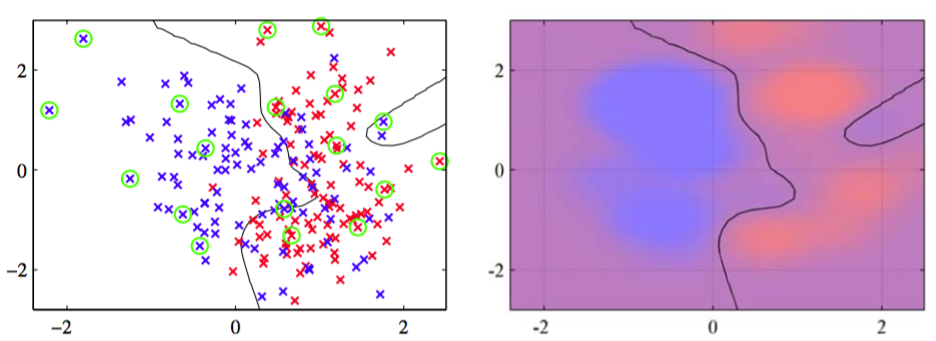

我们可以将相关向量机框架推广到分类问题，推广的方法是将权值的ARD先验应用到第4章研究过的概率线性分类模型上。首先，我们考虑二分类问题，目标变量是二值变量$$ t \in \{0, 1\} $$。这个模型现在的形式为基函数的线性组合经过logistic sigmoid函数的变换，即    

$$
y(x,w) = \sigma(w^T\phi(x)) \tag{7.108}
$$

其中$$ \sigma(\dot) $$是式（4.59）定义的logistic sigmoid函数。如果我们引入权值$$ w $$上的高斯先验，那么我们就得到了第4章讨论过的模型。这里的区别在于，在RVM中，模型使用的是ARD先验（7.80），其中每个权值参数有一个独立的精度超参数。    

与回归模型不同，我们不在对参数向量$$ w $$解析地求积分。这里，我们按照Tipping(2001)的方法，使用拉普拉斯近似，它曾经被应用于一个密切相关的问题，即4.5.1节介绍的贝叶斯logistic回归。    

首先，我们初始化超参数向量$$ \alpha $$。对于这个给定的$$ \alpha $$值，我们接下来对后验概率建立一个高斯近似，从而得到了对边缘似然的一个近似。这个近似后的边缘似然函数的最大化就引出了对$$ \alpha $$值的重新估计，并且不断重复这个过程，直到收敛。    

让我们详细研究这个模型的拉普拉斯近似。对于固定的$$ \alpha $$值，$$ w $$的后验概率分布的众数可以通过最大化

$$
\begin{eqnarray}
\ln p(w|t,\alpha) &=& \ln\{p(t|w)p(w|\alpha)\} - \ln p(t|\alpha) \\
&=& \sum\limits_{n=1}^N\{t_n\ln y_n + (1 - t_n)\ln(1 - y_n)\} - \frac{1}{2}w^TAw + const \tag{7.109}
\end{eqnarray}
$$

来得到。其中$$ A = diag(\alpha_i) $$。最大化可以使用4.3.3节讨论的迭代重加权最小平方（IRLS）方法完成。对于这个算法，我们需要求出对数后验概率分布的梯度向量和Hessian矩阵。根据式（7.109），结果为    

$$
\begin{eqnarray}
\nabla\ln p(w|t,\alpha) &=& \Phi^T(t - y) - Aw \tag{7.110} \\
\nabla\nabla\ln p(w|t,\alpha) &=& -(\Phi^TB\Phi + A) \tag{7.111}
\end{eqnarray}
$$

其中$$ B $$是一个$$ N \times N $$的对角矩阵，元素为$$ b_n = y_n(1 − y_n) $$。向量$$ y = (y_1,...,y_N)^T $$，矩阵$$ \Phi $$是设计矩阵，元素为$$ \Phi_{ni} = \phi_i(x_n) $$。这里，我们使用到了logistic sigmoid函数的导数的性质（4.88）。在IRLS算法收敛的位置，负Hessian矩阵表示后验概率分布的高斯近似的协方差矩阵的逆矩阵。    

后验概率的高斯近似的众数，对应于高斯近似的均值，可以通过令式（7.1100等于0求得。得到的拉普拉斯近似的均值和方差的形式为    

$$
\begin{eqnarray}
w^* &=& A^{-1}\Phi^T(t - y) \tag{7.112} \\
\Sigma &=& (\Phi^TB\Phi + A)^{-1} \tag{7.113}
\end{eqnarray}
$$

我们现在使用这个拉普拉斯近似来计算边缘似然函数。使用式（4.135）给出的使用拉普拉斯近似计算的积分的一般结果，我们有    

$$
\begin{eqnarray}
p(t|\alpha) &=& \int p(t|w)p(w|\alpha)dw \\
&\simeq& p(t|w^*)p(w^*|\alpha)(2\pi)^{M/2}\vert\Sigma\vert^{1/2} \tag{7.114}
\end{eqnarray}
$$

如果我们代入$$ p(t|w^*) $$和$$ p(w^*|\alpha) $$的表达式，然后令边缘似然函数关于$$ \alpha_i $$的导数等于0，得到    

$$
-\frac{1}{2}(w_i^*)^2 + \frac{1}{2\alpha_i} - \frac{1}{2}\Sigma_{ii} = 0 \tag{7.115}
$$

定义$$ \gamma_i = 1 − \alpha_i\Sigma_{ii} $$，整理可得：    

$$
\alpha_i^{new} = \frac{\gamma_i}{(w_i^*)^2} \tag{7.116}
$$

这与回归RVM的重估计式（7.87）相同。    

如果我们定义    

$$
\hat{t} = \Phi w^* + B^{-1}(t - y) \tag{7.117}
$$

那么我们可以将近似对数边缘似然函数写成

$$
\ln p(t|\alpha) = -\frac{1}{2}\left\{N\ln(2\pi) + \ln\vert C \vert + (\hat{t})^TC^{-1}\hat{t}\right\} \tag{7.118}
$$

这样的形式，其中    

$$
C = B + \Phi A \Phi^T \tag{7.119}
$$

这与回归问题得到的式（7.85）形式相同，因此我们可以应用同样的稀疏性分析的过程，得到同样的快速学习算法，这种算法中，我们在每一步最优化单独的一个超参数$$ \alpha_i $$。    

图7.12给出了将相关向量机应用于人工生成的分类数据上的结果。

      
图 7.12 相关向量机应用于人工数据集的说明。左图给出了决策边界和数据点，相关向量用圆圈标记出。将这个结果与图7.4给出的对应的支持向量机的结果进行比较，表明RVM得到了更稀疏的模型。右图画出了由RVM给出的后验概率分布，其中红色（蓝色）所占的比重表示数据点属于红色（蓝色）类别的概率。

我们看到相关向量倾向于不在决策边界区域内，这与支持向量机恰好相反。这与我们之前对于RVM的分析是相容的，因为以位于决策边界附近的数据点为中心的基函数$$ \phi_i(x) $$会产生一个向量$$ \phi_i $$，它与训练数据向量的对齐效果较差。    

与SVM相比，相关向量机的一个潜在的优势是，它做出了概率形式的预测。如对于视频流人脸跟踪的线性动态系统的非线性扩展，可以用RVM来辅助构建它的发射概率密度（Williams et al., 2005）。    

目前为止，我们已经考虑了二分类问题的RVM。对于$$ K > 2 $$个类别的情形，我们再次使用4.3.4节中的概率方法。这种方法中，有$$ K $$个形式为

$$
a_k = w_k^Tx \tag{7.120}
$$

的线性模型。这些模型使用softmax函数进行组合，给出形式为

$$
y_k(x) = \frac{exp(a_k)}{\sum_jexp(a_j)} \tag{7.121}
$$

的输出。这样，对数似然函数为    

$$
\ln p(T|w_1,...,w_K) = \prod\limits_{n=1}^N\prod\limits_{k=1}^K y_{nk}^{t_nk} \tag{7.122}
$$

其中，对于每个数据点$$ n,t_{nk} $$的表示方式是“1-of-K”的形式，$$ T $$是一个元素为$$ t_{nk} $$的矩阵。同样的，拉普拉斯近似可以用来最优化超参数（Tipping, 2001），其中模型和Hessian矩阵可以使用IRLS算法得到。与支持向量机使用的“类别对”形式的方法相比，RVM对多分类问题的处理的基础更加牢固，并且对于新的数据点，能够给出概率形式的预测。主要的缺点是，Hessian矩阵的维度为$$ MK \times MK
$$，其中$$ M $$是激活的基函数的数量，这使得与二分类的RVM相比，训练的计算代价多了一个额外的$$ K^3 $$因子。    

相关向量机的主要缺点是，与SVM相比，训练时间相对较长。但是，RVM避免了通过交叉验证确定模型复杂度的过程，从而补偿了训练时间的劣势。此外，因为它产生的模型更稀疏，所以它对于测试点进行预测的计算时间通常更短，而对于测试点的计算时间通常在实际应用中更加重要。

