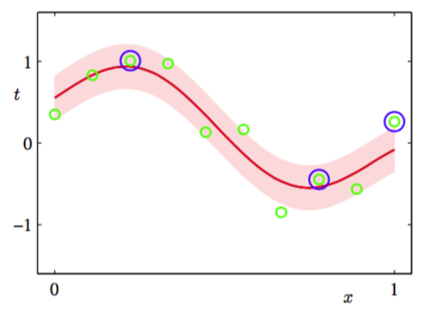

用于回归的相关向量机的形式是第3章研究过的线性模型的形式，但是先验概率有所不同，从而产生了稀疏解。模型定义了给定一个输入向量$$ x $$的情况下，实值目标变量$$ t $$的条件概率分布为    

$$
p(t|x,w,\beta) = \mathcal{N}(t|y(x),\beta^{-1}) \tag{7.76}
$$

其中$$ \beta = \sigma^{−2} $$是噪声精度（噪声方差的逆），均值是由一个线性模型给出，形式为    

$$
y(x) = \sum\limits_{i=1}^Mw_i\phi_i(x) = w^T\phi(x) \tag{7.77}
$$

模型带有固定非线性基函数$$ \phi_i(x) $$，通常包含一个常数项，使得对应的权参数表示一个“偏置”。    

相关向量机是这个模型的一个具体实例，它试图重现支持向量机的结构。特别地，基函数由核给出，训练集的每个数据点关联着一个核。一般的表达式（7.77）于是就可以写成与SVM相类似的形式    

$$
y(x) = \sum\limits_{n=1}^Nw_nk(x,x_n) + b \tag{7.78}
$$

其中$$ b $$是一个偏置参数。在目前的问题中，参数的数量为$$ M = N + 1 $$。$$ y(x) $$与SVM的预测模型（7.64）具有相同的形式，唯一的差别是系数$$ a_n $$在这里被记作$$ w_n $$。应该强调的是，后面的分析对于任意的基函数的选择都成立。为了一般情况，我们将对式（7.77）给出的形式进行操作。与SVM的情形相反，没有正定核的限制，基函数也没有被训练数据点的数量或位置所限制。    

假设我们有输入向量$$ x $$的$$ N $$次观测，我们将这些观测聚集在一起，记作数据矩阵$$ X $$，它的第$$ n $$行是$$ x-n^T $$，其中$$ n = 1,...,N $$。对应的目标值为$$ t = (t_1,...,t_N)^T $$。因此，似然函数为     

$$
p(t|X,w,\beta) = \prod\limits_{n=1}^Np(t_n|x_n,w,\beta) \tag{7.79}
$$

接下来我们引入参数向量$$ w $$上的先验分布。与第3章一样，我们考虑0均值的高斯先验。然而，RVM中的关键区别在于我们为每个权参数$$ w_i $$都引入了一个单独的超参数$$ \alpha_i $$，而不是一个共享的超参数。因此权值先验的形式为     

$$
p(w|\alpha) = \prod\limits_{i=1}^M\mathcal{N}(w_i|0,\alpha_i^{-1}) \tag{7.80}
$$

其中$$ \alpha_i $$表示对应参数$$ w_i $$的精度，$$ \alpha $$表示$$ (\alpha_1,...,\alpha_M)^T $$。我们将会看到，当我们关于这些超参数最大化模型证据时，大部分都趋于无穷，对应的权参数的后验概率分布集中在零附近。与这些参数关联的基函数于是对于模型的预测没有作用，因此被高效地剪枝掉，从而生成了一个稀疏的模型。    

使用式（3.49）给出的线性模型的结果，我们看到权值的后验概率分布还是高斯分布，形式为    

$$
p(w|t,X,\alpha,\beta) = \mathcal{N}(w|m,\Sigma) \tag{7.81}
$$

其中，均值和方差为    

$$
\begin{eqnarray}
m &=& \beta\Sigma\Phi^Tt \tag{7.82} \\
\Sigma = (A + \beta\Phi^T\Phi)^-1 \tag{7.83}
\end{eqnarray}
$$

其中，$$ \Phi $$是$$ N \times M $$的设计矩阵，元素为$$ \Phi_{ni} = \phi_i(x_n) $$，且$$ A = diag(\alpha_i) $$。注意在模型（7.78）的特殊情况下，我们有$$ \Phi = K $$，其中$$ K $$是元素为$$ k(x_n,x_m) $$的$$ (N+1) \times (N+1) $$对称核矩阵。    

$$ \alpha,\beta $$的值可以通过第二类最大似然法（也被称为证据近似）来确定。这种方法中，我们最
大化通过对权向量积分得到的边缘似然函数：    

$$
p(t|X,\alpha,\beta) = \int p(t|X,w,\beta)p(w|\alpha)dw \tag{7.84}
$$

由于这表示两个高斯分布的卷积，因此可以得到对数边缘似然函数：    

$$
\begin{eqnarray}
\ln p(t|X,\alpha,\beta) &=& \ln\mathcal{N}(t|O,C) \\
&=& -\frac{1}{2}\{N\ln(w\pi) + \ln\vert C \vert + t^TC^{-1}t\} \tag{7.85}
\end{eqnarray}
$$    

其中$$ t = (t_1,...,t_N)^T $$，且我们定义了形式为    

$$
C = \beta^{-1}I + \Phi A^{-1}\Phi^T \tag{7.86}
$$

的$$ N \times N $$的矩阵$$ C $$。    

我们现在的目标是关于超参数$$ \alpha, \beta $$最大化式（7.85）。这只需要对3.5节给出的线性模型的证据近似进行微小的修改即可。我们可以区分出两种方法。第一种方法中，我们简单地令要求解的边缘似然函数的导数等于0，然后得到再估计方程：    

$$
\begin{eqnarray}
\alpha_i^{new} &=& \frac{\gamma_i}{m_i^2} \tag{7.87} \\
(\beta^{new})^{-1} = \frac{\Vert t - \Phi_m \Vert^2}{N - \sum_i\gamma_i} \tag{7.88}
\end{eqnarray}
$$

其中$$ m_i $$是式（7.82）定义的后验均值$$ m $$的第$$ i $$个分量。$$ \gamma_i $$定义为

$$
\gamma_i = 1 - \alpha_i\Sigma_{ii} \tag{7.89}
$$

这度量了对应的参数$$ w_i $$由数据确定的效果。其中$$ \Sigma_{ii} $$是式（7.83）给出的后验协方差$$ \Sigma $$的第$$ i $$个对角元素。因此，学习过程按照，首先选择$$ \alpha, \beta $$的初始值，分别使用式（7.82）和式（7.83）计算后验概率的均值和协方 差，然后交替地重新估计超参数（使用式（7.87）和式（7.88）进行）、重新估计后验均值与协方差（使用式（7.82）和式（7.83）进行），直到满足一个合适的收敛准则，这个步骤进行。    

第二种方法是使用EM算法，将在9.3.4节讨论。这两种寻找最大化证据的超参数值的方法在形式上是等价的。然而，在数值计算上，使用对应于式（7.87）和式（7.88）的直接最优化方法可以更快地收敛（Tipping, 2001）。    

作为最优化的结果，我们发现超参数$$ \{\alpha_i\} $$的一部分趋于特别大的值（原则上是无穷大），因此对应于这些超参数的权参数$$ w_i $$的后验概率的均值和方差都是零。因此这些参数以及对应的基函数$$ \phi_i(x) $$被从模型中去掉，对于新输入的预测没有作用。在式（7.78）给出的模型中，对应于剩下的非零权值的输入$$ x_n $$被称为相关向量（relevance
vector），因为它们是通过自动相关性检测的方法得到的，类似于SVM中的支持向量。然而，值得强调的一点是，通过自动相关性检测得到概率模型的稀疏性的方法是一种相当通用的方法，可以应用于任何表示成基函数的可调节线性组合形式的模型。    

找到了最大化边缘似然函数的超参数$$ \alpha^*,\beta^* $$的值之后，对于一个新的输入$$ x $$，我们可以计算$$ t $$上的预测分布。使用式（7.76）和式（7.81），预测分布为    

$$
\begin{eqnarray}
p(t|x,X,t,\alpha^*,\beta^*) &=& \int p(t|x,w,\beta^*)p(w|X,t,\alpha^*,\beta^*)dw \\
&=& \mathcal{N}(t|m^T\phi(x),\sigma^2(x)) \tag{7.90}
\end{eqnarray}
$$    

因此预测均值由式（7.76）给出，其中$$ w $$被设置为后验均值$$ m $$，预测分布的方差为    

$$
\sigma^2(x) = (\beta^*)^{-1} + \phi(x)^T\Sigma\phi(x) \tag{7.91}
$$

公式中的$$ \Sigma $$由式（7.83）给出，其中$$ \alpha, \beta $$被设置为最优值$$ \alpha^*, \beta^* $$。这类似于式（3.59）给出的线性回归模型的结果。回忆一下，对于局部的基函数，线性回归模型的预测方差在输入空间中没有基函数的区域会变小。于是，对于带有以数据点为中心的基函数的RVM的情形，当对数据以外的区域进行外插时，模型会对预测变得越来越确定（Rasmussen and Quinorro-Candela, 2005）,这当然不是我们想要的结果。高斯过程回归的预测分布没有这种问题。然而，高斯过程做预测的计算代价通常比RVM高得多。    

图7.9给出了将RVM应用于正弦数据集回归问题的一个例子。    

      
图 7.9 使用与图7.8相同的数据集和相同的高斯核进行RVM回归的说明。RVM预测分布的均值用红色曲线表示，预测分布的一个标准差的位置用阴影区域表示。此外，数据点用绿色表示，相关向量用蓝色圆圈标记。注意，只有3个相关向量，而图7.8的$$ v $$-SVM有7个支持向量。

这里，噪声精度β也通过证据最大化的方式确定。我们看到RVM中先关向量的数量比SVM中使用的支持向量的数量少得多。对于一大类回归任务和分类任务，RVM生成的模型通常比对应的支持向量机生成的模型简洁了一个数量级，从而使得处理测试数据的速度有了极大的提升。值得注意的是，与SVM相比，这种稀疏性的增大并没有减小泛化误差。    

与RVM相比，SVM的一个主要缺点是训练过程涉及到优化一个非凸的函数，并且与一个效果相似的SVM相比，训练时间要更长。对于有$$ M $$个基函数的模型，RVM需要对一个$$ M \times M $$的矩阵求逆，这通常需要$$ O(M^3) $$次操作。在类似SVM的模型（7.78）这一具体情形下，我们有$$ M = N + 1 $$。正如我们已经注意到的那样，存在训练SVM的高效方法，它的计算代价大致是N的二次函数。当然，在RVM的情况下，我们总可以在开始时将基函数的数量设置为小于$$ N + 1 $$。更重要的一点是，在相关向量机中，控制模型复杂度的参数以及噪声方差自动由一次训练过程确定，而在支持向量机中，参数$$ C $$和$$ \epsilon $$（或者$$ v $$）通常使用交叉验证的方法确定，这涉及到多次训练过程。此外，在下一节中，我们会推导另一种训练相关向量机的方法，它极大地提升了训练速度。
