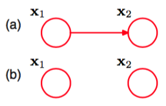
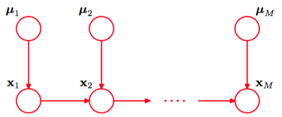
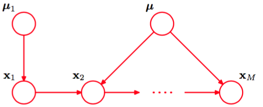

我们已经讨论了指数族概率分布的重要性，我们看到这一类概率分布将许多著名的概率分布当成了指数族分布的特例。虽然指数族分布相对比较简单，但是它们组成了构建更复杂概率分布的基本元件。图模型的框架在表达这些基本元件之间的联系时非常有用。    

如果我们将有向图中的每个父结点-子结点对的关系选为共轭的，那么这样的模型有一些特别好的性质，我们稍后会给出几个例子。两种情形很值得注意，即父结点和子结点都对应于离散变量的情形，以及它们都对应高斯变量的情形，因为在这两种情形中，关系可以层次化地推广，构建任意复杂的有向无环图。我们首先考察离散变量的情形。    

对于有着$$ K $$个可能状态（使用“1-of-K”表达方式）的一元离散变量$$ x $$，概率$$ p(x|\mu) $$为    

$$
p(x|\mu) = \prod\limits_{k=1}^K\mu_k^{x_k} \tag{8.9}
$$

并且由参数$$ \mu = (\mu_1,...,\mu_K)^T $$控制。由于限制条件$$ \sum_k\mu_k = 1 $$的存在，因此为了定义概率分布，只需要指定$$ K - 1 $$个$$ \mu_k $$的值即可。    

现在假设我们有两个离散变量$$ x_1,x_2 $$，每个都有$$ K $$个状态，我们项对它们的联合概率分布建模。我们将$$ x_{1k} = 1 $$和$$ x_{2l} = 1 $$同时被观测到的概率记作参数$$ \mu_{kl} $$，其中$$ x_{1k} $$表示$$ x_1 $$的第$$ k $$个分量，$$ x_{2l} $$的意义与此相似。联合概率分布可以写成     

$$
p(x_1,x_2|\mu) = \prod\limits_{k=1}^K\prod\limits_{l=1}^K\mu_{kl}^{x_{1k}x_{2l}}
$$

由于参数$$ \mu_{kl} $$满足限制条件$$ \sum_k\smu_l\mu_{kl} = 1 $$，因此这个分布由$$ K^2 − 1 $$个参数控制。很容易看到，对于$$ M $$个变量的任意一个联合概率分布，需要确定的参数的数量为$$ K^M −1 $$，因此随着变量$$ M $$的数量指数增长。    

使用概率的乘积规则，我们可以将联合概率分布$$ p(x_1, x_2) $$分解为$$ p(x_2|x_1)p(x_1) $$，它对应于一个具有两个结点的图，链接从结点$$ x_1 $$指向结点$$ x_2 $$，如图8.9(a)所示。

      
图 8.9 (a)全连接的图描述了两个$$ K $$状态离散变量上的一般的分布，具有$$ K^2 − 1 $$给参数。(b)通过丢弃结点
之间的链接，参数的数量减小到了$$ 2(K − 1) $$。    

边缘概率分布$$ p(x_1) $$与之前一样，由$$ K − 1 $$个参数控制。类似地，条件概率分布$$ p(x_2|x_1) $$需要指定$$ K − 1 $$个参数，确定$$ x_1 $$的$$ K $$个可能的取值。因此，与之前一样，在联合概率分布中，需要指定的参数的总数为$$ (K−1)+K(K−1) = K^2−1 $$。     

现在假设变量$$ x_1, x_2 $$是独立的，对应于图8.9(b)所示的图模型。这样，每个变量由一个独立的多项式概率分布描述，参数的总数是$$ 2(K − 1) $$。对于$$ M $$个独立离散变量上的概率分布，其中每个变量有$$ K $$个可能的状态，参数的总数为$$ M(K − 1) $$，因此随着变量的数量线性增长。从图的角度看，我们通过删除结点之间链接的方式，减小了参数的数量，代价是类别的概率分布受到了限制。    

更一般地，如果我们有$$ M $$个离散变量$$ x_1,...,x_M $$，那么我们可以使用有向图来对联合概率分布建模，每个变量对应于一个结点。每个结点的条件概率分布由一组非负参数给出，同时需要满足归一化限制条件。如果图是全连接的，那么我们有一个完全一般的概率分布，这个分布有$$ KM − 1 $$个参数。而如果图中不存在链接，那么联合概率分布可以分解为边缘概率分布的乘积，参数的总数为$$ M(K − 1)
$$。连接度处于二者之间的图使得模型能够处理比完全分解的概率分布更加一般的概率分布，同时参数的数量比一般的联合概率分布的参数数量少。作为一个说明，考虑图8.10所示的结点链。

      
图 8.10 $$ M $$个离散结点组成的链，每个结点有$$ K $$个状态，要求指定$$ K − 1 + (M − 1)K(K − 1) $$个参数，它随着链的长度M线性增长。相反，$$ M $$个结点的一个完全连接的图具有$$ KM −1 $$个参数，它随着$$ M  $$指数增长。

边缘概率分布$$ p(x_1) $$需要$$ K − 1 $$个参数，而对于$$ M − 1 $$个条件概率分布$$ p(x_i|x_{i−1}) $$（其中$$ i = 2,...,M $$）需要$$ K(K − 1) $$个参数。从而，参数的总数为$$ K − 1 + (M − 1)K(K − 1) $$，这是$$ K $$的二次函数，并且随着链的长度$$ M $$线性增长（而不是指数增长）。     

另一种减小模型中独立参数数量的方法是参数共享（sharing），也被称为参数捆扎（tying）。如，在图8.10给出的结点链的例子，我们可以使所有的条件概率分布$$ p(x_i|x_{i−1}) $$（其中$$ i=2,...,M $$）由同样的参数集合$$ K(K−1) $$。加上控制$$ x_1 $$的$$ K−1 $$个参数，为了定义联合概率分布所需指定的参数的总数为$$ K^2 − 1 $$。     

通过引入参数的狄利克雷先验，我们可以将离散变量上的图模型转化为贝叶斯模型。从图的观点来看，每个结点需要额外的父结点表示对应于每个离散结点的参数。这种情况在图8.11中进行了说明。

      
图 8.11 图8.10的模型的扩展，包含了控制离散分布的参数的狄利克雷先验分布。

如果我们将控制条件概率分布$$ p(x_i|x_{i−1}) $$（其中$$ i=2,...,M $$）的参数进行参数共享，那么对应的模型如图8.12所示。

      
图 8.12 与图8.11相同，但是所有的条件概率分布$$ p(x_i|x_{i−1}) $$共享一个单一的参数$$ \mu $$的集合。     

另一种控制离散变量模型参数数量的指数增长的方式是对条件概率分布使用参数化的模型，而不使用条件概率值的完整表格。为了说明这个想法，考虑图8.13所示的图，其中所有的结点表示二值变量。    

每个父结点变量$$ x_i $$由单一参数$$ \mu_i $$控制，这个参数表示概率$$ p(x_i = 1) $$，从而对于$$ M $$个父结点，参数总数为$$ M $$。但是，条件概率分布$$ p(x_1,...,x_M) $$需要$$ 2^M $$个参数，每个参数表示$$ 2^M $$种父结点变量的可能配置下的概率$$ p(y = 1) $$。因此，通常来说，确定这个条件概率分布的参数的数量会随着$$ M $$指数增长。将logistic sigmoid函数作用于父结点变量的线性组合上，我们可以得到一个更加简洁的形式为

$$
p(y=1|x_1,...,x_M) = \sigma\left(w_0 + \sum\limits_{i=1}^Mw_ix_i\right) = \sigma(w^Tx) \tag{8.10}
$$

的条件概率分布。其中$$ \sigma(a) = (1 + exp(−a))^{−1} $$是一个logistic sigmoid函数，$$ x = (x_0, x_1,...,x_M)^T $$是一个$$ (M + 1) $$维向量，表示父结点的$$ M $$个状态加上一个额外的变量$$ x_0 $$，其值被固定为1。$$ w = (w_0, w_1,...,w_M)^T $$是一个$$ M + 1 $$个参数的向量。与一般的情形相比，这是一个更加受限形式的条件概率分布，但是参数的数量随着$$ M
$$线性增长。在这种情况下，类似于选择多元高斯分布的协方差矩阵的限制形式（例如对角矩阵）。采用logistic sigmoid表示方法的原因在4.2节已经讨论过。    

