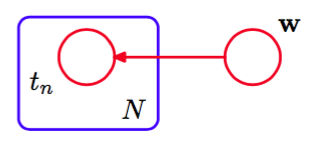
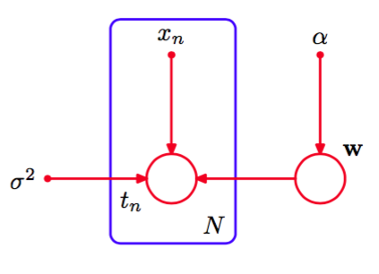
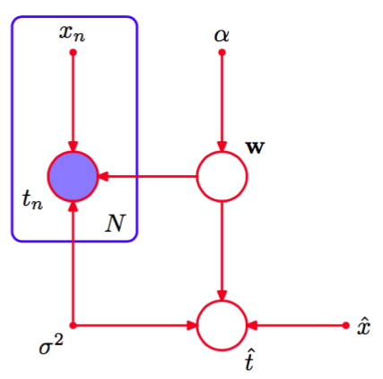

作为有向图描述概率分布的一个例子，我们考虑1.2.6节介绍的贝叶斯多项式拟合模型。这个模型中的随机变量是多项式系数向量$$ w $$和观测数据$$ t = (t_1,...,t_N)^T $$。此外，这个模型包含输入数据$$ x = (x_1,...,x_N)^T $$、噪声方差$$ \sigma^2 $$以及表示$$ w $$的高斯先验分布的精度的超参数$$ \alpha $$。所有这些都是模型的参数而不是随机变量。现阶段我们只关注随机变量，我们看到联合概率分布等于先验概率分布$$ p(w)
$$与$$ N $$个条件概率分布$$ p(t_n|w) $$的乘积，其中$$ n=1,...,N $$，即    

$$
p(t,w) = p(w)\prod\limits_{n=1}^Np(t_n|w) \tag{8.6}
$$

图模型表示的联合概率分布如图8.3所示。    

      
图 8.3 有向图模型表示联合概率分布（8.6），对应于1.2.6节介绍的贝叶斯多项式回归模型。    

在本书的后面章节中，当我们开始处理更加复杂的模型时，我们会看到，像图8.3那样显式地画出$$ t_1,...,t_N $$的结点是很不方便的。于是，我们引入一种可以使多个结点更简洁地表示出来的图结构。这种图结构中，我们画出一个单一表示的结点$$ t_n $$，然后用一个被称为板（plate）的方框圈起来，标记为$$ N $$，表示有$$ N $$个同类型的点。用这种方式重新表示图8.3，我们得到了图8.4。    

      
图 8.4 一种更加简洁的方式表示图8.3中的图，其中我们引入了一个板（plate）（标记为$$ N $$的方框）来表示$$ N $$个结点，这些结点中，只有一个例子$$ t_n $$被显式地画出。    

我们有时会发现，显式地写出模型的参数和随机变量是很有帮助的。此时，式（8.6）就变成了    

$$
p(t,w|x,\alpha,\sigma^2) = p(w|\alpha)\prod\limits_{n=1}^Np(t_n|w,x_n,\sigma^2)
$$

对应地，我们可以在图表示中显式地写出$$ x, \alpha $$。为了达到这个目的，我们会遵循：随机变量由空心圆表示，确定性参数由小的实心圆表示，这些惯例。如果我们让图8.4包含确定性参数，我们就得到了图8.5。

      
图 8.5 给出了与图8.4相同的模型，但是显式地画出了确定性参数，用小的实心圆表示。    

当我们将图模型应用于机器学习或模式识别的问题中时，我们通常将某些随机变量设置为具体的值，如将变量$$ \{t_n\} $$根据多项式曲线拟合中的训练集进行设置。在图模型中，我们通过给对应的结点加上阴影的方式来表示这种观测变量（observed variables）。于是，如果图8.5图中的$$ \{t_n\} $$是观测变量，那么就变成了图8.6。

      
图 8.6 与图8.5相同，但是结点$$ \{t_n\} $$被标记为阴影，表示对应的随机变量被设置成它们在训练集里的观测值。

注意，$$ w $$不是观测变量，因此$$ w $$是潜在变量（latent variable）的一个例子。潜在变量也被称为隐含变量（hidden variable）。这样的变量在许多概率模型中有着重要的作用，将在第9章和第12章详细讨论。    

观测到$$ \{t_n\} $$的值后，如果必要的话，我们可以计算系数$$ w $$的的后验概率，就像1.2.5节讨论的那样。现阶段，我们注意到，这是贝叶斯定理的一个直接应用：    

$$
p(w|T) \propto p(w)\prod\limits_{n=1}^Np(t_n|w) \tag{8.7}
$$

其中为了记号简洁，我们再一次省略了确定性参数。    

通常，因为我们的最终目标是对输入变量进行预测，所以对$$ w $$这样的参数本身不感兴趣。假设给定一个输入值$$ x $$，我们想找到以观 测数据为条件的对应的$$ t $$的概率分布。描述这个问题的图模型如图8.7所示。

      
图 8.7 多项式回归模型，对应图8.6。同时画出了新的输入$$ \hat{x} $$和对应的模型精度$$ \hat{t} $$

以确定性参数为条件，这个模型的所有随机变量的联合分布为    

$$
p(\hat{t},t,w|\hat{x},x,\alpha,\sigma^2) = \left[\prod\limits_{n=1}^Np(t_n|x_n,w,\sigma^2)\right]p(w|\alpha)p(\hat{t}|\hat{x},w,\sigma^2) \tag{8.8}
$$

然后，根据概率的加法规则，对模型参数$$ w $$积分，得到$$ \hat{t} $$的预测分布    

$$
p(\hat{t}|\hat{x},x,t,\alpha,\sigma^2) \propto \int p(\hat{t},t,w|\hat{x},x,\alpha,\sigma^2)dw
$$

其中我们隐式地将$$ t $$中的随机变量设置为数据集中观测到的具体值。计算的细节已经在第3章中讨论过。
