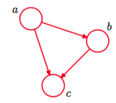
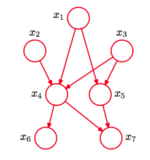

为了理解有向图对于描述概率分布的作用，首先考虑三个变量$$ a, b, c $$上的一个任意的联合分布$$ p(a, b, c) $$。注意，现阶段我们不需要对这些变量做出任何更多的假设，如它们是离散的还是连续的。实际上，图模型的一个强大的方面是，一个具体的图可以描述一大类概率分布。通过使用概率的乘法规则（1.11），我们可以将联合概率分布写成

$$
p(a,b,c) = p(c|a,b)p(a,b) \tag{8.1}
$$

这样的形式。再次使用乘积规则，这次处理方程（8.1）右侧的第二项，我们有    

$$
p(a,b,c) = p(c|a,b)p(b|a)p(a) \tag{8.2}
$$

注意，这个分解方法对于任意的联合概率分布的选择都成立。现在，我们使用一个简单的图模型表示方程（8.2）的右手边，如下所述：首先，我们为每个随机变量$$ a, b, c $$引入一个结点，然后为每个结点关联上式（8.2）右侧的对应的条件概率。然后，对于每个条件概率分布，我们在图中添加一个链接（箭头），链接的起点是条件概率的条件中的随机变量对应的结点。因此，对于因子$$ p(c|a, b) $$，会存在从结点$$ a, b $$到结点$$ c $$的链接，而对于因子$$ p(a)
$$，没有输入的链接，结果就如图8.1。

      
图 8.1 一个有向图模型，表示三个变量$$ a, b, c $$上的联合概率分布，对应于式（8.2）右侧的分解。

如果存在一个从结点$$ a $$到结点$$ b $$的链接，那么我们说结点$$ a $$是结点$$ b $$的父结点，结点$$ b $$是结点$$ a $$的子结点。注意，我们不会形式化地区分结点和结点对应的变量，而是简单地使用同样的符号表示两者。    

关于式（8.2），很有趣的一点是，它的左侧关于三个变量$$ a, b, c $$是对称的，而右侧不是。实际上，通过进行式（8.2）的分解，我们隐式地选择了一个特定的顺序（即$$ a, b, c $$）。如果选择一个不同的顺序，我们会得到一个不同的分解方式，所以就得到一个不同的图表示形式。我们稍后再讨论这个想法。    

现在，让我们将图8.1给出的例子扩展到$$ K $$个变量的联合概率分布$$ p(x_1,...,x_K) $$。通过重复使用概率的乘积规则，联合概率分布可以写成条件概率的乘积，每一项对应一个形式为

$$
p(x_1,...,x_K) = p(x_K|x_1,...,x_{K-1}...p(x_2|x_1)p(x_1) \tag{8.3}
$$

的变量。对应一个给定的$$ K $$，我们可以将其表示为一个具有$$ K $$个结点的有向图，每个结点对应于式（8.3）右手边的一个条件概率分布，每个结点的输入链接包括所有以编号低于当前结点编号的结点为起点的链接。因为每对结点之间都存在一个链接，所以我们说这个图是全连接的（fully connected）。    

目前为止，我们操作的对象是一个完全一般的联合概率分布，从而分解方式以及对应的全连接图表示，可以应用于概率分布的任意选择。正如我们将会看到的，真正传递出图表示的概率分布的性质的有趣信息的是图中链接的缺失（absence）。考虑图8.2的图。

      
图 8.2 有向无环图描述变量$$ x_1,...,x_7 $$。联合概率分布的对应的概率分解由式（8.4）给出。

因为从$$ x_1 $$到$$ x_2 $$或从$$ x_3 $$到$$ x_7 $$之间不存在链接，所以这不是一个全连接的图。    

现在，我们将根据这幅图，写出对应的联合概率表达式。联合概率表达式由一系列条件概率的乘积组成，每一项对应于图中的一个结点。每个这样的条件概率分布只以图中对应结点的父结点为条件。如$$ x_5 $$以$$ x_1, x_3 $$为条件。于是$$ 7 $$个变量的联合概率分布为    

$$
p(x_1)p(x_2)p(x_3)p(x_4|x_1,x_2,x_3)p(x_5|x_1,x_3)p(x_6|x_4)p(x_7|x_4,x_5) \tag{8.4}
$$    

读者现阶段应该仔细研究式（8.4）与图8.2之间的对应关系。    

我们现在说明给定的有向图和变量上对应的概率分布之间的一般关系。在图的所有结点上定义的联合概率分布由每个结点上的条件概率分布的乘积表示，每个条件概率分布的条件都是图中结点的父结点所对应的变量。因此，对于一个有$$ K $$个结点的图，联合概率为    

$$
p(x) = \prod\limits_{k=1}^Kp(x_k|pa_k) \tag{8.5}
$$

其中$$ pa_k $$表示$$ x_k $$的父结点的集合，$$ x = \{x_1,...,x_K\} $$。这个关键的方程表示有向图模型的联合概率分布的分解（factorization）属性。虽然我们之前考虑的情况是每个结点对应于一个变量的情形，但是我们可以很容易地推广到让图的每个结点关联一个变量的集合，或关联向量值的变量。很容易证明，如果式（8.5）右侧的每一个条件概率分布都是归一化的，那么这个表示方法整体总是归一化的。    

我们考虑的有向图要满足一个重要的限制，即不能存在有向环（directed cycle）。换句话说，在图中不能存在从某个结点开始，沿着链接中箭头的方向运动，结束点为起点的路径。这种没有有向环的图被称为有向无环图（directed acyclic graph），或DAG。这等价于存在一个点排序，使得不存在从某个结点到序号较小的结点的链接。
