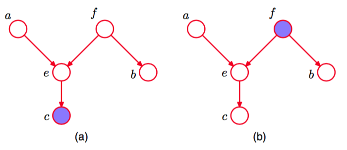
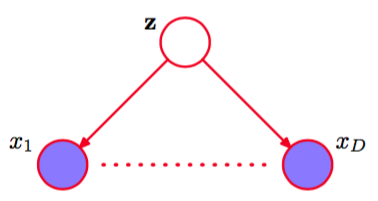
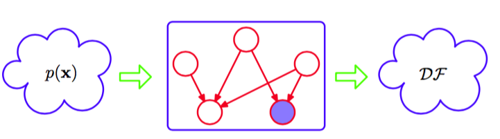
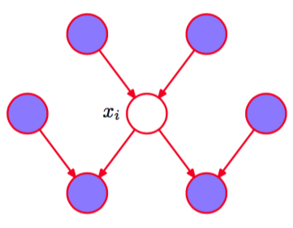

我们现在给出有向图D-划分性质的一个一般描述（Pearl, 1988）。考虑一个一般的有向图，其中$$ A, B, C $$是任意无交集的结点集合（它们的并集可能比图中结点的完整集合要小）。我们希望弄清楚，一个有向无环图是否暗示了一个特定的条件依赖表述$$ A \perp B | C $$。为了解决这个问题，我们考虑从$$ A $$中任意结点到$$ B $$中任意结点的所有可能的路径。我们说这样的路径被“阻隔”，如果它包含一个结点满足下面两个性质中的任何一个。    

1. 路径上的箭头以头到尾或者尾到尾的方式交汇于这个结点，且这个结点在集合$$ C $$中。    
2. 箭头以头到头的方式交汇于这个结点，且这个结点和它的所有后继都不在集合$$ C $$中。    

如果所有的路径都被“阻隔”，那么我们说$$ C $$把$$ A $$从$$ B $$中D-划分开，且图中所有变量上的联合概率分布将会满足$$ A \perp B | C $$。    

图8.22说明了D-划分的概念。

      
图 8.22 D划分概念的说明。    

在图(a)中，从$$ a $$到$$ b $$的路径没有被结点$$ f $$阻隔，因为对于这个路径来说，它是一个尾到尾结点，并且没有被观测到。这条路径也没有被结点$$ e $$阻隔，因为虽然后者是一个头到头的结点，但是它有一个后继$$ c $$在条件集合中。因此条件独立关系$$ a \perp b | c $$在这个图中不成立。在图(b)中，从$$ a $$到$$ b $$的路径被结点$$ f
$$阻隔，因为它是一个尾到尾的结点，并且被观测到，因此使用这幅图进行分解的任何概率分布都满足条件独立性质$$ a \perp b | f $$。注意，这个路径也被结点$$ e $$阻隔，因为$$ e $$是一个头到头的结点，并且它和它的后继都没在条件集合中。    

对于D-划分的目的来说，图8.5中用小实心圆表示的参数（如$$ \alpha \sigma^2 $$）与观测结点的行为相同。然而，这些结点没有边缘概率分布。结果，参数结点本身没有父结点，因此所有通过这些结点的路径总是尾到尾的，因此是阻隔的。从而它们在D-划分中没有作用。      

1.2.4节介绍的独立同分布数据的概念提供了条件独立和D-划分的另一个例子。考虑寻找一元高斯分布的均值的后验概率分布的问题。这可以表示为图8.23的有向图的形式。    

      
图 8.23 (a)对应于推断观测$$ x_1,...,x_N $$上的一元高斯分布的均值μ的问题的有向图。(b)同样的图，使用板的记号表示。    

其中联合概率分布由先验概率分布$$ p(\mu) $$和一组条件分布$$ p(x_n|\mu) $$表示，其中$$ n=1,...,N $$。在实际应用中，我们观测到$$ D = \{x_1,...,x_N\} $$，我们的目标是推断$$ \mu $$。我们现在假设我们以$$ \mu
$$为条件，考虑观测的联合概率分布。使用D-划分，我们注意到从任意结点$$ x_i $$到其他的结点$$ x_{j \neq i} $$有一条唯一的路径，这个路径关于观测结点$$ \mu $$是尾到尾的。每条这样的路径都是阻隔的，因此给定$$ \mu $$，观测$$ D = \{x_1,...,x_N\} $$是独立的，即    

$$
p(D|\mu) = \prod\limits_{n=1}^Np(x_n|\mu) \tag{8.34}
$$

然而，如果我们对$$ \mu $$积分，通常观测不再独立，即    

$$
p(D) = \int_{-\infty}^\infty p(D|\mu)p(\mu)d\mu \neq \prod\limits_{n=1}^Np(x_n) \tag{8.35}
$$

这里因为$$ \mu $$的值未被观测，所以它是一个潜在变量。    

另一个表示独立同分布数据模型的例子如图8.7所示，它对应于贝叶斯多项式回归。这里，随机结点对应于$$ \{t_n\},w $$和$$ t $$。我们看到，$$ w $$的结点关于从$$ t $$到任意结点$$ t $$的路径是尾对尾的，因此我们有条件独立性质：    

$$
\hat{t} \perp t_n| w \tag{8.36}
$$

因此，以多项式系数$$ w $$为条件，$$ \hat{t} $$的预测分布独立于训练数据$$ \{t_1,...,t_N\} $$。于是我们可以首先使用训练数据确定系数$$ w $$的后验概率分布，然后我们就可以丢弃训练数据，使用$$ w $$的后验概率分布对新输入观测$$ \hat{x} $$做出$$ \hat{t} $$的预测。    

一种被称为朴素贝叶斯（naive Bayes）模型的分类方法可以产生一种相关的图结构，其中我们使用条件独立性假设来简化模型的结构。假设观测变量由$$ D $$维向量$$ x = (x_1,...,x_D)^T $$组成，我们希望将$$ x $$的观测值分配到$$ K $$个类别中的一个。使用“1-of-K ”表示方式，我们可以使用一个$$ K $$维二值向量$$ z $$表示这些类别。然后我们可以这样定义一个生成式模型：引入类别标签上的多项式先验概率分布$$ p(z |\mu)
$$，其中$$ \mu $$的第$$ k $$个元素$$ \mu_k $$表示类别$$ C_k $$的先验概率，再引入观测向量$$ x $$的条件概率分布$$ p(x|z) $$。朴素贝叶斯模型的关键假设是，以类别$$ z $$为条件，输入变量$$ x_1,...,x_D $$的分布是独立的。这个模型的图表示如图8.24所示。

      
图 8.24 用于分类的“朴素贝叶斯”模型的图表示。以类别标签$$ z $$为条件，观测向量$$ x=(x_1,...,x_D)^T $$的元素假设是独立的。

我们看到$$ z $$的观测阻隔了从$$ x_i $$到$$ x_j $$的路径，其中$$ j \neq i $$，因为这样的路径在结点$$ z $$处是尾到尾的。因此给定$$ z $$的条件下，$$ x_i, x_j $$是条件独立的。然而，如果我们对$$ z $$求和或积分（即$$ z $$不是观测变量），那么从$$ x_i $$到$$ x_j $$的尾到尾路径就不再是阻塞的了。这告诉我们，通常边缘概率密度$$ p(x) $$不可以关于$$ x $$的元素进行分解。在1.5节中讨论将不同来源的医疗诊断数据整合到一起的问题时，我们遇到了朴素贝叶斯模型的一个简单的例子。     

如果给定一个有标记的训练集，由输入$$ \{x_1,...,x_N\} $$以及它们的类别标签组成，那么我们可以使用最大似然法，根据训练数据调整朴素贝叶斯模型，其中我们假设数据是独立地从模型中 抽取的。使用每个类别对应的标记数据，我们可以为每个类别分别调整一个模型，得到最终解。举例来说，假设每个类别的概率密度分布被选为高斯分布。在这种情况下，朴素贝叶斯的假设表明每个高斯分布的协方差矩阵是对角矩阵，且每个类别中常数密度的轮廓线是与坐标轴
对齐的椭球。然而，边缘概率密度由对角高斯的叠加组成（权系数由类别先验给出），因此不再能够关于各个分量进行分解。    

当输入空间的维度$$ D $$很高时，在完整的$$ D $$维空间进行概率密度估计比较困难，此时朴素贝叶斯的假设很有帮助。如果输入向量既包含离散变量又包含连续变量，那么朴素贝叶斯的假设也很有意义，因为每个变量都可以分别使用合适的模型进行表示，例如用伯努利分布表示二值观测，或者用高斯分布表示实值变量。这个模型中的条件独立性假设显然过于强烈，可能会导致 对类条件概率密度的表示相当差。尽管这样，即使这个假设无法精确满足，但是模型仍然可能给出较好的分类效果，因为决策边界对于类条件概率的细节不敏感，如图1.27所示。    

我们已经看到一个特定的有向图表示将联合概率分布分解为条件概率分布乘积形式的一个具体的分解方式。图也表示一组条件独立的性质，这些性质通过D-划分的方式得到，并且D-划分定 理实际上是一个等价于这两个性质的表示。为了让这一点更明显，将有向图想象成滤波器是很 有帮助的。假设我们考虑x上的一个特定的联合概率分布$$ p(x) $$，其中x对应于图中的（未观测）结点。一个概率分布能够通过滤波器当且仅当它能够用与图对应的式（8.5）给出的分解方式
进行分解。如果我们将变量x的集合上的所有可能的概率分布$$ p(x) $$输入到滤波器中，那么通过滤波器的概率分布的子集被记作DF，表示有向分解(directed factorization)，如图8.25所示。

      
图 8.25 我们可以将图模型（在这幅图中是有向图）看成滤波器。当且仅当概率分布$$ p(x) $$满足有向分解性质（8.5）时，$$ p(x) $$才可以通过滤波器。通过滤波器的所有可能的概率分布$$ p(x) $$被记作$$ DF $$。我们也可以根据概率分布是否满足由图的D-划分性质表示的所有的条件独立性质来使用图对概率分布进行过滤。D-划分定理表明，这两种滤波方式得到的概率分布集合$$ DF $$是相同的。

我们还可以将图用作另一种滤波器，首先将D-划分准则应用到图中，列出所有得到的条件独立性质，然后只有当一个概率分布满足所有这些性质时才允许通过。如果我们将所有可能的概率分 布输入到这一类滤波器中，那么D-划分定理告诉我们，允许通过的概率分布的集合就是$$ DF $$。    

应该强调的是，从D-划分中得到的条件独立性质适用于任何由那个特定的有向图描述的概率模型。例如，无论变量是离散的还是连续的还是二者的组合，这个性质都成立。与之前一样， 我们看到特定的图描述了一大类概率分布。在一种极限的情况下，我们有一个全连接的图，它不表示任何的条件独立性质，可以表示给
定变量上的任何可能的联合概率分布。集合$$ DF $$将包含所有可能的概率分布$$ p(x) $$。在另一种情况 下，我们有一个完全非连接的图，即一张不存在任何链接的图。这对应的联合概率分布可以分解为图结点组成的变量上的边缘概率分布的乘积。    

注意，对于任意给定的图，分布的集合DF 中的概率分布还会具有图中未描述的独立性质。例如，一个完全分解的概率分布总会通过由对应变量组成的任意图结构表示的滤波器。    

最后，我们通过研究马尔科夫毯（Markov blanket）或者马尔科夫边界（Markov boundary）的概念来结束我们关于条件独立性的讨论。考虑一个联合概率分布$$ p(x_1,...,x_D) $$，它由一个具有$$ D $$个结点的有向图表示。考虑变量$$ x_i $$对应的结点上的条件概率分布，其中条件为所有剩余的变量$$ x_{j \neq i} $$使用分解性质(8.5)，我们可以将条件概率分布表示为下面的形式    

$$
\begin{eqnarray}
p(x_i|x_{\{j \neq i\}} &=& \frac{p(x_1,...,x_D)}{\int p(x_1,...,x_D)dx_i} \\
&=& \frac{\prod\limits_kp(x_k|pa_k)}{\int \prod\limits_kp(x_k|pa_k)dx_i}
\end{eqnarray}
$$

对于离散变量，上式中的积分需要替换为求和式。我们现在观察到任何与xi没有函数依赖关系的因子都可以提到xi的积分外面，从而在分子和分母之间消去。唯一剩余的因子是结点$$ x_i $$本身的条件概率分布$$ p(x_i|pa_i) $$，以及满足下面性质的结点xk的条件概率分布：结点$$ x_i $$在$$ p(x_k|pa_k) $$的条件集合中，即$$ x_i $$是$$ x_k $$的父结点。条件概率分布$$ p(x_i|pa_i) $$依赖于结点$$ x_i $$的父结点，而条件概率分布$$ p(x_k|pa_k) $$依赖于$$ x_i
$$的子结点以及同父结点（co-parents），即那些对应于$$ x_k $$（而不是$$ x_i $$）的父结点的变量。由父结点、子结点、同父结点组成的结点集合被称为马尔科夫毯，如图8.26所示。    

      
图 8.26 结点$$ x_i $$的马尔科夫毯由父结点、子结点、同父结点组成的集合构成。它的性质为：以图中所有剩余结点为条件，$$ x_i $$的条件概率分布值依赖于马尔科夫毯中的变量。

我们可以将结点$$ x_i $$的马尔科夫毯想象成将$$ x_i $$与图的剩余部分隔离开的最小结点集合。注意，只包含$$ x_i $$的父结点和子结点是不够的，因为之前的例子表明，子结点的观测不会阻隔某个结点到同父结点的路径。因此我们必须也观测同父结点。

