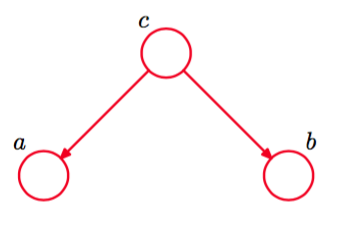
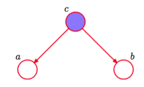
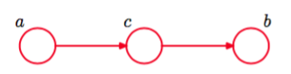
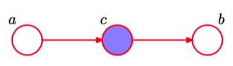
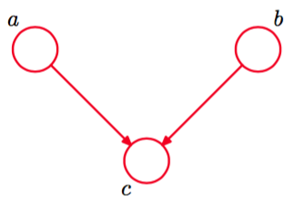
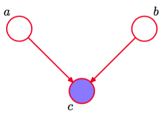
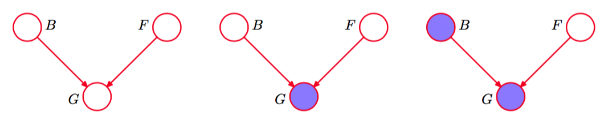

现在，开始讨论有向图的条件独立性质。考虑三个简单的例子，每个例子涉及到只有三个结点的图。这些例子会说明d-划分中的关键概念。三个例子中的第一个如图8.15所示。

      
图 8.15 三个变量$$ a, b, c $$上的图模型的三个例子中的第一个，这些例子用来讨论有向图模型的条件独立性质。

使用公式（8.5）给出的一般结果，这个图的联合概率分布很容易写出来，即    

$$
p(a,b,c) = p(a|c)p(b|c)p(c) \tag{8.23}
$$

如果没有变量是观测变量，那么我们可以通过对式（8.23）两边进行积分或求和的方式，考察$$ a, b $$是否是相互独立的，即    

$$
p(a,b) = \sum\limits_cp(a|c)p(b|c)p(c) tag{8.24}
$$

一般地，这不能分解为乘积$$ p(a)p(b) $$，因此    

$$
a \not\perp | \varnothing  \tag{8.25}
$$

其中$$ \varnothing $$表示空集，符号$$ \not\perp $$表示条件独立性质不总是成立。当然，通过给各个概率分布关联具体的数值，可能存在一个特定的分布使得条件独立的性质成立，但是一般情形下，不能构建图结构。

现在假设我们以变量$$ c $$为条件，如图8.16所示。根据式（8.23），我们可以很容易地写出给定$$ c $$的条件下，$$ a,b $$的条件概率分布，形式为    

$$
\begin{eqnarray}
p(a,b|c) &=& \frac{p(a,b,c)}{p(c)} \\
&=& p(a|c)p(b|c)
\end{eqnarray}
$$

因此我们可以得到条件独立性质    

$$
a \perp b | c
$$

通过考虑从结点$$ a $$经过结点$$ c $$到结点$$ b $$，我们可以给这个结果一个简单的图表示。结点$$ c $$被称为关于这个路径“尾到尾”（tail-to-tail），因为结点与两个箭头的尾部相连。这样的一个连接结点$$ a $$和结点$$ b $$的路径的存在使得结点相互依赖。然而，当我们以结点$$ c $$为条件时（如图8.16所示），被用作条件的结点“阻隔”了从$$ a $$到$$ b $$的路径，使得$$ a,b $$变得（条件）独立了。

      
图 8.16 与图8.15相同，但是我们以变量$$ c $$为条件。    

我们可以类似地考虑图8.17给出的图。

      
图 8.17 3结点图的三个例子中的第二个，这些例子用来说明有向图模型的条件独立框架。

这幅图对应的联合概率分布可以通过一般形式的式（8.5）得到，形式为    

$$
p(a,b,c) = p(a)p(c|a)p(b|c) \tag{8.26}
$$    

首先，假设所有的变量都不是观测变量。与之前一样，我们可以考察$$ a, b $$是否是相互独立的，方法是对$$ c $$积分或求和，得到     

$$
p(a,b) = p(a)\sum\limits_cp(c|a)p(b|c) = p(a)p(b|a)
$$

这通常不能够分解为$$ p(a)p(b) $$，因此    

$$
a \not\perp b | \varnothing \tag{8.27}
$$

这个结果与之前的相同。    

现在假设我们以结点$$ c $$为条件，如图8.18所示。

      
图 8.18 与图8.17相同，但是现在以$$ c $$为条件

使用贝叶斯定理，以及式（8.26），得到     

$$
\begin{eqnarray}
p(a,b|c) &=& \frac{p(a,b,c)}{p(c)} \\
&=& \frac{p(a)p(c|a)p(b|c)}{p(c)} \\
&=& p(a|c)p(b|c)
\end{eqnarray}
$$    

从而我们又一次得到了条件独立性质    

$$
a \perp b | c
$$

同样的，我们可以用图表示这个结果。结点$$ c $$被称为关于从结点$$ a $$到结点$$ b $$的路径“头到尾”(head-to-tail)。这样的一个路径连接了结点$$ a $$和结点$$ b $$，且使它们互相之间存在依赖关系。如果我们现在观测结点$$ c $$，如图8.18所示，那么这个观测“阻隔”了从$$ a $$到$$ b $$的路径，因此我们得到了条件独立性质$$ a \perp b | c $$。    

最后，我们考虑第三个3结点图的例子，如图8.19所示。

      
图 8.19 3结点图的三个例子中的最后一个例子，这些例子用来研究图模型中的条件独立性质。这张图与前两个例子的性质相当不同。

正如我们将看到的那样，这幅图的行为比之前两幅图更微妙。     

与之前一样，联合概率分布可以使用我们的一般结果（8.5）得到。    

$$
p(a,b,c) = p(a)p(b)p(c|a,b) \tag{8.28}
$$

首先考虑当没有变量是观测变量时的情形。对式（8.28）两侧关于$$ c $$积分或求和，得到    

$$
p(a,b) = p(a)p(b)
$$

因此当没有变量被观测时，$$ a, b $$是独立的，这与前两个例子相反。我们可以把这个结果写成    

$$
a \perp b | \varnothing \tag{8.29}
$$

现在假设我们以$$ c $$为条件，如图8.20所示。

      
图 8.20 与图8.19相同，但是以结点$$ c $$的值为条件。这张图中，引入条件结点使得$$ a, b $$之间产生了依赖关系。

$$ a, b $$的条件概率分布为

$$
\begin{eqnarray}
p(a,b|c) &=& \frac{p(a,b,c)}{p(c)} \\
&=& \frac{p(a|c)p(b|c)p(c|a,b)}{p(c)}
\end{eqnarray}
$$

这通常无法被分解为乘积$$ p(a)p(b) $$，因此

$$
a \not\perp b | c
$$

因此，我们第三个例子与前两个例子的行为相反。图形上，因为$$ c $$连接了两个箭头的头，所以我们说结点$$ c $$关于从$$ a $$到$$ b $$的路径是“头到头”（head-to-head）。当结点$$ c $$没有被观测到的时候，它“阻隔”了路径，从而变量$$ a,b $$是独立的。然而，以$$ c $$为条件时，路径被“解除阻隔”，使得$$ a,b $$相互依赖了。    

第三个例子还有一个更加微妙的地方需要考虑。首先，我们引入一些新的概念。如果存在从结点$$ x $$到结点$$ y $$的一条路径，其中路径的每一步都沿着箭头的方向，那么我们说结点$$ y $$是结点$$ x $$的后继（descendant）。这样，可以证明，在一个头到头的路径中，如果任意结点或者它的任意一个后继被观测到，那么路径会被“解除阻隔”。     

总之，一个尾到尾结点或者头到尾结点使得一条路径没有阻隔，除非它被观测到，之后它就阻隔了路径。相反，一个头到头结点如果没有被观测到，那么它阻隔了路径，但是一旦这个结点或者至少一个后继被观测到，那么路径就被“解除阻隔”了。      

花一些时间进一步理解图8.20给出的图的不寻常的行为是很有意义的。考虑一个特定的实例，即这个图对应于下面的问题：问题中有三个二值随机变量，这些变量与汽车的燃料系统相关，如图8.21所示。    

      
图 8.21 一个3结点图的例子，用来说明“辩解”的现象。三个结点表示电池的状态(B)、油箱的状态(F)以及油量计读数的状态(G)。

变量B表示电池的状态是充电过(B = 1)还是没充电(B = 0)，变量F 表示油箱是满的(F = 1)还是空的(F = 0)，变量G表示电子油量测量计给出的读数是满的(G = 1)还是空的(G = 0)。电池要么充电过，要么没充电。与此独立，油箱要么是满的，要么是空的。二者的先验概率为    

$$
\begin{eqnarray}
p(B = 1) = 0.9 \\
p(F = 1) = 0.9
\end{eqnarray}
$$

给定油箱和电池的状态，油量计给出“满的”读数的概率为    

$$
\begin{eqnarray}
p(G = 1 | B = 1, F = 1) = 0.8 \\
p(G = 1 | B = 1, F = 0) = 0.2 \\
p(G = 1 | B = 0, F = 1) = 0.2 \\
p(G = 1 | B = 0, F = 0) = 0.1 
\end{eqnarray}
$$    

所以这是一个相当不可靠的油量计。所有剩下的概率根据总和等于$$ 1 $$的要求来确定，因此我们得到了一个完整的概率模型。    

在我们观测到任何数据之前，油箱为空的先验概率为$$ p(F = 0) = 0.1 $$。现在假设我们观察油量计，发现读数为“空的”，即G = 0，对应于图8.21的中间的图。我们可以使用贝叶斯定理计算油箱为空的后验概率。首先，我们计算贝叶斯定理的分母，结果为    

$$
p(G = 0) = \sum\limits_{B \in \{0,1\}} \sum\limits_{F \in \{0,1\}} p(G = 0|B,F)p(B)p(F) = 0.315 \tag{8.30}
$$

类似地，我们得到    

$$
p(G = 0|F = 0) = \sum\limits_{B \in \{0,1\}}p(G = 0|B,F = 0)p(B) = 0.81 \tag{8.31}
$$

使用这些结果，得到    

$$
p(F=0|G=0) = \frac{p(G=0|F=0)p(F =0)}{p(G=0} \simeq 0.257 \tag{8.32}
$$

从而$$ p(F = 0 | G = 0) > p(F = 0) $$。因此观测到油量计的读数为空使得油箱确实为空的概率增加，这与我们的直觉相符。接下来假设我们也检查了电池的状态，发现它没充电，即B = 0。 我们现在观测到了油量计的状态和电池的状态，如图8.21的右侧图所示。给定油量计的观测以及电池状态的观测，油箱为空的后验概率为    

$$
p(F = 0 | G = 0, B = 0) =  \frac{p(G=0|B=0,F=0)p(F =0)}{\sum_{F \in \{0,1\}}p(G=0|B=0,F)p(F)} \simeq 0.111 \tag{8.33}
$$

其中先验概率$$ p(B = 0) $$在分子和分母之间消去了。因此，由于电池状态的观测结果，油箱为空的概率减小了（从0.257到0.111）。这与我们的直觉相符，即发现电池没充电“辩解”(explain away)了油量计的读数为“空的”。我们看到，由于观测到了油量计的读数，油箱的状态和电池的状态确实变得不独立了。事实上，如果我们没有直接观测到油量计的读数，而是观测到了G的后继，那么情况仍然相同。注意，概率$$ p(F = 0 | G = 0,B = 0) \simeq 0.111
$$大于先验概率$$ p(F = 0) = 0.1 $$，因为观测到油量计读数为零仍然给油箱为空提供了一定的证据。    

