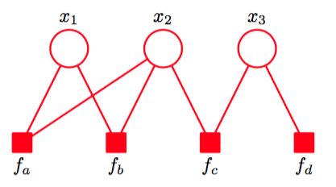
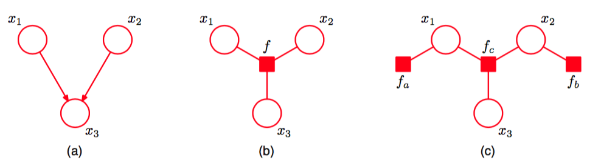
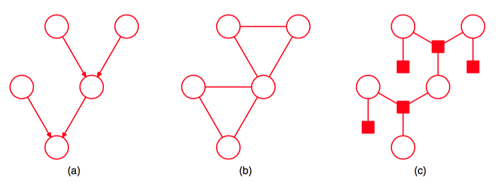
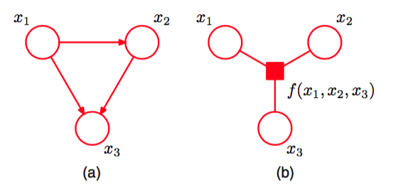
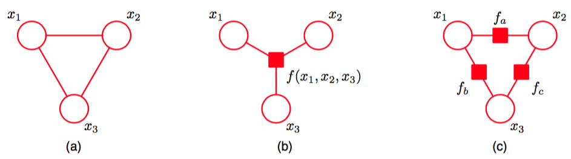

在下一节中我们将要推导的加和-乘积算法适用于无向树、有向树以及多树。如果我们首先引入一个新的图结构，被称为因子图（factor graph）（Frey, 1998; Kschischnang et al., 2001），那么算法的形式会变得特别简单并且具有一般性。    

有向图和无向图都使得若干个变量的一个全局函数能够表示为这些变量的子集上的因子的乘积。因子图显式地表示出了这个分解，方法是：在表示变量的结点的基础上，引入额外的结点表示因子本身。因子图也使我们能够更加清晰地了解分解的细节，正如我们将看到的那样。    

让我们将一组变量上的联合概率分布写成因子的乘积形式     

$$
p(x) = \prod\limits_sf_s(x_s) \tag{8.59}
$$

其中$$ x_s $$表示变量的一个子集。为了方便，我们把单独的变量记作$$ x_i $$，但是在之前的讨论中，这可以由一组变量组成（例如向量或矩阵）。每个因子$$ f_s $$是对应的变量集合$$ x_s $$的函数。     

有向图的分解由式（8.5）定义，表示式（8.59）的特殊情况，即因子$$ f_s(x_s) $$是局部条件概率分布。类似的，式（8.39）给出的无向图的分解，也是一个特例，即因子是最大团块上的势函数（标准化系数$$ 1 / Z $$可以被看做定义在空变量集合上的因子)。     

在因子图中，概率分布中的每个变量都有一个结点（同样用圆圈表示），这与有向图和无向图的情形相同。还存在其他的结点（用小正方形表示），表示联合概率分布中的每个因子$$ f_s(x_s)
$$。最后，在每个因子结点和因子所依赖的变量结点之间，存在无向链接。如：考虑一个表示为因子图形式的概率分布     
$$
p(x) = f_a(x_1,x_2)f_b(x_1,x_2)f_c(x_2,x_3)f_d(x_3) \tag{8.60}
$$

这可以表示为图8.40所示的因子图。注意有两个因子$$ f_a(x_1, x_2), f_b(x_1, x_2) $$定义在同一个变量集合上。在一个无向图中，两个这样的因子的乘积被简单地合并到同一个团块势函数中。类似 的，$$ f_c(x_2, x_3), f_d(x_3) $$可以结合到$$ x_2, x_3 $$上的一个单一势函数中。然而，因子图显式地写出这些因子，因此能够表达出关于分解本身的更加细节的信息。     

由于因子图由两类不同的结点组成，且所有的链接都位于两类不同的结点之间，因此因子图被称为二分的（bipartite）。于是，因子图通常总可以被画成两排结点（变量结点在上排，因子结点在下排），同时两排结点之间具有链接，如图8.40所示。     

      
图 8.40 因子图的例子，对应于公式(8.60)的分解。

然而，在某些情况下，其他的表示因子图的方式可能更符合直觉，如因子图从有向图或者无向图中推导出的情形，正如我们将要看到的那样。     

如果我们有一个通过无向图表示的概率分布，那么我们可以将其转化为因子图。为了达到这个目的，我们构造变量结点，对应于原始无向图，然后构造额外的因子结点，对应于最大团块$$ x_s $$。因子$$ f_s(x_s) $$被设置为与团块势函数相等。注意，对于同一个无向图，可能存在几个不同的因子图。图8.41说明了这些概念。     

      
图 8.41 (a)一个无向图，有一个单一的团块势函数$$ \psi(x_1,x_2,x_3) $$。(b)一个因子图，因子$$ f(x_1,x_2,x_3) = \psi(x_1, x_2, x_3) $$，它表示与无向图相同的概率分布。(c)一个不同的因子图，表示相同的概率分布，它的因子满足$$ f_a(x_1, x_2, x_3)f_b(x_2, x_3) = \psi(x_1, x_2, x_3) $$。

类似地，为了将有向图转化为因子图，我们构造变量结点对应于有向图中的结点，然后构造因子结点，对应于条件概率分布，最后添加上合适的链接。与之前一样，同一个有向图可能对应于多个因子图。有向图到因子图的转化如图8.42所示。

      
图 8.42 (a)一个有向图，可以分解为$$ p(x_1)p(x_2)p(x_3 | x_1, x_2) $$。(b)一个因子图,表示与有向图相同的概率分布，它的因子满足$$ f(x_1, x_2, x_3) = p(x_1)p(x_2)p(x_3 | x_1, x_2) $$。(c)一个不同的因子图，表示同样的概率分布，因子为$$ f_a(x_1) = p(x_1), f_b(x_2) = p(x2), f_c(x_1, x_2, x_3) = p(x_3 | x_1, x_2) $$。

我们已经看到了树结构图对于进行高效推断的重要性。如果我们将一个有向树或者无向树转化为因子图，那么生成的因子图也是树（即：因子图没有环，且任意两个结点之间有且只有一条路径）。在有向多树的情形中，由于“伦理”步骤的存在，转化为无向图会引入环，而转化后的因子图仍然是树，如图8.43所示。

      
图 8.43 (a)一个有向多树。(b)将多树转化为无向图的结果，展示了环的形成。(c)将多树转化为因子图的结果，保留了树形结构。

事实上，有向图中由于链接父结点和子结点产生的局部环可以在转换到因子图时被移除，只需定义合适的因子函数即可，如图8.44所示。    

      
图 8.44 (a)具有局部环的有向图的片段。(b)转化得到的因子图的片段，具有树形结构，其中$$ f(x_1, x_2, x_3) = p(x_1)p(x_2|x_1)p(x_3|x_1, x_2) $$。

我们已经看到多个不同的因子图可以表示同一个有向图或者无向图。这使得因子图对于分解的精确形式的表示更加具体。图8.45给出了一个全连接的无向图以及两个不同的因子图的例子。

      
图 8.45 (a)表示一个完全连接的无向图。(b)和(c)表示两个因子图,每个因子图都对应于(a)中的无向图。

在图(b)中,联合概率分布是一般形式$$ p(x) = f(x_1, x_2, x_3) $$，而在图(c)中，它表示为一个更加具体的分解方式￥￥ p(x) = f_a(x_1, x_2)f_b(x_1, x_3)f_c(x_2, x_3) $$。应该强调的是，(c)中的分解不对应于任何条件独立性质。
