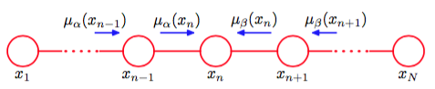

现在考虑一个更加复杂的问题，涉及到图8.32所示的结点链。这个例子是本节中对更一般的图的精确推断的讨论的基础。    

具体地，我们会考虑图8.32(b)所示的无向图。我们已经看到，有向链可以被转化为一个等价的无向链。由于有向图中任何结点的父结点数量都不超过一个，因此不需要添加任何额外的链接，且图的有向版本和无向版本表示完全相同的条件依赖性质集合。     

这个图的联合概率分布形式为     

$$
p(x)= \frac{1}{Z}\psi_{1,2}(x_1,x_2)\psi_{2,3}(x_2,x_3)···\psi_{N−1,N}(x_{N−1},x_N) \tag{8.49}
$$     

我们会考虑一个具体的情形，即$$ N $$个结点表示$$ N $$个离散变量，每个变量都有$$ K $$个状态。这种情况下的势函数$$ \psi_{n−1,n}(x_{n−1}, x_n) $$由一个$$ K \times K $$的表组成，因此联合概率分布有$$ (N − 1)K^2 $$个参数。     

让我们考虑寻找边缘概率分布$$ p(x_n) $$这一推断问题，其中$$ x_n $$是链上的一个具体的结点。注意，现阶段，没有观测结点。根据定义，这个边缘概率分布可以通过对联合概率分布在除$$ x_n $$以外的所有变量上进行求和的方式得到，即     

$$
p(x_n) = \sum\limits_{x_1}\dots \sum\limits_{x_{n-1}}\sum\limits_{x_{n+1}}\dots \sum\limits_{x_N}p(x) \tag{8.50} 
$$

在一个朴素的实现中，我们首先计算联合概率分布，然后显式地进行求和。联合概率分布可以表示为一组数，对应于$$ x $$的每个可能的值。因为有$$ N $$个变量，每个变量有$$ K $$个可能的状态，因此$$ x $$有$$ K^N $$个可能的值，从而联合概率的计算和存储以及得到$$ p(x_n) $$所需的求和过程，涉及到的存储量和计算量都会随着链的长度$$ N $$而指数增长。     

然而，通过利用图模型的条件独立性质，我们可以得到一个更加高效的算法。如果我们将联合概率分布的分解表达式（8.49）代入式（8.50）中，那么我们可以重新整理加法与乘法的顺序，使得需要求解的边缘概率分布可以更加高效地计算。如：考虑对$$ x_N $$的求和。势函数$$ \psi_{N −1,N}(x_{N−1}, x_N) $$是唯一与$$ x_N $$有关系的势函数，因此我们可以进行下面的求和    

$$
\sum\limits_{x_N}\psi_{N-1,N}(x_{N-1},x_N) \tag{8.51}
$$

得到一个关于$$ x_{N−1} $$的函数。之后，我们可以使用它进行$$ x_{N−1} $$上的求和，这只涉及到这个新的函数以及势函数$$ \psi_{N−2,N−1}(x_{N−2}, x_{N−1}) $$，因为这个势函数是唯一出现了$$ x_{N−1} $$的地方。类似的，$$ x_1 $$上的求和式只涉及到势函数$$ \psi_{1,2}(x_1, x_2) $$，因此可以单独进行，得到$$ x_2 $$的函数，以此类推。因为每个求和式都移除了概率分布中的一个变量，因此这可以被看成从图中移除一个结点。     

如果我们使用这种方式对势函数和求和式进行分组，那么我们可以将需要求解的边缘概率密度写成

$$
\begin{eqnarray}
p(x_n) = \frac{1}{Z} \\
\underbrace{\left[\sum\limits_{x_{n-1}\psi_{n-1,n}(x_{n-1},x_n}\dots\left[\sum\limits_{x_2}\psi_{2,3}(x_2,x_3)\left[\sum\limits_{x_1}\psi_{1,2}(x_1,x_2)\right]\right]\dots \right]}_{\mu_\alpha(x_n)} \\
\underbrace{\left[\sum\limits_{x_{n+1}}\psi_{n,n+1}(x_n,x_{n+1})\dots\left[\sum\limits_{x_N}\psi_{N-1,N}(x_{N-1},x_N)\right]\dots\right]}_{\mu_\beta(x_n)}  \tag{8.52}
\end{eqnarray}
$$

的形式。我们建议读者仔细研究这个重排序的方式，因为这背后的思想组成了后续对于一般的加和-乘积算法的讨论的基础。这里，我们利用的关键的概念是乘法对加法的分配率，即     

$$
ab + ac = a(b+c) \tag{8.53}
$$

其中左侧涉及到三次算术计算而右侧将它简化成了两次计算。    

让我们考察使用这种重排序的表达式之后，计算边缘概率分布所需的计算代价。我们必须进行$$ N − 1 $$次求和，每次求和的对象是$$ K $$个状态，并且每次求和涉及到两个变量组成的函数。如，对$$ x_1 $$的求和只涉及到函数$$ \psi_{1,2}(x_1, x_2) $$，这是一个$$ K \times K $$的表格。对于每个$$ x_2 $$，我们必须关于$$ x_1 $$对这个表进行求和，因此计算代价为$$ O(K^2) $$。得到的$$ K $$个数字的向量与$$ \psi_{2,3}(x_2, x_3) $$的矩阵相乘，计算代价还是$$ O(K^2)
$$。因为有$$ N − 1 $$次这样的求和与乘积操作，因此计算边缘概率分布$$ p(x_n) $$的总代价是$$ O(NK^2) $$。这是链长度的一个线性函数，与朴素方法的指数代价不同。于是，我们已经能够利用这个简单图的许多条件独立性质来得到一个高效的计算方式。如果图是全连接的，那么将不存在条件独立性质，我们就必须直接计算完整的联合概率分布。    
我们现在使用图中局部信息传递的思想，给出这种计算的一个强大的直观意义。根据式（8.52），我们看到边缘概率分布$$ p(x_n) $$的表达式分解成了两个因子的乘积乘以标准化常数    

$$
p(x_n) = \frac{1}{Z}\mu_\alpha(x_n)\mu_\beta(x_n) \tag{8.54}
$$

我们把$$ \mu_\alpha(x_n) $$看成从结点$$ x_{n−1} $$到结点$$ x_n $$的沿着链向前传递的信息。类似地，$$ \mu_\beta(x_n) $$可以看成从结点$$ x_{n+1} $$到结点$$ x_n $$的沿着链向后传递的信息。注意，每条信息由$$ K $$个值的集合构成，每个值对应于$$ x_n $$的一种选择，因此两条信息的乘积可以被看做两条信息的元素之间的点积，得到另外$$ K $$个值的集合。     

信息$$ \mu_\alpha(x_n) $$可以递归地计算，因为    

$$
\begin{eqnarray}
\mu_\alpha(x_n) &=& \sum\limits_{x_{n-1}}\psi_{n-1,n}(x_{n-1},x_n)\left[\sum\limits_{x_{n-1}}\dots\right] \\
&=& \sum\limits_{x_{n-1}}\psi_{n-1,n}(x_{n-1},x_n)\mu_\alpha(x_{n-1}) \tag{8.55}
\end{eqnarray}
$$     

因此我们首先计算    

$$
\mu_\alpha(x_2) = \sum\limits_{x_1}\psi_{1,2}(x_1,x_2) \tag{8.56}
$$    

然后重复应用式（8.55）直到我们到达需要求解的结点。注意一下信息传递方程的结构。式（8.55）中的向外传播的信息$$ \mu_\alpha(x_n) $$通过下面的方式得到：将输入信息$$ \mu_\alpha(x_{n−1}) $$与涉及到结点变量与输出变量的势函数相乘，然后对结点变量求和。     

类似地，信息$$ \mu_\beta(x_n) $$可以递归的计算。计算方法是：从结点$$ x_N $$开始，使用

$$
\begin{eqnarray}
\mu_\beta(x_n) &=& \sum\limits_{x_{n+1}}\psi_{n,n+1}(x_n,x_{n+1})\left[\sum\limits_{x_{n+2}}\dots\right] \\
&=& \sum\limits_{x_{n+1}}\psi_{n,n+1}(x_n,x_{n+1})\mu_\beta(x_n+1) \tag{8.57}
\end{eqnarray}
$$     

这种递归的信息传递如图8.38所示。

      
图 8.38 对于结点链上的一个结点$$ x_n $$，边缘概率分布可以通过下面的方式求得：将两个信息$$ \mu_\alpha(x_n),\my_\beta(x_n) $$相乘，然后标准化。这些信息本身可以通过从结点链的两侧向结点$$ x_n $$传递信息的方式递归地计算。

标准化常数$$ Z $$很容易通过对式（8.54）右侧关于$$ x_n $$的所有状态求和的方式得到，这只需要$$ O(K) $$次计算。     

图8.38所示的图被称为马尔科夫链（Markov chain），对应的信息传递方程是马尔科夫过程的Chapman-Kolmogorov方程的一个例子（Papoulis, 1984）。     

现在假设我们将计算链中每个结点$$ n \in \{1,...,N\} $$的边缘概率分布$$ p(x_n) $$。简单地对每个结点单独地应用上面的步骤产生的计算代价为$$ O(N^2K^2) $$。然而，这种方法对于计算很浪费。如：为了得到$$ p(x_1) $$，我们需要将信息$$ \mu_\beta(\dot) $$从结点$$ x_N $$传递到结点$$ x_2 $$。类似的，为了计算$$ p(x_2) $$，我们需要将信息$$ \mu_\beta(\dot) $$从结点$$ x_N $$传递到结点$$ x_3 $$。这涉及到许多重复的计算，因为这两种情况下，大部分信息都是相同的。     

假设我们首先计算出结点$$ x_N $$开始的信息$$ \mu_\beta(x_{N−1}) $$，然后将信息一路传递回结点$$ x_1 $$，同时假设我们类似地计算出了从结点$$ x_1 $$开始的信息$$ μ\mu_\alpha(x_2) $$，然后将信息一路向前传递到结点$$ x_N
$$。只要我们存储了所有的中间信息，那么任何结点的边缘概率分布都可以通过使用式（8.54）简单的计算出来。计算代价仅仅是找到一个结点的边缘概率分布的二倍，而不是$$ N $$倍。我们观察到，一个信息沿着图中每个链接在每个方向上都传递了一次。还要注意，标准化常数$$ Z $$只需计算一次，使用任何一个结点都可以计算。     

如果图中的某些结点被观测到，那么对应的变量简单地被限制为观测值即可，不需要求和。为了说明这一点，我们注意到将变量$$ x_n $$限制为一个观测值$$ x_n $$的效果可以表示为将联合概率分布乘以一个额外的函数$$ I(x_n,\hat{x}_n) $$，这个函数当$$ x_n = \hat{x}_n $$时取值为1，其他情况取值为0。这种函数可以被整合到包含$$ x_n $$的势函数中。这样，对$$ x_n $$的求和值包含$$ x_n = \hat{x}_n $$的一项。     

现在假设我们项计算结点链中两个相邻结点的联合概率分布$$ p(x_{n−1}, x_n) $$。这类似于计算单一结点的边缘概率分布，区别在于现在有两个变量没有被求和出来。稍微思考一下，我们就会看到，需要求解的边缘概率分布可以写成下面的形式     

$$
p(x_{n−1},x_n) = \frac{1}{Z}\mu_\alpha(x_{n−1})\psi_{n−1,n}(x_{n−1},x_n)\mu_\beta(x_n) \tag{8.58}
$$

因此一旦我们完成了计算边缘概率分布所需的信息传递，我们就可以直接得到每个势函数中的所有变量上的联合概率分布。    

这是一个很有用的结果，因为在实际应用中，我们可能希望使用团块势函数的参数形式，或等价地，使用条件概率分布的参数形式（在有向图中）。为了在并非所有的变量都被观测到的情况下学习势函数的参数，我们可以使用EM算法。可以证明，以任意观测数据为条件，团块的局部联合概率分布恰好是E步骤中所需要的。我们会在第13章详细讨论一些例子。     

