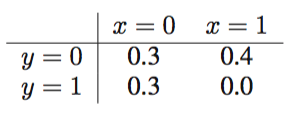
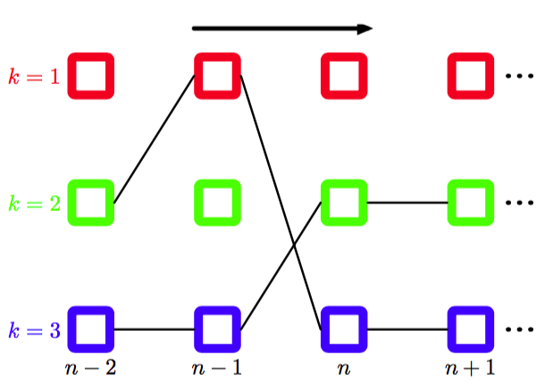

加-乘算法使得我们能够将联合概率分布$$ p(x) $$表示为一个因子图，并且高效地求出成分变量上的边缘概率分布。有两个其他的比较常见的任务，即找到变量的具有最大概率的一个设置，以及找到这个概率的值。这两个任务可以通过一个密切相关的算法完成，这个算法被称为最大和（max-sum），可以被看成动态规划（dynamic programming）在图模型中的一个应用（Cormen et al., 2001）。    

一个简单的寻找具有最大概率的潜在变量值的方法是，运行加和-乘积算法，得到每个变量的边缘概率分布$$ p(x_i) $$，然后，反过来对于每个边缘概率分布，找到使边缘概率最大的$$ x_i^* $$。然而，这回给出一组值，每个值都单独取得最大的概率。在实际应用中，我们通常希望找到联合起来具有最大概率的值的集合，换句话说，找到向量$$ x $$最大，使得联合概率分布达到最大值，即     

$$
x^{max} = \arg\max_x p(x) \tag{8.87}
$$

这样，联合概率分布的对应值为    

$$
p(x^{max}) = \max_x p(x) \tag{8.88}
$$

      
表 8.1 两个二值变量上的联合概率分布，其中联合概率分布的最大值出现的位置与两个边缘概率分布的最大值出现的位置不同。     

通常，$$ x^{max}, x_i^* $$的集合不同，我们会用一个简单的例子说明这一点。考虑两个二值变量$$ x,y \in \{0,1\} $$上的联合概率分布$$ p(x,y) $$，由表8.1给出。通过令$$ x = 1 $$以及$$ y = 0 $$，联合概率分布被最大化，值为$$ 0.4 $$。然而，通过对$$ y $$的值进行求和得到的$$ p(x) $$的边缘概率分布为$$ p(x = 0) = 0.6 $$和$$ p(x = 1) = 0.4 $$，类似的，$$ y $$的边缘概率分布为$$ p(y = 0) = 0.7 $$和$$ y(y = 1) = 0.3 $$，因此当$$ x = 0 $$且$$ y = 0
$$时，边缘概率分布取最大值，此时联合概率分布的值为$$ 0.3 $$。事实上，不难构造出各自的概率最大的值在联合概率分布下的概率为0的例子。     

于是，我们寻找一个高效的算法，来求出最大化联合概率分布$$ p(x) $$的$$ x $$的值，这会使得我们得到在最大值处的联合概率分布的值。为了解决第二个问题，我们只需简单地写出分量的最大值算符，即    

$$
\max_x p(x) = \max_{x_1}\dots\max_{x_M}p(x) \tag{8.89}
$$

其中$$ M $$是变量的总数。之后，使用$$ p(x) $$的用因子乘积形式表示的展开式替换$$ p(x) $$即可。在推导加-乘算法时，我们使用了乘法的分配律（8.53）。这里，我们使用最大化操作的类似定律     

$$
\max(ab,ac) = a \max(b,c)  \tag{8.90}
$$

这对于$$ a \geq 0 $$的情形成立（这对于图模型的因子总成立）。这使得我们交换乘积与最大化的顺序。     

首先考虑式（8.49）描述的结点链这一简单的例子。概率最大值的计算可以写成    

$$
\begin{eqnarray}
\max_x p(x) &=& \frac{1}{Z}\max_{x_1}\dots\max_{x_M}[\psi_{1,2}(x_1,x_2)\dots\psi_{N-1,N}(x_{N-1},x_N)] \\
&=&  \frac{1}{Z}\max_{x_1}\left[\max_{x_2}\left[\psi_{1,2}(x_1,x_2)\left[\dots\max_{x_N}\psi_{N-1,N}(x_{N-1},x_N)\right]\dots\right]\right]
\end{eqnarray}
$$

正如边缘概率的计算一样，我们看到交换最大值算符和乘积算法会产生一个更高效的计算，且更容易表示为从结点$$ x_N $$沿着结点链传递回结点$$ x_1 $$的信息。     

我们可以将这个结果推广到任意树结构的因子图上，推广的方法为：将因子图表达式（8.59）代入式（8.89）中，然后交换乘积与最大化的计算顺序。这种计算的结构与加-乘算法完全相同，因此我们能够简单地将那些结果转化到当前的问题中。特别地，假设我们令图中的一个特定的变量结点为根结点。之后，我们计算起始的一组信息，然后从树的叶结点向内部传递到根结点。对于每个结点，一旦它接收到来自其他相邻结点的输入信息，那么它就向根结点发送信息。最后对所有到达根结点的信息的乘积进行最大化，得出$$
p(x) $$的最大值。这可以被称为最大化乘积算法（max-produce algorithm），与加-乘算法完全相同，唯一的区别是求和被替换为了求最大值。注意，现阶段信息被从叶结点发送到根结点，而没有相反的方向。     

在实际应用中，许多小概率的乘积可以产生数值下溢的问题，因此更方便的做法是对联合概率分布的对数进行操作。对数函数是一个单调函数，因此如果$$ a > b $$，那么$$ \ln a > \ln b $$，因此求最大值的运算符可以与取对数的运算交换顺序，即     

$$
\ln\left(\max_x p(x)\right)  = \max_x \ln p(x) \tag{8.91}
$$

分配性质仍然成立，因为     

$$
\max(a+b, a+c) = a + max(b,c) \tag{8.92}
$$

所以取对数的唯一效果是把最大化乘积算法中的乘积替换成了加和，因此我们得到了最大化和算法（max-sum algorithm）。根据之前在加-乘算法中得到的式（8.66）和式（8.69）给出的结果，我们可以基于信息传递写出最大化加和算法，只需把“加法”替换为“最大化”，把“乘积”替换为对数求和即可。结果为     

$$
\begin{eqnarray}
\mu_{f \to x}(x) &=& \max_{x_1,...,x_M}\left[\ln f(x,x_1,...,x_M) + \sum\limits_{m \in ne(f)\\x}\mu_{x_m \to f}(x_m)\right] \tag{8.93} \\
\mu_{x \to f}(x) &=& \sum\limits_{l \in ne(x)\\f}\mu_{f_l \to x}(x) \tag{8.94}
\end{eqnarray}
$$

最开始的由叶结点发送的信息可以通过类比式（8.70）和式（8.71）得到，结果为     

$$
\begin{eqnarray}
\mu_{x \to f}(x) &=& 0 \tag{8.95} \\
\mu_{f \to x}(x) &=& \ln f(x) \tag{8.96}
\end{eqnarray}
$$     

而在根结点处的最大概率可以通过类比式（8.63）得到，结果为     

$$
p^{max} = \max_x\left[\sum\limits_{s \in ne(x)}\mu_{f_s \to x}(x) \right] \tag{8.97}
$$     

目前为止，我们已经看到了如何通过从叶结点到任意选择的根结点传递信息的方式找到联合概率分布的最大值。这个结果与根结点的选择无关。现在，我们转向第二个问题，即寻找联合概率达到最大值的变量的配置。目前，我们已经将信息从叶结点发送到了根结点。计算式（8.97）的过程也会得到根结点变量的概率最高的值$$ x^{max} $$，定义为     

$$
x^{max} = \arg\max_x\left[\sum\limits_{s \in ne(x)}\mu_{f_s \to x}(x) \right] \tag{8.98}
$$     

现在，我们可能试图简单地继续使用信息传递方法，使用式（8.93）和式（8.94），将信息从根结点传回叶结点，然后将式（8.98）应用于所有剩余的变量结点。然而，由于我们现在进行的是最大化过程而不是求和过程，因此有可能存在多个$$ x $$的配置，它们都会给出$$ p(x) $$的最大值。在这种情况下，这个策略就失效了，因为通过对属于不同的最大化配置的每个结点处的信息的乘积进行最大化得到的各个变量值可能给出一个并不对应于最大值的整体配置。     

通过使用一个从根结点到叶结点的一个相当不同的信息传递方式，这个问题可以得到解决。为了说明工作原理，让我们再次回到简单的结点链的例子中，其中有$$ N $$个变量$$ x_1,...,x_N $$，每个变量有$$ K $$个状态，对应于图8.38所示的图。假设我们令结点$$ x_N $$是根结点。那么在第一阶段，我们从叶结点$$ x_1 $$开始，将信息传递到根结点，使用下面的公式     

$$
\begin{eqnarray}
\mu_{x_n \to f_{n, n+1}}(x_n) &=& \mu_{f_{n-1,n} \to x_n}(x_n) \\
\mu_{f_{n-1,n} \to x_n}(x_n) &=& \max_{x_{n-1}}[\ln f_{n-1,n}(x_{n-1},x_n) + \mu_{x_{n-1} \to f_{n-1, n}}(x_{n-1})]
\end{eqnarray}
$$     

将式（8.94）和式（8.93）应用到这个特定的图上即可得到上面的结果。叶结点发送的初始信息为     

$$
\mu_{x_1 \to f_{1,2}}(x_1) = 0 \tag{8.99}
$$

这样，$$ x_N $$的概率最高的值为     

$$
x_N^{max} = \arg\max_{x_N}[\mu_{f_{N-1,N} \to x_N}(x_N)] \tag{8.100}
$$

现在我们需要确定对应于同样的最大化配置的前一个变量的状态。可以通过跟踪变量的哪个值产生了每个变量的最大值状态，即存储下面的量

$$
\phi(x_n) =  \arg\max_{x_{n-1}}\left[\ln f_{n-1,n}(x_{n-1},x_n) + \mu_{x_{n-1} \to f_{n-1, n}(x_{n-1})}\right] \tag{8.101}
$$    

来确定。    

为了更好地理解工作过程，比较有帮助的做法是将变量链表示为晶格图（lattice diagram）或格子图（trellis diagram），如图8.53所示。    

      
图 8.53 一个晶格图，或格子图，显式地画出了结点链模型中每个变量$$ x_n $$的$$ K $$个可能的状态（图中的每一行表示一个状态）。在这个例子中，$$ K = 3 $$。箭头表示在最大乘积算法中信息传播的方向。对于每个变量$$ x_n $$（对应于图中第$$ n $$列）的每个状态$$ k $$，函数$$ \phi(x_n)
$$定义了之前变量的一个唯一的状态，用黑线表示。穿过晶格的两条路径对应于能够得到联合概率分布最大值的配置，每一条路径都可以沿着黑线，按照箭头的相反方向反向跟踪的方式找到。

注意，这不是一个概率图模型，因为结点表示变量的独立状态，而每个变量对应于图中这个状态的一列。对于给定变量的每个状态，存在前一个变量的一个唯一的状态使得概率取最大值，对应于式（8.101）给出的函数$$ \phi(x_n) $$，这通过连接结点的线表示。一旦我们知道了最终结点$$ x_N $$的最可能的值，我们就可以沿着链接回退，找到结点$$ x_{N−1} $$的最可能状态，并且以此类推，回到最初的结点$$ x_1 $$。这对应于将信息沿着链进行反方向的传递，使用下面的公式    

$$
x_{n-1}^{max} = \phi(x_n^{max}) \tag{8.102}
$$

被称为反向跟踪（back-tracking）。注意，可能存在多个$$ x_{n−1} $$的值，每个都能给出式（8.101）的最大值。在进行反向跟踪时，只要我们选择了这些变量中的一个，那么我们就能够保证得到一个全局相容的最大化配置。     

在图8.53中，我们画出了两条路径。对于每条路径，我们都假设对应于联合概率分布的一个全局最大值。如果$$ k = 2 $$和$$ k = 3 $$都表示$$ x
$$最大的可能值，那么从任意一个状态开始沿着黑线回退（对应于式(8.102)的迭代），我们都可以得到一个合法的全局最大值配置。注意，如果我们运行一个正向的最大加和信息传递，然后运行一个反向的传递，之后对每个节点分别应用式（8.98），那么我们最后会从一条路径中选出某些状态，从另一条路径中选出另外一些状态，得到一个并非为全局最大值的整体配置。我们看到，有必要在正向信息传递时，使用函数$$
\phi(x_n) $$对最大化状态进行跟踪，然后使用反向跟踪找到一个相容的解。      

现在，推广到一般的树形结构因子图的方法就比较明显了。如果一条信息从因子结点$$ f $$发送到变量结点$$ x $$，那么最大化针对的是因子结点的全部其他变量结点$$ x_1,...,x_M $$，使用式（8.93）。当我们进行这个最大化时，我们记录了给出最大值的变量$$ x_1,...,x_M $$的值。这样，找到了$$ x^{max} $$之后，我们在反向跟踪步骤中可以使用这些存储的值，为相容的最大状态$$ x_1^{max},...,x_M^{max}
$$的值。只要因子图是树，最大和算法以及反向跟踪方法就可以给出变量的精确最大化配置。这种方法的一个重要应用是寻找隐马尔科夫模型中隐含状态的最可能序列，这种情况下被称为Viterbi算法。     

与加-乘算法一样，引入观测变量是很直接的。观测变量被限制为它们的观测值，最大化过程针对剩余的隐含变量进行。形式化地，可以通过引入恒等函数的方式，将观测变量引入到因子函数中，正如我们之前在加-乘算法中做的那样。     

将最大加和算法与8.3.3节描述的迭代条件峰值算法（ICM）进行对比是很有趣的。ICM中的每一步计算都比较简单，因为从一个结点传递到下一个结点的“信息”由一个包含结点新状态的单一值组成。对于这个结点，条件概率分布被最大化。最大化加和算法更加复杂，因为信息是结点变量$$ x $$的函数，从而由$$ x $$的可能状态的$$ K
$$个值组成。然而，与最大化和算法不同，即使对于树结构的图，ICM也无法保证找到一个全局的最大值。      

