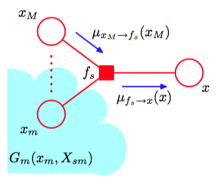
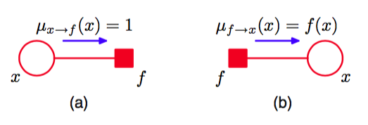
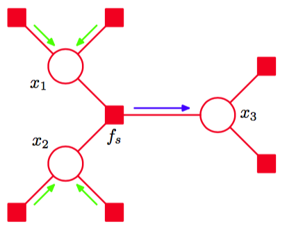
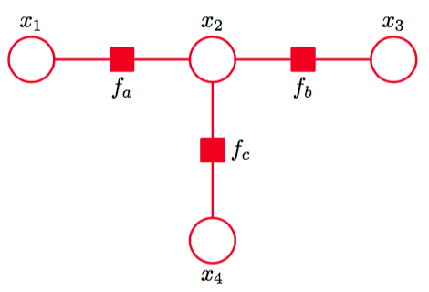
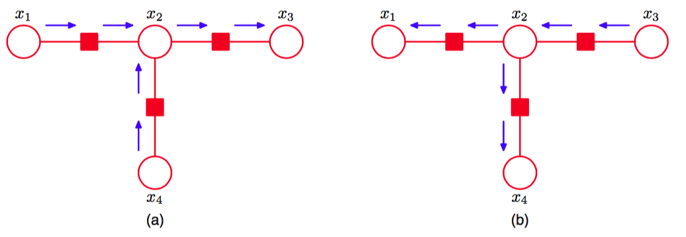

我们会使用因子图框架推导一类强大的、高效的精确推断算法，这些算法适用于树结构的图。这里我们把注意力集中于计算结点或者结点子集上的局部边缘概率分布，这会引出加-乘算法（sum-product algorithm）。稍后，我们会修改这个方法，使得概率最大的状态被找到，这就引出了最大和算法（max-sum algorithm）。     

此外，我们假设模型中所有的变量都是离散的，因此求边缘概率对应于求和的过程。然而，这个框架同样适用于线性高斯模型，这种情形下求边缘概率涉及到求积分。当我们讨论线性动态系统时，我们会详细讨论这种情形。    

关于有向无环图的精确推断，有一个被称为置信传播（belief propagation）的算法（Parl, 1988; Lauritzen and Spiegelhalter, 1988），它等价于加-乘算法的一个具体情形。这里，我们只考虑加-乘算法，因为它的推导和使用都更容易，并且更一般。    

我们假设原始的图是一个无向树或者有向树或者多树，从而对应的因子图有一个树结构。首先，我们将原始的图转化为因子图，使得我们可以使用同样的框架处理有向模型和无向模型。我们的目标是利用图的结构完成两件事：(1)得到一个高效的精确推断算法来寻找边缘概率，(2)在需要求解多个边缘概率的情形，计算可以高效地共享。    

首先，对于特定的变量结点$$ x $$，我们寻找边缘概率$$ p(x) $$。现阶段，我们假设所有的变量都是隐含变量。稍后我们会看到如何修改这个算法，使得观测变量被整合到算法中。根据定义，边缘概率分布通过对所有$$ x $$之外的变量上的联合概率分布进行求和的方式得到，即    

$$
p(x) = \sum\limits_{\mathbb{x}\backslash x}p(\mathbb{x}) \tag{8.61}
$$

其中$$ \mathbb{x}\\x $$表示从变量$$ x $$的集合去掉变量$$ x $$。算法的思想是使用因子图的表达式（8.59）替换$$ p(x) $$，然后交换加和与乘积的顺序，得到一个高效的算法。考虑图8.46给出的图，我们看到图的树结构使得我们可以将联合概率分布中的因子划分为若干组，每组对应于变量结点$$ x $$的相邻结点组成的因子结点集合。我们看到联合概率分布可以写成乘积的形式     

$$
p(\mathbb{x}) = \prod\limits_{s \in ne(x)}F_s(x,X_s) \tag{8.62}
$$

其中$$ ne(x) $$表示与$$ x $$相邻的因子结点的集合，$$ X_s $$表示子树中通过因子结点$$ f_s $$与变量结点$$ x $$相连的所有变量的集合，$$ F_s(x, X_s) $$表示分组中与因子$$ f_s $$相关联的所有因子的乘积。     

将式（8.62）代入（8.61），交换加和与乘积的顺序，我们有    

$$
\begin{eqnarray}
p(x) &=& \prod\limits_{s \in ne(x)}\left[\sum\limits_{X_s}F_s(x,X_s)\right] \\
&=& \prod\limits_{s \in ne(x)}\mu_{f_s \to x}(x) \tag{8.63}
\end{eqnarray}
$$

这里我们引入了一组新定义为

$$
\mu_{f_s \to x}(x) \equiv \sum\limits_{X_s}F_s(x,X_s) \tag{8.64}
$$

的函数$$ \mu_{f_s \to x}(x) $$。这可以被看做从因子结点$$ f_s $$到变量结点$$ x $$的信息（message）。我们看到，需要求解的边缘概率分布$$ p(x) $$等于所有到达结点$$ x $$的输入信息的乘积。    

为了计算这些信息，我们再次回到图8.46。我们注意到每个因子$$ F_s(x, X_s) $$由一个因子（子）图，因此本身可以被分解。特别地，我们有

$$
F_s(x,X_s) = f_s(x,x_1,...,x_M)G_1(x_1,X_{s1})...G_M(x_M,X_{sM}) \tag{8.65}
$$

其中，为了方便，我们将$$ x $$之外的与因子fs相关的变量记作$$ x_1,...,x_M $$。图8.47说明了这个分解过程。注意变量集合$$ \{x,x_1,...,x_M\} $$是因子$$ f_s $$依赖的变量的集合，因此使用式（8.59）的记号，它也可以被记作$$ x_s $$。     

将式（8.65）代入式（8.64），得到     

$$
\begin{eqnarray}
\mu_{f_s \to x}(x) &=& \sum\limits_{x_1}\dots\sum\limits_{x_M}f_s(x,x_1,\dots,x_M)\prod\limits_{m \in ne(f_s) \backslash x}\left[\sum\limits_{X_{sm}}G_m(x_m,X_{sm})\right] \\
&=& \sum\limits_{x_1}\dots\sum\limits_{x_M}f_s(x,x_1,\dots,x_M)\prod\limits_{m \in ne(f_s) \backslash x}\mu_{x_m \to f_s}(x_m) \tag{8.66}
\end{eqnarray}
$$

其中$$ ne(f_s) $$表示因子结点$$ fs $$的相邻变量结点的集合，$$ ne(f_s) \\ x $$表示同样的集合，但是移除了结
点$$ x $$。这里，我们定义了下面的从变量结点到因子结点的信息    

$$
\mu_{x_m \to f_s}(x_m) \equiv \sum\limits_{X_{sm}}G_m(x_m,X_{sm}) \tag{8.67}
$$

于是，我们引入了两类不同的信息。一类信息是从因子结点到变量结点的信息，记作$$ \mu_{f \to x }(x) $$，另一类信息是从变量结点到因子结点的信息，记作$$ \mu_{x \to f}(x) $$。在任何一种情况下，我们看到沿着一条链接传递的信息总是一个函数，这个函数是与那个链接相连的变量结点相关的变量的函数。     

式（8.66）给出的结果表明，一个变量结点通过一个链接发送到一个因子结点的信息可以按照如下的方式计算：计算沿着所有进入因子结点的其他链接的输入信息的乘积，乘以与那个结点关联的因子，然后对所有与输入信息关联的变量进行求和。如图8.47所示。

      
图 8.47 与因子结点$$ f_s $$关联的子图的分解。

值得注意的是，一旦一个因子结点从所有其他的相邻变量结点的输入信息，那么这个因子结点就可以向变量结点发送信息。

最后，我们推导变量结点到因子结点的信息的表达式，再次使用（子）图分解。根据图8.48，我们看到与结点$$ x_m $$关联的项$$ G_m(x_m, X_{sm}) $$由项$$ F_l(x_m, X_{lm}) $$的乘积组成，每一个这样的项都与连接到结点$$ x_m  $$的一个因子结点$$ f_l $$相关联（不包括结点$$ f_s $$），即      

$$
G_m(x_m,X_{sm}) = \prod\limits_{l \in ne(x_m) \\ f_s}F_l(x_m,X_{lm}) \tag{8.68}
$$

其中求乘积的对象是结点$$ x_m $$的所有相邻但排除结点$$ f_s $$结点。注意，每个因子$$ F_l(x_m, X_{lm}) $$表示原始图的一个子树，这个原始图与式（8.62）表示的图的形式完全相同。将式（8.68）代入（8.67），得到     

$$
\begin{eqnarray}
\mu_{x_m \to f_s}(x_m) &=& \prod\limits_{l \in ne(x_m)\\f_s}\left[\sum\limits_{x_{lm}}F_l(x_m,X_{lm})\right] \\
&=& \sum\limits_{l \in ne(x_m)\\f_s}\mu_{f_l \to x_m}(x_m) \tag{8.69}
\end{eqnarray}
$$     

其中我们使用了因子结点到变量结点的信息传递的表达式（8.64）。因此，为了计算从一个变量结点到相邻因子结点沿着链接传递的信息，我们只需简单地在其他所有结点上对输入信息取乘积。注意，任何只有两个相邻结点的变量结点无需参与计算，只需将信息不变地传递过去即可。此外，我们注意到，一旦一个变量结点接收到了来自所有其他相邻因子结点的输入信息，那么这个变量结点就可以给因子结点发送信息。     

回忆一下，我们的目标是计算变量结点$$ x $$的边缘概率分布，这个边缘概率分布等于沿着所有到达这个结点的链接的输入信息的乘积。这些信息中的每一条信息都可以使用其他的信息递归地计算。为了开始这个递归计算的过程，我们可以将结点x看成树的根结点，然后从叶结点开始计算。根据式（8.69）的定义，我们看到如果一个叶结点是一个变量结点，那么它沿着与它唯一相连的链接发送的信息为     

$$
\mu_{x \to f}(x) = 1 \tag{8.70}
$$     

如图8.49(a)所示。

      
图 8.49 加-乘算法的开始阶段是从叶结点发送信息，信息取决于叶结点是(a)变量结点，或(b)因子结点。

类似地，如果叶结点是一个因子结点，那么我们根据式（8.66）可以看到，发送的信息的形式为    

$$
\mu_{f \to x}(x) = f(x) \tag{8.71}
$$

如图8.49(b)所示。     

现在，让我们停下来，总结一下计算边缘概率分布$$ p(x) $$时得到的加-乘算法。首先，我们将变量结点x看成因子图的根结点，使用式（8.70）和式（8.71），初始化图的叶结点的信息。之后，递归地应用信息传递步骤（8.66）和（8.69），直到信息被沿着每一个链接传递完毕，并且根结点收到了所有相邻结点的信息。每个结点都可以向根结点发送信息。一旦结点收到了所有其他相邻结点的信息，那么它就可以向根结点发送信息。一旦根结点收到了所有相邻结点的信息，需要求解的边缘概率分布就可以使用公式（8.63）进行计算。我们稍后会说明这个过程。    

为了说明每个结点总会收到足够的信息来使得发送信息变得可能，我们可以使用归纳法简单地说明如下。很明显，对于一个由变量根结点直接与几个因子叶结点相连的图，算法仅仅涉及到直接从叶结点向根结点发送形如（8.71）的信息。现在，假设通过每次添加一个结点的方式构 建一个一般的图，并且假设对于某个特定的图，我们有一个合法的算法。当添加了一个更多的结点（变量结点或因子结点）之后，这个结点只能通过一个单一的链接与图相连，因为整体的图必须仍然是树，因此新结点是一个叶结点。于是，这个结点向它连接的结点发送一个信息，反过来会收到为了将自己的信息送往根结点所需的所有的信息，因此与之前一样，我们得到了 一个合法的算法，从而完成了证明。    

现在假设我们想寻找图中每个变量结点的边缘概率分布。这可以通过简单地对每个结点独立的运行上述算法的方式完成。然而，这会相当浪费计算结果，因为许多需要进行的计算被重复了多次。通过“叠加”多个信息传递算法，我们可以得到一个更加高效的步骤，从而得到一般的加-乘算法，如下所述。任意选择一个结点（变量结点或因子结点），然后将其指定为根结点。像之前一样，我们从叶结点向根结点传递信息。现在，根结点会接收到来自所有相邻结点的信息。因此，它可以向所有的相邻结点发送信息。反过来，这些结点之后会接收到来自所有相邻结点的信息，因此可以沿着远离根结点的链接发送出信息，以此类推。通过这种方式，信息可以从根结点向外传递到叶结点。现在，信息已经在两个方向上沿着图中所有的链接传递完毕，并且每个结点都已经接收到了来自所有相邻结点的信息。与之前一样，可以使用一个简单的归纳过程验证信息传递协议的合法性。因为每个变量结点会收到来自所有相邻结点的信息，所以我们可以计算图中每个变量的边缘概率分布。必须计算的的信息的数量等于图中链接数量的二倍，因此所需的计算量仅仅是计算一个边缘概率分布的二倍。作为对比，如果我们对每个结点分别运行加-乘积算法，那么计算量会随着图的规模以二次函数的形式增长。注意，这个算法实际上与哪个结点被选择为根结点无关。事实上，引入一个具有具体状态的结点仅仅是为 了便于解释信息传递协议。    

接下来，假设我们想找到边缘概率分布$$ p(x_s) $$，它与属于每个因子的变量集合相关联。通过一个与之前类似的讨论，很容易看到与某个因子关联的边缘概率分布为到达这个因子结点的信 息与这个结点的局部因子的乘积，即     

$$
p(x_s) = f_s(x_s)\prod\limits_{i \in ne(f_s)}\mu_{x_i \to f_s}(x_i) \tag{8.72}
$$

这与变量结点的边缘概率分布十分相似。如果因子是参数化的函数，我们希望使用EM算法学习到参数的值，那么这些边缘概率分布恰好就是我们在E步骤中需要计算的值，正如我们在第13章讨论隐马尔科夫模型时将要看到的那样。     

正如我们已经看到的那样，一个变量结点发送到一个因子结点的信息仅仅其他链接上的输入信息的乘积。如果必要的话，我们可以用一个稍微不同的形式考查加和-乘积算法，即消去从变 量结点到因子结点的信息，仅考虑由因子结点发送出的信息。考虑图8.50中的简单例子，我们可以很容易地看出这一点。    

      
图 8.50 加-乘算法可以被看做纯粹的因子结点与其他因子结点之间的信息传递。在这个例子中，蓝色箭头表示的输出信息通过对所有绿色箭头表示的输入信息求乘积，然后乘以因子$$ f_s $$，然后在变量$$ x_1, x_2 $$上求和或积分来计算。

目前为止，我们始终忽略了标准化系数的问题。如果因子图是从有向图推导的，那么联合概率分布已经正确的被标准化了，因此通过加-乘算法得到的边缘概率分布会类似的被正确标准化。然而，如果我们开始于一个无向图，那么通常会存在一个未知的标准化系数$$ 1 / Z $$。与图8.38给出的简单例子相同，通过对未标准化的联合概率$$ \tilde{p}(x) $$进行操作，这个问题可以很容易处理，其中$$ p(x) = \tilde{p}(x) $$。首先，我们运行加和-乘积算法找到对应的未标准化的边缘概率分布$$ \tilde{p}(x) $$。然后，
系数$$ \frac{1}{Z} $$可以很容易地通过对任意一个边缘概率分布进行标准化的方式得到。因为标准化是在单一变量上而不是在整个变量集合上进行的，所以这种计算很高效。如果在整个变量集合上进行，那么我们就需要直接标准化$$ \tilde{p}(x) $$。

现在，考虑一个简单的例子来说明加-乘算法是很有帮助的。

      
图 8.51 一个简单的因子图，用来说明加-乘算法。

图8.51给出了一个简单的4节点因子图，它的未标准化联合概率分布为    

$$
\tilde{p}(x) = f_a(x_1,x_2)f_b(x_2,x_3)f_c(x_2,x_4) \tag{8.73}
$$    

为了对这个图应用加-乘算法，让我们令结点$$ x_3 $$为根结点，此时有两个叶结点$$ x_1, x_4 $$。从叶结点开始，我们有

$$
\begin{eqnarray}
\mu_{x_1 \to f_a}(x_1) &=& 1 \tag{8.74} \\
\mu_{f_a \to x_2}(x_2) &=& \sum\limits_{x_1}f_a(x_1, x_2) \tag{8.75} \\
\mu_{x_4 \to f_c}(x_4) &=& 1 \tag{8.76} \\
\mu_{f_c \to x_2}(x_2) &=& \sum\limits_{x_4}f_c(x_2, x_4) \tag{8.77} \\
\mu_{x_2 \to f_b}(x_2) &=& \mu_{f_a \to x_2}(x_2)\mu_{f_c \to x_2}(x_2) \tag{8.78} \\
\mu_{f_b \to x_3}(x_3) &=& \sum\limits_{x_2}f_b(x_2, x_3)\mu_{x_2 \to f_b}(x_2) \tag{8.79}
\end{eqnarray}
$$

这六个信息组成的序列。信息流的方向如图8.52所示。    

      
图 8.52 应用于图8.51给出的图的加-乘算法的信息流。(a)从叶结点$$ x_1, x_4 $$向根结点$$ x_3 $$传递。(b)从根结点向叶结点传递。

一旦信息传播完成，我们就可以将信息从根结点传递到叶结点，这些信息为     

$$
\begin{eqnarray}
\mu_{x_3 \to f_b}(x_3) &=& 1 \tag{8.80} \\
\mu_{f_b \to x_2}(x_2) &=& \sum\limits_{x_3}f_b(x_2, x_3) \tag{8.81} \\
\mu_{x_2 \to f_a}(x_2) &=& \mu_{f_b \to x_2}(x_2)\mu_{f_c \to x_2}(x_2) \tag{8.82} \\
\mu_{f_a \to x_1}(x_1) &=& \sum\limits_{x_2}f_a(x_1, x_2)\mu_{x_2 \to f_a}(x_2) \tag{8.83} \\
\mu_{x_2 \to f_c}(x_2) &=& \mu_{f_a \to x_2}(x_2)\mu_{f_b \to x_2}(x_2) \tag{8.84} \\
\mu_{f_c \to x_4}(x_4) &=& \sum\limits_{x_2}f_c(x_2, x_4)\mu_{x_2 \to f_c}(x_2) \tag{8.85}
\end{eqnarray}
$$

现在一个信息已经在两个方向上通过了每个链接，因此我们现在可以计算边缘概率分布。作为一个简单的检验，让我们验证边缘概率分布$$ p(x_2) $$由正确的表达式给出。使用式（8.63），使用上面的结果将信息替换掉，我们有    

$$
\begin{eqnarray}
\tilde{p}(x_2) &=& \mu_{f_a \to x_2}(x_2)\mu_{f_b \to x_2}(x_2)\mu_{f_c \to x_2}(x_2) \\
&=& \left[\sum\limits_{x_1}f_a(x_1,x_2)\right]\left[\sum\limits_{x_3}f_b(x_2,x_3)\right]\left[\sum\limits_{x_4}f_c(x_2,x_4)\right] \\
&=& \sum\limits_{x_1}\sum\limits_{x_3}\sum\limits_{x_4}f_a(x_1,x_2)f_b(x_2,x_3)f_c(x_2,x_4) \\
&=& \sum\limits_{x_1}\sum\limits_{x_3}\sum\limits_{x_4}\tilde{p}(x) \tag{8.86}
\end{eqnarray}
$$

这与我们预期的结果相同。    

目前为止，我们已经假定图中所有的变量都是隐含变量。在大多数实际应用中，变量的一个子集会被观测到，我们希望计算以这些观测为条件的后验概率分布。观测结点在加-乘算法中很容易处理，如下所述。假设我们将$$ x $$划分为隐含变量$$ h $$和观测变量$$ v $$，且$$ v $$的观测值被记作$$ v $$。然后，我们简单地将联合概率分布$$ p(x) $$乘以$$ \prod_i I(v_i,\hat{v}_i) $$，其中如果$$ v = \hat{v} $$，则$$ I(v,\hat{v}) = 1 $$，否则$$ I(v,\hat{v}) = 0 $$。这个乘积对应于$$ p(h, v = \hat{v}) $$，因此是$$ p(h|v =
\hat{v}) $$的一个未标准化版本。通过使用加-乘算法，我们可以高效地计算后验边缘概率$$ p(h_i|v=\hat{v}) $$，忽略标准化系数。标准化系数的值可以使用一个局部的计算高效地计算出来。$$ v $$中变量上的任意求和式就退化成了单一的项。    

我们在本节中一直假设我们处理的是离散变量。然而，无论是加-乘算法的图框架，还是算法的概率构建，方法都不局限于离散变量。对于连续变量，求和只需简单地替换为积分。当我们考虑线性动态系统时，我们会给出将加-乘算法应用于线性高斯变量的图结构中的例子。
