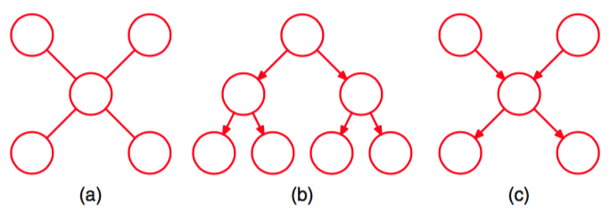

我们已经看到，一个由结点链组成的图的精确推断可以在关于结点数量的线性时间内完成，方法是使用通过链中信息传递表示的算法。更一般地，通过局部信息在更大的一类图中的传递，我们可以高效地进行推断。这类图被称为树（tree）。特别地，我们会对之前在结点链的情形中得到的信息传递公式进行简单的推广，得到加和-乘积算法（sum-product algorithm），它为树结构图的精确推断提供了一个高效的框架。     

在无向图的情形中，树被定义为满足下面性质的图：任意一对结点之间有且只有一条路径。于是这样的图没有环。在有向图的情形中，树的定义为：有一个没有父结点的结点，被称为根（root），其他所有的结点都有一个父结点。如果我们将有向树转化为无向图，我们会看到“伦理”步骤不会增加任何链接，因为所有的结点至多有一个父结点，从而对应的道德图是一个无向 树。无向树和有向树的例子如图8.39(a)和8.39(b)所示。注意，一个表示为有向树的概率分布可以很容易地转化为一个由无向树表示的概率分布，反之亦然。    

      
图 8.39 三个树结构的例子。(a)一个无向树,(b)一个有向树,(c)一个有向多树。

如果有向图中存在具有多个父结点的结点，但是在任意两个结点之间仍然只有一条路径（忽略箭头方向），那么这个图被称为多树（polytree），如图8.39(c)所示。这样的图中，存在多个 没有父结点的结点，并且对应的道德无向图会存在环。
