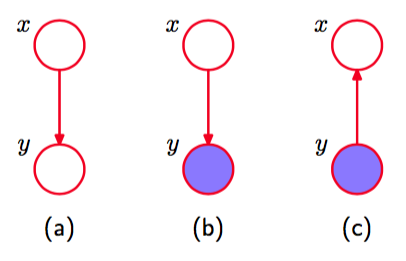

我们现在考虑图模型中的推断问题，图中的一些结点被限制为观测值，我们想要计算其他结点中的一个或多个子集的后验概率分布。正如我们将看到的那样，我们可以利用图结构找到高 效的推断算法，也可以让这些算法的结构变得透明。具体来说，我们会看到许多算法可以用图中局部信息传播的方式表示。本节中，我们会把注意力主要集中于精确推断的方法。在第10章中，我们会考虑许多近似推断的算法。    

首先，让我们考虑贝叶斯定理的图表示。假设我们将两个变量x和y上的联合概率分布$$ p(x,y) $$分解为因子的乘积的形式$$ p(x, y) = p(x)p(y|x) $$。这可以用图8.37(a)中的有向图表示。 现在假设我们观测到了$$ y $$的值，如图8.37(b)中的阴影结点所示。    

      
图 8.37 贝叶斯定理的图表示。

我们可以将边缘概率分布$$ p(x) $$看成潜在变量$$ x $$上的先验概率分布，我们的目标是推断$$ x $$上对应的后验概率分布。使用概率的加和规则和乘积规则，我们可以计算    

$$
p(y) = \sum\limits_{x'}p(y|x')p(x') \tag{8.47}
$$    

然后，这个式子被用于贝叶斯定理中，计算

$$
p(x|y) = \frac{p(y|x)p(x)}{p(y)} \tag{8.48}
$$    

因此现在联合概率分布可以通过$$ p(y) $$和$$ p(x|y) $$。从图的角度看，联合概率分布$$ p(x,y) $$现在可以表示为图8.37(c)所示的图，其中箭头的方向翻转了。这是图模型中推断问题的最简单的例子。
