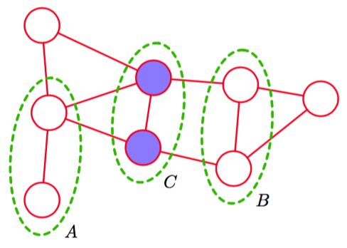
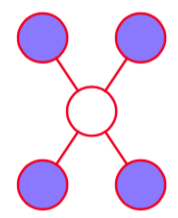

在有向图的情形下，我们看到可以通过使用被称为D-划分的图检测方法判断一个特定的条件独立性质是否成立。这涉及到判断链接两个结点集合的路径是否被“阻隔”。然而，由于头到头 结点的存在，阻隔的定义多少有些微妙。我们可能会问，是否可以定义另一种概率分布的图语义表示，使得条件独立性由单一的图划分确定。这种情形确实存在，对应于无向图模型。通过移除图中链接的方向性，父结点和子结点的非对称性也被移除了，因此头到头结点的微妙性也 就不再存在了。      

假设在一个无向图中，我们有三个结点集合，记作$$ A, B, C $$。我们考虑条件独立性质    

$$
A \perp B | C \tag{8.37}
$$

为了判定由图定义的概率分布是否满足这个性质，我们考虑连接集合A的结点和集合B的结点的所有可能路径。如果所有这些路径都通过了集合$$ C $$中的一个或多个结点，那么所有这样的路径都被“阻隔”，因此条件独立性质成立。然而，如果存在至少一条未被阻隔的路径，那么性质条件独立的性质未必成立，或更精确地说，存在至少某些对应于图的概率分布不满足条件独立性质。图8.27给出了一个例子。    

      
图 8.27 无向图的一个例子，其中从集合$$ A $$中的任意结点到集合$$ B $$中的任意结点的每天路径都通过集合$$ C $$中的至少一个结点。结果，对于所有由这个图描述的任意概率分布，以$$ C $$为条件，$$ A $$与$$ B $$都条件独立。    

注意，这与D-划分的准则完全相同，唯一的差别在于没有头到头的现象。因此，无向图的条件独立性的检测比有向图简单。     

另一种条件独立性的检测的方法是假设从图中把集合$$ C $$中的结点以及与这些结点相连的链接全部删除。然后，我们考察是否存在一条从$$ A $$中任意结点到$$ B $$中任意结点的路径。如果没有这样的路径，那么条件独立的性质一定成立。    

无向图的马尔科夫毯的形式相当简单，因为结点只条件依赖于相邻结点，而条件独立于任何其他的结点，如图8.28所示。     

      
图 8.28 对于一个无向图，结点$$ x_i $$的马尔科夫毯由相邻结点的集合组成。它的性质为：以图中所有剩余变量为条件，$$ x_i $$的条件概率分布只依赖于马尔科夫毯中的变量。    

