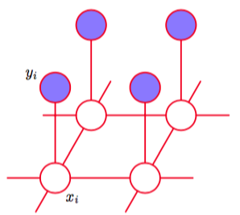

我们可以使用二值图像中图像去噪的例子来说明无向图的应用（Besag, 1974; Geman and Geman, 1984; Besag, 1986）。虽然这是一个非常简单的例子，但是它可以代表许多更复杂的应用。我们令观测的噪声图像通过一个二值像素值$$ y_i \in \{−1, +1\} $$组成的数组来描述，其中下标$$ i = 1,...,D $$覆盖了所有的像素。我们假设图像通过取一张未知的无噪声图像，这幅图像由二值像素值$$ x_i \in \{−1, +1\}
$$描述，然后以一个较小的概率随机翻转像素值的符号的方式获得。图8.30给出了一个二值图像以及一副噪声图像，其中噪声图像中像素值发生符号翻转的概率为10%。      

      
图 8.30 使用马尔科夫随机场进行图像去噪的例子。上面一行中，左侧是原始的二值图像，右侧是随机改变10%的像素后得到的带有噪声的图像。下面一行中，左图是使用迭代条件模型(ICM)恢复的图像，右图是使用最大割算法得到的图像。ICM产生的图像中，96%的像素与原始图像相符，而最大割算法产生的图像中，这个比例为99%。

给定带有噪声的图像，我们的目标是恢复原始的无噪声的图像。    

由于噪声等级比较小，因此我们知道xi和yi之间有着强烈的相关性。我们还知道图像中相邻像素$$ x_i, x_j $$的相关性很强。这种先验知识可以使用马尔科夫随机场模型进行描述，它的无向图如图8.31所示。    

      
图 8.31 一个无向图模型，表示图像去噪的马尔科夫随机场，其中$$ x_i $$是一个二值变量，表示像素$$ i $$在一个未知的无噪声的图像中的状态，$$ y_i $$表示在观测到的噪声图像中，像素$$ i $$的对应值。

这个图中有两种类型的团块，每一种团块包含两个变量。形如$$ \{x_i, y_i\} $$的团块有一个关联的能量函数，表达了这些变量之间的相关性。对于这些团块，我们选择一个非常简单的能量函数$$ −\eta x_iy_i $$，其中$$ \eta $$是一个正的常数。这个能量函数具有当$$ x_i, y_i $$符号相同时，能量函数会给出一个较低的能量（即较高的概率），而当$$ x_i, y_i $$符号相反时，能量函数会给出一个较高的能量的效果。     

剩余的团块由变量$$ \{x_i,x_j\} $$组成，其中$$ i, j $$是相邻像素的下标。与之前一样，我们希望当两个像素符号相同时能量较低，当两个像素符号相反时能量较高，因此我们选择能量函数$$ −\beta x_ix_j $$，其中$$ \beta $$是一个正的常数。     

由于势函数是最大团块上的一个任意的非负的函数，因此我们可以将势函数与团块的子集上的任意非负函数相乘，或等价的，我们可以加上对应的能量。在这个例子中，这使得我们可以为无噪声图像的每个像素$$ i $$加上一个额外的项$$ hx_i $$。这样的项具有将模型进行偏置，使得模型倾向于选择一个特定的符号，而不选择另一个符号的效果。     

于是，模型的完整的能量函数的形式为    

$$
E(x,y) = h \sum\limits_ix_i - \beta\sum\limits_{\{i,j\}}x_ix_j - \eta\sum\limits_ix_ix_j \tag{8.42}
$$

它定义了$$ x, y $$上的一个联合概率分布，形式为     

$$
p(x,y) = \frac{1}{Z}exp\{-E(x,y)\} \tag{8.43}
$$

我们现在固定噪声图像的像素给出的观测值y的元素，这个噪声图像隐式地定义了一个无噪声图像上的条件概率分布$$ p(x|y) $$。这是Ising模型的一个例子，这个模型在统计物理学中被广泛研究。为了恢复图像，我们希望找到一个具有较高概率（理想情况下具有最高概率）的图像$$ x $$。 为了完成这件事，我们要使用一个简单的迭代方法，叫做迭代条件峰值（iterated conditional model），或称为ICM（Kittler and Foglein,
1984)。这种方法仅仅是坐标间的梯度上升方法的一个应用。这种方法的思想是，首先初始化变量$$ \{x_i\} $$，这个过程中我们只是简单地令$$ x_i = y_i $$对于所有$$ i $$都成立。然后，我们每次取一个$$ x_j $$结点，计算两个可能状态$$ x_j = +1 $$和$$ x_j = −1 $$的总能量，保持其他所有结点变量固定，将$$ x_j $$设置为能量较低的状态。如果$$ x_j $$不变，则概率不变，否则概率就会增大。由于只有一个变量发生改变，因此这是一个可以高效进行的简单局部计算。然后，我们对其他的结点重复更新过程，以此类推，知道满足某个合适的停止条件。结点可以用一种系统的方式更新，例如重复地依次扫描图像，或随机地选择结点。     

如果我们有一个更新的顺序，使得每个像素都至少被访问一次，且没有变量发生改变，那么根据定义，算法会收敛于概率的一个局部最大值。然而，这未必对应于全局最大值。    

对于这个简单的例子来说，我们将参数固定为$$ \beta = 1.0, \eta = 2.1, h = 0 $$。注意，令$$ h = 0 $$意味着两个状态$$ x_i $$的先验概率是相等的。首先，我们使用噪声图像进行初始化，然后运行ICM直到收敛，得到了图8.30左下角的去噪图像。注意，如果我们令$$ \beta = 0 $$，从而去除了相邻像素点之间的联系，那么整体概率最大的解为$$ x_i = y_i $$（对于所有的$$ i $$），这对应于观测到的噪声图像。     

稍后，我们会讨论一种更加高效的算法寻找高概率的解，这种算法被称为最大加和算法，它通常会产生更好的解，虽然这种算法仍然不保证找到后验概率的全局最大值。然而，对于某类模型，包括由式（8.42）给出的模型，存在基于图割（graph cut）的高效的算法，保证找到全局的最大值（Greig et al., 1989; Boykov et al., 2001; Kolmogorov and Zabih, 2004）。图8.30的右下角给出了将图割算法应用于去噪问题的结果。     

