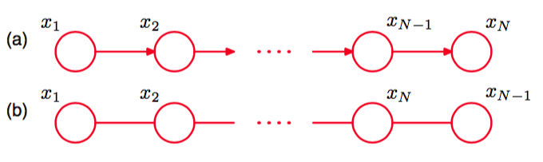
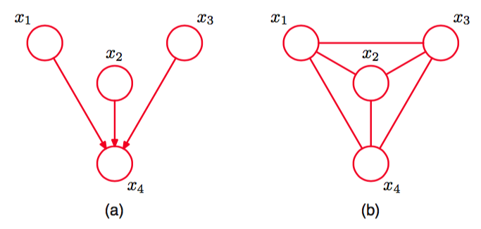
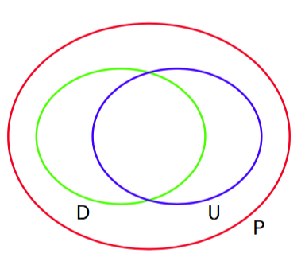
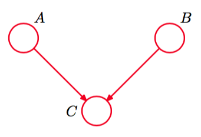
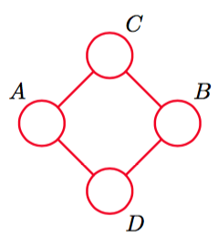

我们已经介绍了表示概率分布的两个图模型的框架，对应于有向图和无向图。讨论二者之间的关系是很有意义的。首先考虑取一个使用有向图描述的模型，尝试将其转化为无向图的问题。在某些情况下，转化方法很直接，例如图8.32给出的简单例子。这里，有向图的联合概率分布由一组形式为     

$$
p(x) = p(x_1)p(x_2|x_1)p(x_3|x_2)...p(x_N|x_{N-1}) \tag{8.44}
$$

的条件概率分布的乘积给出。现在假设我们将其转化为无向图的表示方法，如图8.32所示。

      
图 8.32 (a)有向图的例子。(b)等价的无向图。

在无向图中，最大团块为相邻结点对，因此根据式（8.39），我们希望将联合概率分布写成下面的形式    

$$
p(x) = \frac{1}{Z}\psi_{1,2}(x_1,x_2)\psi_{2,3}(x_2,x_3)...\psi_{N-1,N}(x_{N-1},x_N) \tag{8.45}
$$     

这很容易做。我们只需令   

$$
\begin{eqnarray}
\psi_{1,2}(x_1,x_2) &=& p(x_1)p(x_2|x_1) \\
\psi_{2,3}(x_2,x_3) &=& p(x_3|x_2) \\
&\vdots&
\psi_{N-1,N}(x_{N-1},x_N) &=& p(x_N|x_{N-1})
\end{eqnarray}
$$    

其中我们将第一个结点的边缘概率分布$$ p(x_1) $$放到了第一个势函数中。注意，在这种情况下，划分函数为$$ Z = 1 $$。    

让我们考虑如何推广这个结构，使得我们可以将任意由有向图的分解给出的概率分布转化为用无向图的分解表示的概率分布。如果无向图的团块势函数由有向图的条件概率分布给出，那么这个任务就可以完成。为了保持这个过程的合法性，我们必须确保出现在每个条件概率分布中的变量的集合是无向图中至少一个团块的成员。对于有向图中只有一个父结点的结点，可以通过简单地将有向链接替换为无向链接的方式完成。然而，对于有向图中具有多个父结点的结点来说，这样做是不够的。这些结点是我们在讨论条件独立性时遇到的“头到头”路径的结点。考虑图8.33所示的具有4个结点的简单有向图。    

      
图 8.33 (a)一个简单的有向图的例子。(b)对应的道德图。    

有向图的联合概率分布为    

$$
p(x) = p(x_1)p(x_2)p(x_3)p(x_4|x_1x_2x_3) \tag{8.46}
$$

我们看到因子$$ p(x_4|x_1,x_2,x_3) $$涉及到四个变量$$ x_1, x_2, x_3, x4 $$，所以如果这个条件概率分布被整合到团块势函数中时，这些变量一定属于一个团块。为了确保这一点，我们在$$ x_4 $$的所有父结点之间添加额外的链接。使用一种过时的说法，这种“与父结点结婚”的过程被称为伦理（moralization），去掉箭头后生成的无向图被称为道德图（moral graph）。很重要的一点是，这个例子中的道德图是完全链接的，因此没有表现出条件独立性质，这与原始的有向图相反。     

因此，通常为了将有向图转化为无向图，我们首先在图中每个结点的所有父结点之间添加额外的无向链接，然后去掉原始链接的箭头，得到道德图。之后，我们将道德图的所有的团块势函数初始化为$$ 1 $$。接下来，我们拿出原始有向图中所有的条件概率分布因子，将它乘到一个团块势函数中去。由于“伦理”步骤的存在，总会存在至少一个最大的团块，包含因子中的所有变量。注意，在所有情形下，划分函数都为$$ Z = 1 $$。     

将有向图转化为无向图的过程在精确推断方法中起着重要的作用，例如联合树算法（junction tree algorithm）。从一个无向图转化到有向图表示不太常用，通常表示归一化限制中出现的问题。     

我们看到从一个有向图表示转化为无向图表示的过程中，我们必须从图中丢弃掉一些条件独立性质。当然，通过简单地使用全连接的无向图，我们可以很容易地将有向图上的任意概率分布转化为无向图上的概率分布。但是，这会丢弃掉所有的条件独立性质，因此没有意义。“伦理”过程增加了最少的额外链接，因此保持了最大的条件独立性质。     

我们已经看到判断条件独立性质的步骤对于有向图和无向图是不同的。可以证明，这两种类型的图可以表示不同的条件独立性质。这一点很值得详细研究。为了研究这个问题，我们回到 一个具体的用作滤波器的有向图或者无向图，从而给定变量上的所有可能的概率分布的集合都可以被化简为一个子集，这个子集保持了图给出的条件独立性质。如果一个概率分布中的所有条件独立性质都通过一个图反映出来，那么这个图被称为这个概率分布的D图（D
map，表 示“依赖图”(dependency map)）。因此一个完全非连接的图（不存在链接）是任意概率分布的平凡D图。    

我们还可以考虑一个具体的概率分布，判断哪些图具有适当的条件独立性质。如果一个图的每个条件独立性质都可以由一个具体的概率分布满足，那么这个图被称为这个概率分布的I图（I map，表示“独立图”(independence map)）。显然,一个完全连接的图是任意概率分布的平凡I图。
如果概率分布的每个条件独立性质都由可以由图反映出来，反之也成立，那么这个图被称为是概率分布的完美图（perfect map）。于是，一个完美图既是I图又是D图。    

考虑概率分布的集合，对于每个概率分布，都存在一个有向图，且这个有向图是完美图。这个集合与概率分布组成的对于每个概率分布，存在一个是完美图的无向图是不同的。此外，存在这样的概率分布使得有向图和无向图都无法成为它的完美图。图8.34给出了这个关系的Venn图表示。     

      
图 8.34 给出了一个给定的变量集合上的所有分布的集合P以及可以用有效图表示为完美图的分布集合D，还有可以使用无向图表示的完美图的分布集合U 。     

图8.35给出了一个有向图，它是满足条件独立性质$$ A \perp B | \varnothing $$和$$ A \not\perp B | C $$的概率分布的一个完美图。     

      
图 8.35 条件独立性质不能够使用同样的三个变量上的无向图表示的有向图。

这三个变量上的对应的无向图中，不存在完美图。    

相反，考虑四个变量上的无向图，如图8.36所示。

      
图 8.36 条件独立性质不能够使用同样的变量集合上的有向图表示的无向图。    

这个图表示条件独立性质$$ A \not\perp B | \varnothing, C \perp D | A \cup B $$以及$$ A \perp B | C \cup D $$。这四个变量上的有向图中，不存在表示同样的条件独立性质集合的有向图。    

图框架可以用一种相容的方式，扩展为同时包含有向链接和无向链接的图。这种图被称为链图（chain graphs）（Lauritzen and Wermuth, 1989; Frydenberg, 1990），将有向图和无向图都当成了具体的实例。虽然与有向图或者无向图自身相比，这种图可以表示更多的概率分布，但是仍然存在概率分布，使得链图也无法给出一个完美图。本书不会详细讨论链图。    

