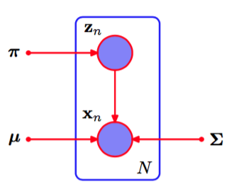

我们现在考虑将EM算法的潜在变量观点应用与一个具体的例子，即高斯混合模型。回忆一 下，我们的目标是最大化对数似然函数（9.14），它是使用观测数据集$$$ X $$进行计算的。我们看到这个计算比单一高斯分布的情形更困难，因为对$$ k $$的求和出现在对数运算内部。假设除了观测数据集$$ X $$，我们还有对应的离散变量$$ Z $$的值。回忆一下，图9.5(a)给出了一个“完整”的数据集，即给出了每个数据点由哪个分量生成，而图9.5(b)给出了对应的“不完整”数据集。完整数据的图模型如图9.9所示。    

      
图 9.9 本图与图9.6相同，只是我们现在假定离散变量$$ z_n $$以及观测变量$$ x_n $$被观测到。

现在考虑对完整数据$$ \{X, Z\} $$进行最大化。根据式（9.10）和式（9.11），似然函数的形式为    

$$
p(X,Z|\mu,\Sigma,\pi) = \prod\limits_{n=1}^N\prod\limits_{k=1}^K\pi_k^{z_{nk}}\mathcal{N}(x_n|\mu_k,\Sigma^k)^{z_{nk}} \tag{9.35}
$$

其中$$ z_{nk} $$表示$$ z_n $$的第$$ k $$个分量。取对数，得到    

$$
\ln p(X,Z|\mu,\Sigma,\pi) = \sum\limits_{n=1}^N\sum\limits_{k=1}^Kz_{nk}\{\ln\pi_k + \ln\mathcal{N}(x_n|\mu_k,\Sigma_k)\} \tag{9.36}
$$

与不完整数据的对数似然函数（9.14）进行对比，我们看到在$$ k $$上的求和与对数运算的顺序交换了。对数运算现在直接作用于高斯分布上，而高斯分布本身是指数族分布的一个成员。丝毫不令人惊讶，这种方法产生了最大似然问题的一个简单得多的解，说明如下。首先考虑关于均值和协方差的最大化。由于$$ z_n $$是一个$$ K
$$维向量，并且只有一个元素等于1，其他所有元素均为0，因此完整数据的对数似然函数仅仅是$$ K $$个独立的贡献的和，每个混合分量都有一个贡献。于是关于均值或协方差的最大化与单一高斯分布的情形完全相同，唯一的区别是它只涉及到被“分配”到那个分量的数据点的子集。对于关于混合系数的最大化问题，我们注意到由于和限制（9.9）的存在，不同$$ k $$值的混合系数相互关联。与之前一样，可以使用拉格朗日乘数法进行优化，结果为     

$$
\pi_k = \frac{1}{N}\sum\limits_{n=1}^Nz_{nk} \tag{9.37}
$$    

从而混合系数等于分配到对应分量的数据点所占的比例。    

因此我们看到，完整数据的对数似然函数可以用一种简单的方法求出最大值的解析解。然而，在实际应用中，我们并没有潜在变量的值，因此，与之前的讨论一样，我们考虑完整数据对数似然函数关于潜在变量后验概率分布的期望。使用式（9.10）、（9.11）以及贝叶斯定理，我们看到这个后验分布的形式为    

$$
p(Z,X,\mu,\Sigma,\pi) \propto \prod\limits_{n=1}^N\prod\limits_{k=1}^K[\pi_k\mathcal{N}(x_n|\mu_k,\Sigma_k)]^{z_{nk}} \tag{9.38}
$$     

因此后验概率分布可以在$$ n $$上进行分解，从而$$ \{z_n\} $$是独立的。通过观察9.6中的有向图然后使用d-划分准则，很容易证明这一点。这样，在这个后验概率分布下，指示值$$ z_{nk} $$的期望为     

$$
\begin{eqnarray}
\mathbb{E}[z_{nk}] &=& \frac{\sum\limits_{z_n}z_{nk}\prod_{k'}[\pi_{k'}\mathcal{N}(x_n|\mu_{k'},\Sigma_{k'})]^{z_{nk'}}}{\sum\limits_{z_n}\prod_j[\pi_j\mathcal{N}(x_n|\mu_j,\Sigma_j)]^{z_{nj}}} \\
&=& \frac{\pi_k\mathcal{N}(x_n|\mu_k,\Sigma_k)}{\sum\limits_{j=1}^K\pi_j\mathcal{N}(x_n|\mu_j,\Sigma_j)} = \gamma(z_{nk}) \tag{9.39}
\end{eqnarray}
$$     

它就是$$ k $$分量对于数据点$$ x_n $$的“责任”。于是，完整数据的对数似然函数的期望值为     

$$
\mathbb{E}_Z[\ln p(X,Z|\mu,\Sigma,\pi)] = \sum\limits_{n=1}^N\sum\limits_{k=1}^K\gamma(z_{nk})\{\ln \pi_k + \ln\mathcal{N}(x_n|\mu_k,\Sigma_k)\} \tag{9.40}
$$

我们现在可以按照下面的方式进行处理。首先，我们为参数$$ \mu^{old}, \Sigma^{old}, \pi^{old} $$选择某个初始值，使用这些初始值计算“责任”(E步骤)。然后我们保持“责任”固定，关于$$ \mu_k,\Sigma_k, \pi_k $$最大化（9.40）（M步骤）。同样的，这会得到由式（9.17）、（9.19）和（9.22）给出$$ \mu^{new}, \Sigma^{new}, \pi^{new} $$的解析解。这与之前推导的高斯混合模型的EM算法完全相同。当我们在9.4节证明EM算法的收敛性时，我们会更加深刻地认识到完整数据的对数似然函数的期望的作用。
