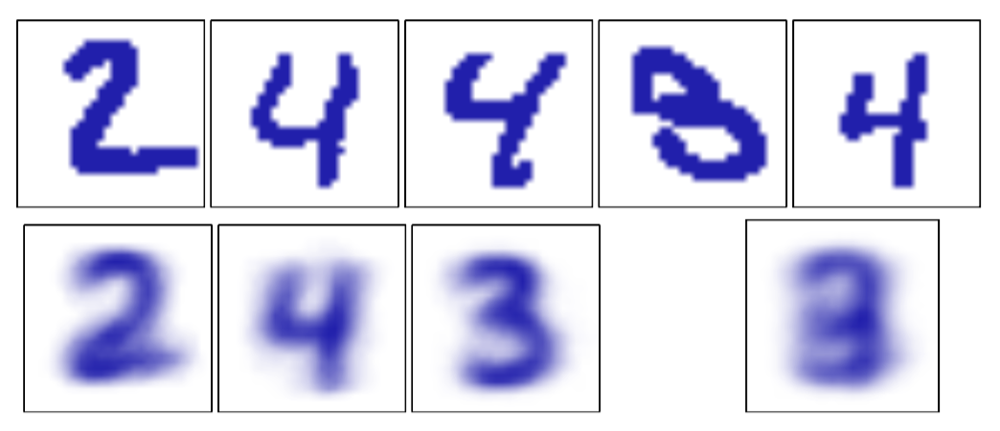

目前为止在本章中，我们的注意力集中于由混合高斯模型描述的连续变量上的概率分布。作为混合模型的另一个例子，同时为了在一个不同的问题中说明EM算法，我们现在讨论由伯努利分布描述的离散二值变量的混合。这个模型也被称为潜在类别分析（latent class analysis）（Lazarsfeld and Henry, 1968; McLachlan and Peel, 2000）。这个模型不仅具有实际应用的重要性，还是我们考虑离散变量上的马尔科夫模型的基础。    

考虑$$ D $$个二值变量$$ x_i $$组成的集合，其中$$ i = 1,...,D $$，每个变量都由一个参数为$$ \mu_i $$的伯努利分布控制，即     

$$
p(x|\mu) = \prod\limits_{i=1}^D\mu_i^{x_i}(1 - \mu_i)^{1 - x_i} \tag{9.44}
$$    

其中$$ x = (x_1,...,x_D)^T $$且$$ \mu = (\mu_1,...,\mu_D)^T $$。我们看到，给定$$ \mu $$的条件下，各个变量$$ x_i $$是独立的。很容易看出，这个分布的均值和方差为    

$$
\begin{eqnarray}
\mathbb{E}[x] &=& \mu \tag{9.45} \\
cov[x] &=& diag\{\mu_i(1 - \mu_i)\} \tag{9.46}
\end{eqnarray}
$$    

现在让我们考虑这种分布的有限混合，即     

$$
p(x|\mu,\pi) = \sum\limits_{k=1}^K\pi_kp(x|\mu_k) \tag{9.47}
$$

其中$$ \mu = \{\mu_1,...,\mu_K\}, \pi = \{\pi_1,...,\pi_K\} $$，且    

$$
p(x|\mu_k) = \prod\limits_{i=1}^D\mu_{ki}^{x_i}(1 - \mu_{ki})^{1-x_i} \tag{9.48}
$$

这个混合分布的均值和方差为    

$$
\begin{eqnarray}
\mathbb{E}[x] &=& \sum\limits_{k=1}^K\pi_k\mu_k \tag{9.49} \\
cov[x] &=& \sum\limits_{k=1}^K\pi_k\{\Sigma_k + \mu_k\mu_k^T\} - \mathbb{E}[x]\mathbb{E}[x]^T \tag{9.50}
\end{eqnarray}
$$     

其中$$ \Sigma_k = diag\{\mu_{ki}(1 − \mu_{ki})\} $$。由于协方差矩阵$$ cov[x] $$不再是对角矩阵，因此混合分布可以描述变量之间的相关性，这与单一的伯努利分布不同。    

如果我们有一个数据集$$ X = \{x_1,...,x_N\} $$，那么这个模型的对数似然函数为     

$$
\ln p(X|\mu,\pi) = \sum\limits_{n=1}^N\ln\left\{\sum\limits_{k=1}^K\pi_kp(x_n|\mu_k)\right\} \tag{9.51}
$$    

与之前一样，我们看到求和运算位于对数运算内部，从而最大似然解没有解析解。    

我们现在推导混合伯努利分布的最大化似然函数的EM算法。为了完成这件事，我们首先显式地引入一个潜在变量$$ z $$，它与$$ x $$的每个实例相关联。与高斯混合模型的情形相同，$$ z = (z_1,...,z_K)^T $$是一个二值$$ K $$维变量，其中只有一个元素等于1，其余元素等于0。这样，给定潜在变量，我们可以写出$$ x $$的条件概率分布，形式为     

$$
p(x|z,\mu) = \prod\limits_{k=1}^Kp(x|\mu_k)^{z_k} \tag{9.52}
$$    

而潜在变量的先验概率分布与高斯混合模型的形式相同，即    

$$
p(z|\pi) = \prod\limits_{k=1}^K\pi_k^{z_k} \tag{9.53}
$$     

如果我们将$$ p(x|z,\mu) $$和$$ p(z|\pi) $$相乘，然后对$$ z $$求和，我们就恢复出了式（9.47）。     

为了推导EM算法，我们首先写出完整数据的对数似然函数，形式为     

$$
\begin{eqnarray}
\ln p(X,Z|\mu,\pi) = \sum\limits_{n=1}^N\sum\limits_{k=1}^Kz_{nk}\left\{\ln\pi_k \\
+ \sum\limits_{i=1}^D[x_{ni}\ln \mu_{ki} + (1 - x_{ni})\ln(1 - \mu_{ki})]\right\} \tag{9.54}
\end{eqnarray}
$$     

其中$$ X = \{x_n\} $$且$$ Z = \{z_n\} $$。接下来我们取完整数据对数似然函数关于潜在变量后验概率分布的期望，得    

$$
\begin{eqnarray}
\mathbb{E}_Z[\ln p(X,Z|\mu,\pi)] = \sum\limits_{n=1}^N\sum\limits_{k=1}^K\gamma{z_{nk}}\left\{\ln\pi_k \\
+ \sum\limits_{i=1}^D[x_{ni}\ln \mu_{ki} + (1 - x_{ni})\ln(1 - \mu_{ki})]\right\} \tag{9.55}
\end{eqnarray}
$$     

其中$$ \gamma(z{nk}) = \mathbb{E}[z_{nk}] $$是给定数据点$$ x_n $$的条件下，分量$$ k $$的后验概率分布，或者“责任”。在E步骤中，这些后验概率使用贝叶斯定理计算，形式为

$$
\begin{eqnarray}
\gamma(z_{nk}) = \mathbb{E}[z_{nk}] &=& \frac{\sum\limits_{z_n}z_{nk}\prod_{k'}[\pi_{k'}p(x_n|\mu_{k'})]^{z_{nk'}}}{\sum\limits_{z_n}\prod_j[\pi_jp(x_n|\mu_j)]^{z_{nj}}} \\
&=& \frac{\pi_kp(x_n|\mu_k)}{\sum\limits_{j=1}^K\pi_jp(x_n|\mu_j)} \tag{9.56}
\end{eqnarray}
$$

如果我们考虑在式（9.55）中对$$ n $$求和，我们看到“责任”只出现在两项中，这两项可以写成     

$$
\begin{eqnarray}
N_k = \sum\limits_{n=1}^N\gamma(z_{nk}) \tag{9.57} \\
\bar{x}_k = \frac{1}{N_k}\sum\limits_{n=1}^N\gamma(z_{nk})x_n \tag{9.58}
\end{eqnarray}
$$     

其中$$ N_k $$是与分量$$ k $$关联的数据点的有效数量。在M步骤中，我们关于参数$$$ \mu_k $$和$$ \pi $$最大化完整数据对数似然函数的期望。如果我们令式（9.55）关于$$ \mu_k $$的导数等于0，整理可得     

$$
\mu_k = \bar{x}_k \tag{9.59}
$$

我们看到，分量$$ k $$的均值组成的集合等于数据的加权平均值，权系数为分量$$ k $$对于数据点的“责任”。对于关于$$ \pi_k $$的最大化，我们需要引入一个拉格朗日乘数来满足限制条件$$ \sum_k\pi_k = 1 $$。采用与高斯混合模型中类似的步骤，我们有     

$$
\pi_k = \frac{N_k}{N} \tag{9.60}
$$     

这与直觉相符，即分量k的混合系数等于数据集里那个分量的数据点所占的比例。     

注意，与混合高斯模型不同，不存在似然函数趋于无穷大的奇异性。我们注意到，因为$$ 0 \leq p(x_n | \mu_k) \leq 1 $$，所以似然函数是有界的。确实存在似然函数趋于零的奇异性，但是只要EM在初始化时没有选择一个病态的起始点，这些点就不会被找到，因为EM算法总是增大似然函数的值，直到达到局部极大值。在图9.10中，我们说明了用伯努利混合模型对手写数字建模的结果。    

      
图 9.10 伯努利混合模型的例子。上面一行给出了将手写数字数据集从灰度图转化为二值图之后的例子，转化时使用的阈值为0.5。下面一行中，最开始的三张图像展示了混合模型的三个分量的参数$$ \mu_{ki} $$。作为对比，我们也使用一个单一的多元伯努利分布对同样的数据进行了拟合，同样使用了最大似然方法。这对应于将每个像素点求平均，结果如下面一行最右侧的图所示。    

这里，数字的图像被转化为了二值向量，转化的方法是令所有超过0.5的值等于1，令其他的值等于0。我们现在有$$ N = 600
$$张这样的图像，由数字“2”、“3”、“4”组成。我们将$$ K = 3 $$个伯努利分布进行混合，运行EM算法进行10轮迭代。混合系数被初始化为$$ \pi = 1 $$，参数$$ \mu_{kj} $$被设置为服从区间$$ (0.25, 0.75) $$上的均匀分布，且满足限制$$ \sum_j \mu_{kj} = 1 $$的随机值。我们看到，三个伯努利分布的混合能够找到数据里里对应于不同数字的三个聚类。     

伯努利分布参数的共轭先验是Beta分布。我们已经看到一个Beta先验分布等价于引入$$ x $$的额外的有效观测。类似地，我们可以引入伯努利混合模型的先验分布，然后使用EM算法最大化后验概率分布。    

很容易将对伯努利混合模型的分析推广到具有$$ M > 2 $$个状态的离散变量多项式分布的情形（由式(2.26)定义）。与之前一样，在必要的情况下，我们可以引入模型参数的狄利克雷先验分布。

