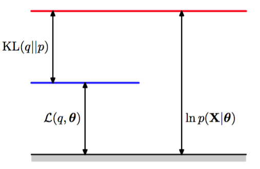
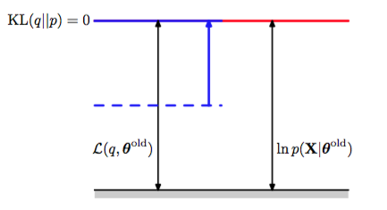
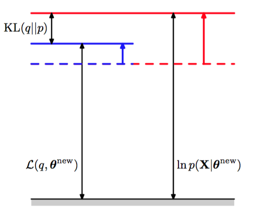
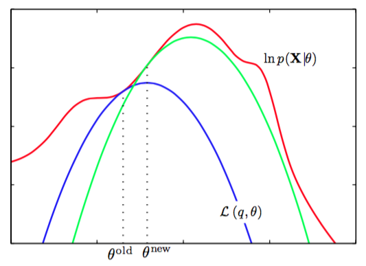

期望最大化算法，或EM算法，是寻找具有潜在变量的概率模型的最大似然解的一种通用的方法（Dempster et al., 1977; MaLachlan and Krishnan, 1997）。这里，我们给出一般的EM算法，并且在这个过程中，会证明9.2节和9.3节在讨论高斯混合模型时启发式地推导出的EM算法确实最大化了似然函数（Csiszar and Tusnady, 1984; Hathaway, 1986; Neal and Hinton, 1999）。我们的讨论也构成了变分推断框架推导的基础。    

考虑一个概率模型，其中我们将所有的观测变量联合起来记作$$ X $$，将所有的隐含变量记作$$ Z $$。联合概率分布$$ p(X,Z|\theta) $$由一组参数控制，记作$$ \theta $$。我们的目标是最大化似然函数     

$$
p(X|\theta) = \sum\limits_Zp(X,Z|\theta) \tag{9.69}
$$     

这里，我们假设$$ Z $$是离散的，不过当$$ Z $$是连续变量或者离散变量与连续变量的组合时，方法是完全相同的，只需把求和换成适当的积分即可。    

我们假设直接最优化$$ p(X|\theta) $$比较困难，但是最优化完整数据似然函数$$ p(X,Z|\theta) $$就容易得多。接下来，我们引入一个定义在潜在变量上的分布$$ q(Z) $$。我们观察到，对于任意的$$ q(Z) $$下面的分解成立     

$$
\ln p(X|\theta) = L(q,\theta) + KL(q \Vert p) \tag{9.70}
$$    

其中，我们定义了     

$$
\begin{eqnarray}
L(q,\theta) &=& \sum\limits_Zq(Z)\ln\left\{\frac{p(X,Z|\theta)}{q(Z)}\right\} \tag{9.71} \\
KL(q\Vert p) &=& - \sum\limits_Zq(Z)\ln\left\{\frac{p(Z|X,\theta)}{q(Z)}\right\} \tag{9.72}
\end{eqnarray}
$$    

注意，$$ L(q, \theta) $$是概率分布$$ q(Z) $$的一个泛函（关于泛函的讨论，见附录D），并且是参数$$ \theta $$的一个函数。值得仔细研究的是表达式（9.71）和（9.72）的形式，特别地，需要注意，二者的符号相反，并且$$ L(q, \theta) $$包含了$$ X, Z $$的联合概率分布，而$$ KL(q \Vert p) $$包含了给定$$ X $$的条件下，$$ Z $$的条件分布。为了验证式（9.70）给出的分解方式，我们首先使用概率的乘积规则，可得    

$$
\ln p(X,Z|\theta) = \ln p(Z|X,\theta) + \ln p(X|\theta) \tag{9.73}
$$    

然后代入$$ L(q, \theta) $$的表达式。这得到了两项，一项消去了$$ KL(q \Vert p) $$，而另一项给出了所需的对数似然函数$$ \ln p(X | \theta) $$，其中我们用到了归一化的概率分布$$ q(Z) $$的积分等于1的事实。    

根据式（9.72），我们看到$$ KL(q \Vert p) $$是$$ q(Z) $$和后验概率分布$$ p(Z|X, \theta) $$之间的Kullback-Leibler散度。 回忆一下，Kullback-Leibler散度满足$$ KL(q \Vert p) \geq 0 $$，当且仅当$$ q(Z) = p(Z|X, \theta) $$时等号成立。因此，根据式（9.70），$$ L(q, \theta) \leq \ln p(X|\theta) $$，换句话说，$$ L(q, \theta) $$是$$ \ln p(X|\theta) $$的一个下界。图9.11说明了式（9.70）的分解。    

      
图 9.11 由式（9.70）给出的分解的说明，它对于分布$$ q(Z) $$的任意选择都成立。由于Kullback-Leibler散 度满足$$ KL(q \Vert p) \geq 0 $$，因此我们看到$$ L(q, \theta) $$是对数似然函数$$ \ln p(X | \theta) $$的下界。

EM算法是一个两阶段的迭代优化算法，用于寻找最大似然解。我们可以使用式（9.70）来定义EM算法，证明它确实最大化了对数似然函数。假设参数向量的当前值为$$ \theta^{old} $$。在E步骤中，下界$$ L(q, \theta^{old}) $$关于$$ q(Z) $$被最大化，而$$ \theta^{old} $$保持固定。最大化问题的解很容易看出来。我们注意到$$ \ln p(X|\theta^{old}) $$不依赖于$$ q(Z) $$，因此$$ L(q, \theta^{old})
$$的最大值出现在Kullback-Leibler散度等于0的时候，换句话说，最大值出现在$$ q(Z) $$与后验概率分布$$ p(Z | X, \theta^{old}) $$相等的时候。此时，下界等于对数似然函数，如图9.12所示。     

      
图 9.12 EM算法的E步骤的说明。$$ q $$分布被设置为当前参数值$$ \theta^{old} $$下的后验概率分布，这使得下界上移到与对数似然函数值相同的位置，此时KL散度为零。    

在接下来的M步骤中，分布$$ q(Z) $$保持固定，下界$$ L(q, \theta) $$关于$$ \theta $$进行最大化，得到了某个新值$$ \theta^{new} $$。这会使得下界L增大（除非已经达到了极大值），这会使得对应的对数似然函数增大。由于概率分布$$ q $$由旧的参数值确定，并且在M步骤中保持固定，因此它不会等于新的后验概率分布$$ p(Z|X, \theta^{new}) $$，从而KL散度非零。于是，对数似然函数的增加量大于下界的增加量，如图9.13所示。    

      
图 9.13 EM算法的M步骤的说明。分布$$ q(Z) $$保持固定，下界$$ L(q, \theta) $$关于参数向量$$ \theta $$最大化，得到修正值$$ \theta^{new} $$。由于KL散度非负，因此这使得对数似然函数$$ \ln p(X|\theta) $$的增量至少与下界的增量相等。     

如果我们将$$ q(Z) = p(Z|X, \theta^{old}) $$代入式（9.71），我们会看到，在E步骤之后，下界的形式为    

$$
\begin{eqnarray}
L(q,\theta) &=& \sum\limits_Zp(Z|X,\theta^{old})\ln p(X,Z|\theta) - \sum\limits_Zp(Z|X,\theta^{old})\ln p(Z|X,\theta^{old}) \\
&=& Q(\theta,\theta^{old}) + const \tag{9.74}
\end{eqnarray}
$$     

其中，常数就是分布$$ q $$的熵，因此与$$ \theta $$无关。从而在M步骤中，最大化的量是完整数据对数似然函数的期望，正如我们之前在混合高斯模型的情形中看到的那样。注意，我们进行优化的变量$$ \theta $$只出现在对数运算内部。如果联合概率分布$$ p(Z, X | \theta) $$由指数族分布的成员组成，或者由指数族分布成员的乘积组成，那么我们看到对数运算会抵消指数运算，从而使得M步骤通常比最大化对应的不完整数据对数似然函数$$ p(X|\theta) $$要容易得多。    

EM算法的计算也可以被看做参数空间中的运算，如图9.14所示。    

      
图 9.14 EM算法涉及到交替计算当前参数值下的对数似然函数的下界以及最大化下界的值得到新的参数值。

这里，红色曲线表示（不完整数据）对数似然函数，它的最大值是我们想要得到的。我们首先选择某个初始的参数值$$ \theta^{old} $$，然后在第一个E步骤中，我们计算潜在变量上的后验概率分布，得到了$$ L(q, \theta^{old} $$)的一个更小的下界，它的值等于在$$ \theta^{old} $$处的对数似然函数值，用蓝色曲线表示。注意，下界与对数似然函数在$$ \theta^{old}
$$处以切线的方式连接，因此两条曲线的梯度相同。这个界是一个凹函数，对于指数族分布的混合分布来说，有唯一的最大值。在M步骤中，下界被最大化，得到了新的值$$ \theta^{new} $$，这个值给出了比$$ \theta^{old} $$处更大的对数似然函数值。接下来的E步骤构建了一个新的下界，它在$$ \theta^{new} $$处与对数似然函数切线连接，用绿色曲线表示。    

对于独立同分布数据集的特殊情形，$$ X $$由$$ N $$个数据点$$ \{x_n\} $$组成，而$$ Z $$由$$ N $$个对应的潜在变量$$ \{z_n\} $$组成，其中$$ n = 1,...,N $$。根据独立性假设，我们有$$ p(X, Z) = \prod_np(x_n, z_n) $$，并且通过关于$$ \{z_n\} $$求边缘概率分布，我们有$$ p(X) = \prod_n p(x_n) $$。使用加法规则和乘法规则，我们看到在E步骤中计算的后验概率分布的形式为    

$$
p(Z|X,\theta) = \frac{p(X,Z|\theta)}{\sum\limits_Zp(X,Z|\theta)} = \frac{\prod\limits_{n=1}^Np(x_n,z_n|\theta)}{\sum\limits_Z\prod\limits_{n=1}^Np(x_n,z_n|\theta)} = \prod\limits_{n=1}^Np(z_n|x_n,\theta) \tag{9.75}
$$    

因此后验概率分布也可以关于$$ n $$进行分解。在高斯混合模型的情形中，这个结果意味着混合分布的每个分量对于一个特定的数据点$$ x_n $$的“责任”只与$$ x_n $$的值和混合分量的参数$$ \theta $$有关，而与其他数据点无关。     

我们已经看到，EM算法的E步骤和M步骤都增大了对数似然函数的一个良好定义的下界的值，并且完整的EM循环会使得模型的参数向着使对数似然函数增大的方向进行改变（除非已经达到了一个极大值，此时参数保持不变）。     

我们也可以使用EM算法来最大化模型的后验概率分布$$ p(\theta|X) $$，其中我们已经引入了参数上的先验概率分布$$ p(\theta) $$。为了理解这一点，我们注意到作为一个$$ \theta $$的函数，我们有$$ p(\theta|X) = p(\theta, X) / p(X) $$，因此     

$$
\ln p(\theta|X) = \ln p(\theta,X) - \ln p(X) \tag{9.76}
$$    

使用式（9.70）的分解，我们有     

$$
\begin{eqnarray}
\ln p(\theta|X) &=& L(q,\theta) + KL(q \Vert p) + \ln p(\theta) - \ln p(X) \\
&\geq& L(q,\theta) + \ln p(\theta) - \ln p(X) \tag{9.77}
\end{eqnarray}
$$

其中$$ \ln p(X) $$是一个常数。同样的，我们可以交替地关于$$ q, \theta $$对右侧进行优化。因为$$ q $$只出现在$$ L(q, \theta) $$中，所以关于$$ q $$的优 化产生了与标准EM算法相同的E步骤。M步骤的方程通过引入先验项$$ \ln p(\theta) $$进行修改，这通常只需要对标准的最大似然M步骤的方程进行很小的修改即可。     

EM算法将最大化似然函数这一困难的问题分解成了两个阶段，即E步骤和M步骤，每个步骤都很容易实现。尽管这样，对于复杂的模型来说，E步骤或者M步骤仍然无法计算。这就引出了对EM算法的两个扩展，叙述如下。    

广义EM算法（generalized EM algorithm），或者简称GEM算法，解决的是M步骤无法计算的问题。这个算法不去关于$$ \theta $$最大化$$ L(q, \theta) $$，而是改变参数的值去增大$$L(q,\theta) $$的值。同样的，由于$$ L(q, \theta) $$是对数似然函数的一个下界，因此GEM算法的完整的EM循环保证了对数似然函数值的增大（除非参数已经对应于一个局部极大值）。一种使用GEM的方法是在M步骤中使用某种非线性最优化策略，例如共轭梯度算法。另一种形式的GEM算法，被称为期望条件最大化算法（expectation conditional maximization
algorithm），或者简称ECM算法，涉及到在每个M步骤中进行若干了具有限制条件的最优化（Meng and Rubin， 1993）。例如，参数可能被划分为若干组，并且M步骤被划分成多个步骤，每个步骤最优化一个子集，同时保持其他的子集固定。    

类似地，我们可以用下面的方法推广EM算法中的E步骤：对$$ L(q, \theta) $$关于$$ q(Z) $$进行一个部分的最优化而不是完全的最优化（Neal and Hinton， 1999）。正如我们已经看到的，对于任意给定的$$ \theta $$值，$$ L(q, \theta) $$关于$$ q(Z) $$有一个唯一的最大值，它对应于后验概率分布$$ q_{\theta}(Z) = p(Z | X, \theta) $$， 并且对于这个$$ q(Z) $$的选择，下界$$ L(q, \theta) $$等于对数似然函数$$ L(q, \theta) $$。因此任何收敛于$$ L(q, \theta) $$的全局最大值的算法都会找到一个$$
\theta $$值，这个值也是对数似然函数$$ \ln p(X | \theta) $$的全局最大值。 只要$$ p(X, Z | \theta) $$是$$ \theta $$的一个连续函数，那么根据连续性，$$ L(q, \theta) $$的任意一个局部极大值也会是$$ \ln p(X | \theta) $$的一个局部极大值。     

考虑N个独立数据点$$ x_1,...,x_N $$对应于潜在变量$$ z_1,...,z_N $$的情形。 联合概率分布$$ p(X, Z | \theta)
$$可以在数据点上进行分解，并且这个结构可以被增量形式的EM算法利用，即在每个EM循环中，只处理一个数据点。在E步骤中，我们不重新计算所有数据点的“责任”，而是只重新计算一个数据点的“责任”。似乎接下来的M步骤会需要涉及到所有数据点的“责任”的计算。但是，如果混合的分量是指数族分布的成员，那么“责任”只出现在简单的充分统计量之中，这些量可以高效地更新。例如，考虑高斯混合分布的情形，假设我们对数据点m进行了一个更新，其中对应的“责任”的旧值和新值分别为$$
\gamma^{old}(z_{mk}) $$和$$ \gamma^{new}(z_{mk}) $$。在M步骤中，所需的充分统计量可以增量地更新。例如，对于均值来说，充分统计量由式（9.17）和式（9.18）定义，因此我们可以得到     

$$
\mu_k^{new} = \mu_k^{old} + \left(\frac{\gamma^{new}(z_{mk}) - \gamma^{old}(z_{mk})}{N_k^{new}}\right)\left(x_m - \mu_k^{old}\right) \tag{9.78}
$$     

以及     

$$
N_k^{new} = N_k^{old} + \gamma^{new}(z_{mk}) - \gamma^{old}(z_{mk}) \tag{9.79}
$$    

对应的协方差和混合系数的结果与此类似。     

因此E步骤和M步骤的计算时间都与数据点的总数无关。由于参数在每个数据点被使用之后进行修改，而不是等到全部数据处理完毕之后才进行又该，因此以批处理版本相比，这个增量版本的收敛速度更快。这个增量算法中的每个E步骤或者M步骤都会增大$$ L(q, \theta) $$的值，并且正如我们之前说明的那样，如果算法收敛于$$ L(q, \theta ) $$的一个局部的（或全局的）最大值，那么这会对应于对数似然函数$$ \ln p(X|\theta) $$的一个局部的（或全局的）最大值。
